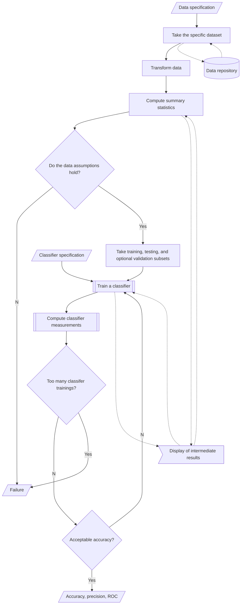
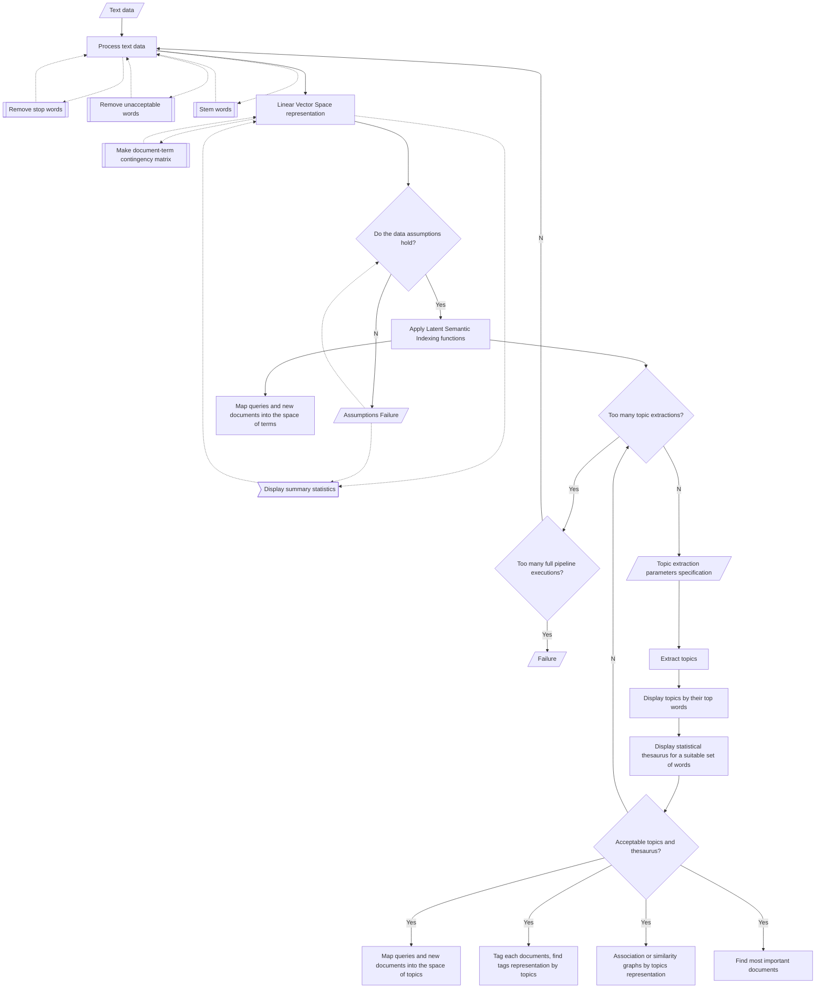

# Mermaid-JS flowcharts

##### Anton Antonov
##### Vanna-da
##### September-October 2022

## Classification workflows

------

## Latent Semantic Analysis workflows

------

## Quantile regression

-------

## Recommender workflows

