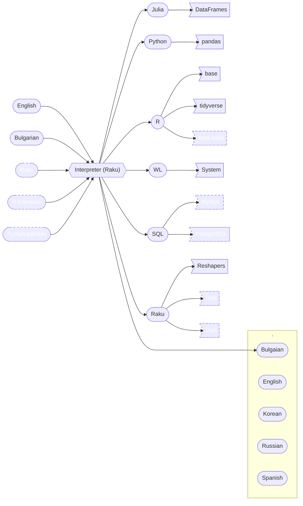
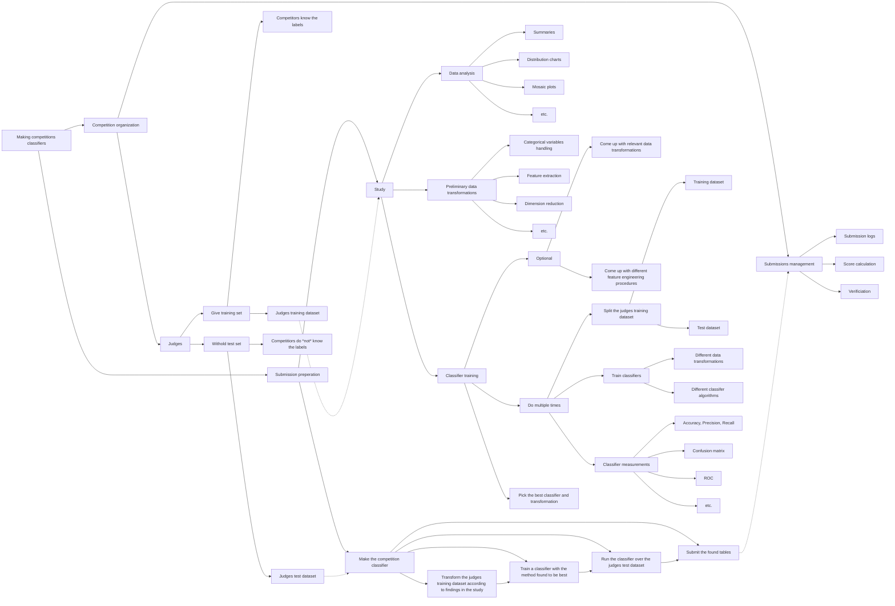
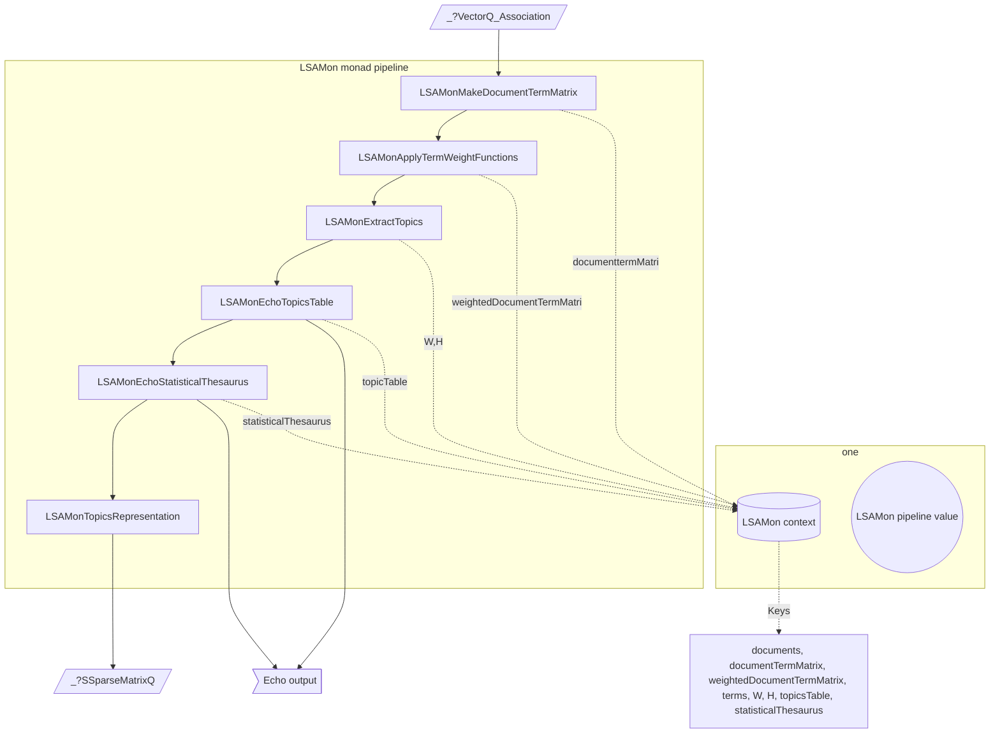
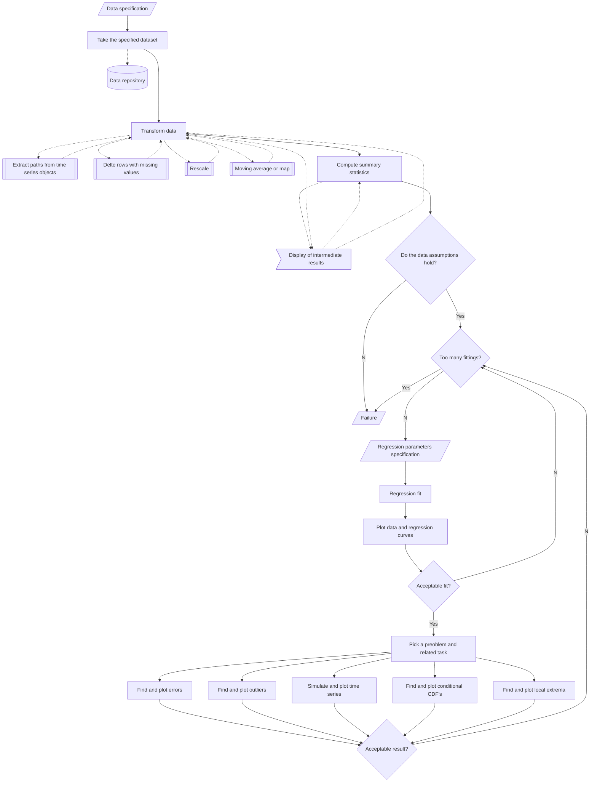
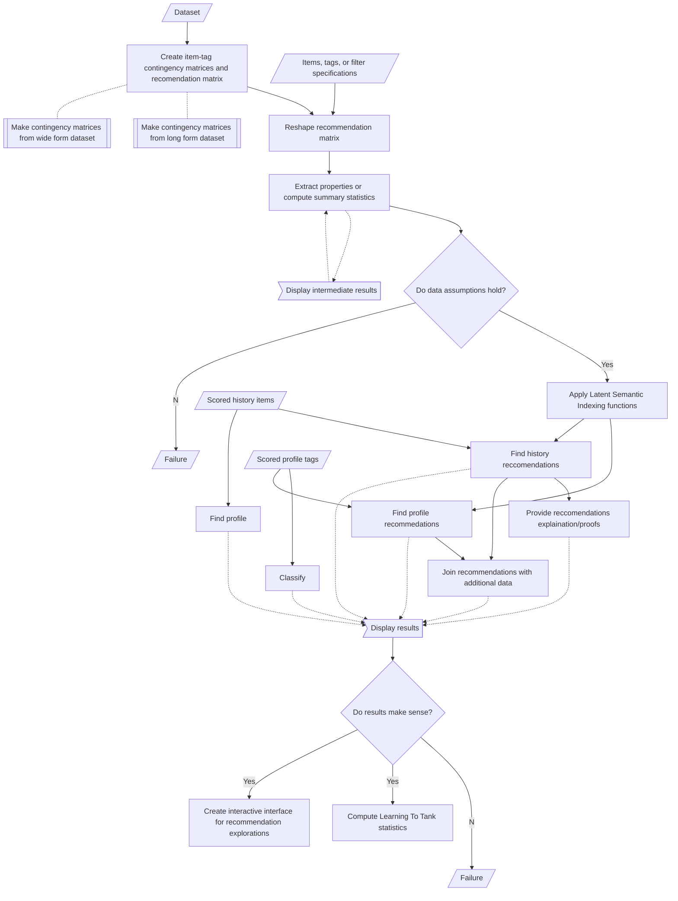

# Mermaid-JS flowcharts

Anton Antonov   
Vanna-do    
[SimplifiedMachineLearningWorkflows-book at GitHub](https://github.com/antononcube/SimplifiedMachineLearningWorkflows-book)   
September-October 2022    

-----

## Introduction

This document has flowcharts specified using the Domain Specific Language (DSL) of
[mermaid-js](https://mermaid-js.github.io).

In web browsers GitHub produces diagrams corresponding to mermaid-js specifications.
One can also use https://mermaid.live/ .

------

## Data transformations

-----

## Classification workflows

### Competition classifiers mind-map

### Workflow

------

## Latent Semantic Analysis workflows

### Workflow flowchart

### Pipeline flowchart

------

## Quantile regression

-------

## Recommender workflows

