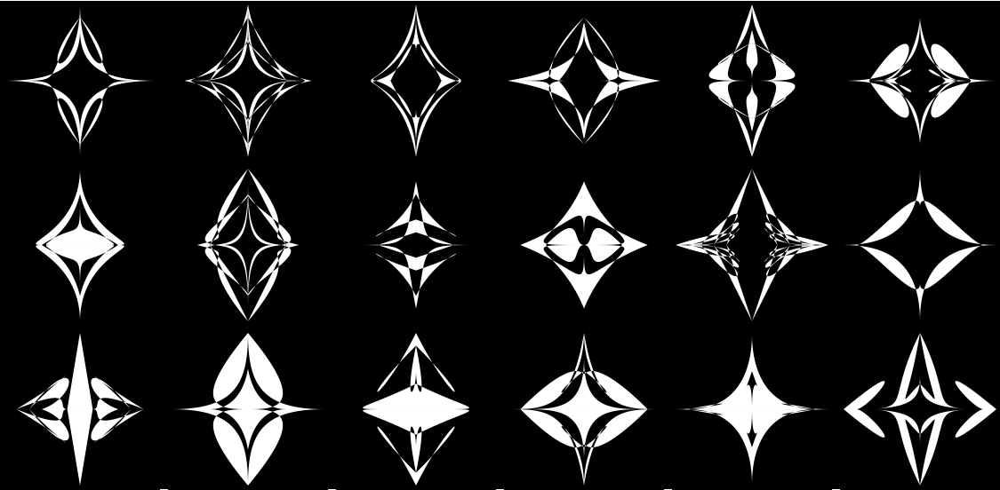
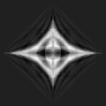

# Generation of Random Bethlehem Stars

Anton Antonov   
MathematicaForPrediction at WordPress   
MathematicaForPrediction at GitHub   
December 2020   

## Introduction

This document/notebook is inspired by the [Mathematica Stack Exchange](https://mathematica.stackexchange.com) (MSE) question ["Plotting the Star of Bethlehem"](https://mathematica.stackexchange.com/q/236499), [[MSE1](https://mathematica.stackexchange.com/q/236499)]. That MSE question requests efficient and fast plotting of a certain mathematical function that (maybe) looks like the [Star of Bethlehem](https://en.wikipedia.org/wiki/Star_of_Bethlehem), [[Wk1](https://en.wikipedia.org/wiki/Star_of_Bethlehem)]. Instead of doing what the author of the questions suggests, I decided to use a generative art program and workflows from three of most important Machine Learning (ML) sub-cultures: Latent Semantic Analysis, Recommendations, and Classification.

Although we discuss making of Bethlehem Star-like images, the ML workflows and corresponding code presented in this document/notebook have general applicability -- in many situations we have to make classifiers based on data that has to be “feature engineered” through pipeline of several types of ML transformative workflows and that feature engineering requires multiple iterations of re-examinations and tuning in order to achieve the set goals. 

The document/notebook is structured as follows: 

1. Target Bethlehem Star images

1. Simplistic approach

1. Elaborated approach outline

1. Sections that follow through elaborated approach outline:

    1. Data generation

    1. Feature extraction

    1. Recommender creation

    1. Classifier creation and utilization experiments

(This document/notebook is a surrogate chapter for the book ["Simplified Machine Learning Workflows"](https://github.com/antononcube/SimplifiedMachineLearningWorkflows-book), [AAr3].)

## Target images

Here are the images we consider to be “Bethlehem Stars” in this document/notebook:

```mathematica
imgStar1 = Import["https://i.stack.imgur.com/qmmOw.png"];
imgStar2 = Import["https://i.stack.imgur.com/5gtsS.png"];
Row[{imgStar1, Spacer[5], imgStar2}]
```


We notice that similar images can be obtained using the Wolfram Function Repository (WFR) function [RandomMandala](https://resources.wolframcloud.com/FunctionRepository/resources/RandomMandala), [AAr1]. Here are a dozen examples:

```mathematica
SeedRandom[5];
Multicolumn[Table[MandalaToWhiterImage@ResourceFunction["RandomMandala"]["RotationalSymmetryOrder" -> 2, "NumberOfSeedElements" -> RandomInteger[{2, 8}], "ConnectingFunction" -> FilledCurve@*BezierCurve], 12], 6, Background -> Black]
```


## Simplistic approach

We can just generate a large set enough set of mandalas and pick the ones we like. 

More precisely we have the following steps:

1. We generate, say, 200 random mandalas using BlockRandom and keeping track of the random seeds

    1. The mandalas are generated with rotational symmetry order 2 and filled Bezier curve connections.

1. We pick mandalas that look, more or less, like Bethlehem Stars

1. Add picked mandalas to the results list

1. If too few mandalas are in the results list go to 1.

Here are some mandalas generated with those steps

```mathematica
lsStarReferenceSeeds = DeleteDuplicates@{697734, 227488491, 296515155601, 328716690761, 25979673846, 48784395076, 61082107304, 63772596796, 128581744446, 194807926867, 254647184786, 271909611066, 296515155601, 575775702222, 595562118302, 663386458123, 664847685618, 680328164429, 859482663706};
Multicolumn[
  Table[BlockRandom[ResourceFunction["RandomMandala"]["RotationalSymmetryOrder" -> 2, "NumberOfSeedElements" -> Automatic, "ConnectingFunction" -> FilledCurve@*BezierCurve, ColorFunction -> (White &), Background -> Black], RandomSeeding -> rs], {rs, lsStarReferenceSeeds}] /. GrayLevel[0.25`] -> White, 6, Appearance -> "Horizontal", Background -> Black]
```



**Remark:** The plot above looks prettier in notebook converted with the resource function [DarkMode](https://resources.wolframcloud.com/FunctionRepository/resources/DarkMode).

## Elaborated approach

Assume that we want to automate the simplistic approach described in previous section.

One approach is to create a Machine Learning (ML) classifier that is capable of discerning which RandomMandala objects look like Bethlehem Star target images and which do not. With such a classifier we can write a function BethlehemMandala that applies the classifier on multiple results from RandomMandala and returns those mandalas that classifier says are good. 

Here are the steps of building the proposed classifier:

- Generate a large enough Random Mandala Images Set (RMIS)

- Create a feature extractor from a subset of RMIS

- Assign features to all of RMIS

- Make a recommender with the RMIS features and other image data (like pixel values)

- Apply the RMIS recommender over the target Bethlehem Star images and determine and examine image sets that are 

    - the best recommendations 

    - the worse recommendations

- With the best and worse recommendations sets compose training data for classifier making

- Train a classifier

- Examine classifier application to (filtering of) random mandala images (both in RMIS and not in RMIS)

- If the results are not satisfactory redo some or all of the steps above

Here is flow chart that corresponds to the outline above:


**Remark:** The elaborated approach outline and flow chart have general applicability, not just for generation of random images of a certain type.

## Data generation and preparation

### Generation data

Generate a large number of mandalas:

```mathematica
k = 20000;
knownSeedsQ = False;
SeedRandom[343];
lsRSeeds = Union@RandomInteger[{1, 10^9}, k];
AbsoluteTiming[
  aMandalas = 
    If[TrueQ@knownSeedsQ, 
     Association@Table[rs -> BlockRandom[ResourceFunction["RandomMandala"]["RotationalSymmetryOrder" -> 2, "NumberOfSeedElements" -> Automatic, "ConnectingFunction" -> FilledCurve@*BezierCurve], RandomSeeding -> rs], {rs, lsRSeeds}], 
    (*ELSE*) 
     Association@Table[i -> ResourceFunction["RandomMandala"]["RotationalSymmetryOrder" -> 2, "NumberOfSeedElements" -> Automatic, "ConnectingFunction" -> FilledCurve@*BezierCurve], {i, 1, k}] 
    ]; 
 ]

(*{18.7549, Null}*)
```

Check the number of mandalas generated:

```mathematica
Length[aMandalas]

(*20000*)
```

Show a sample of the generated mandalas:

```mathematica
Magnify[Multicolumn[MandalaToWhiterImage /@ RandomSample[Values@aMandalas, 40], 10, Background -> Black], 0.7]
```


### Data preparation

Convert the mandala graphics into images using appropriately large (or appropriately small) image sizes: 

```mathematica
AbsoluteTiming[
  aMImages = ParallelMap[ImageResize[#, {120, 120}] &, aMandalas]; 
 ]

(*{248.202, Null}*)
```

Flatten each of the images into vectors:

```mathematica
AbsoluteTiming[
  aMImageVecs = ParallelMap[Flatten[ImageData[Binarize@ColorNegate@ColorConvert[#, "Grayscale"]]] &, aMImages]; 
 ]

(*{16.0125, Null}*)
```

**Remark:** Below those vectors are called ***image-vectors***.

## Feature extraction

In this section we use the software monad [LSAMon](https://github.com/antononcube/MathematicaForPrediction/blob/master/MonadicProgramming/MonadicLatentSemanticAnalysis.m), [AA1, AAp1], to do dimension reduction over a subset of random mandala images.

**Remark:** Other feature extraction methods can be used through the built-in functions [FeatureExtraction](https://reference.wolfram.com/language/ref/FeatureExtraction.html) and [FeatureExtract](https://reference.wolfram.com/language/ref/FeatureExtract.html).

### Dimension reduction

Crate an LSAMon object and extract image topics using Singular Value Decomposition (SVD) or Independent Component Analysis (ICA), [AAr2]:

```mathematica
SeedRandom[893];
AbsoluteTiming[
  lsaObj = 
    LSAMonUnit[]⟹
     LSAMonSetDocumentTermMatrix[SparseArray[Values@RandomSample[aMImageVecs, UpTo[2000]]]]⟹
     LSAMonApplyTermWeightFunctions["None", "None", "Cosine"]⟹
     LSAMonExtractTopics["NumberOfTopics" -> 40, Method -> "ICA", "MaxSteps" -> 240, "MinNumberOfDocumentsPerTerm" -> 0]⟹
     LSAMonNormalizeMatrixProduct[Normalized -> Left]; 
 ]

(*{16.1871, Null}*)
```

Show the importance coefficients for the topics (if SVD was used the plot shows the singular values values):

```mathematica
ListPlot[Norm /@ SparseArray[lsaObj⟹LSAMonTakeH], Filling -> Axis, PlotRange -> All, PlotTheme -> "Scientific"]
```


Show the interpretation of the extracted image topics:

```mathematica
lsaObj⟹
   LSAMonNormalizeMatrixProduct[Normalized -> Right]⟹
   LSAMonEchoFunctionContext[ImageAdjust[Image[Partition[#, ImageDimensions[aMImages[[1]]][[1]]]]] & /@ SparseArray[#H] &];
```


### Approximation

Pick a mandala or a target image and pre-process it:

```mathematica
If[True, 
   ind = RandomChoice[Range[Length[Values[aMImages]]]]; 
   imgTest = MandalaToWhiterImage@aMandalas[[ind]]; 
   matImageTest = ToSSparseMatrix[SparseArray@List@ImageToVector[imgTest, ImageDimensions[aMImages[[1]]]], "RowNames" -> Automatic, "ColumnNames" -> Automatic], 
  (*ELSE*) 
   imgTest = Binarize[imgStar2, 0.5]; 
   matImageTest = ToSSparseMatrix[SparseArray@List@ImageToVector[imgTest, ImageDimensions[aMImages[[1]]]], "RowNames" -> Automatic, "ColumnNames" -> Automatic] 
  ];
imgTest
```


Find its representation with chosen feature extractor (LSAMon object here):

```mathematica
matReprsentation = lsaObj⟹LSAMonRepresentByTopics[matImageTest]⟹LSAMonTakeValue;
lsCoeff = Normal@SparseArray[matReprsentation[[1, All]]];
ListPlot[lsCoeff, Filling -> Axis, PlotRange -> All]
```


Show the interpretation of the found representation:

```mathematica
H = SparseArray[lsaObj⟹LSAMonNormalizeMatrixProduct[Normalized -> Right]⟹LSAMonTakeH];
vecReprsentation = lsCoeff . H;
ImageAdjust@Image[Rescale[Partition[vecReprsentation, ImageDimensions[aMImages[[1]]][[1]]]]]
```



## Recommendations

In this section we utilize the software monad [SMRMon](https://github.com/antononcube/MathematicaForPrediction/blob/master/MonadicProgramming/MonadicSparseMatrixRecommender.m), [[AAp3](https://github.com/antononcube/MathematicaForPrediction/blob/master/MonadicProgramming/MonadicSparseMatrixRecommender.m)], to create a recommender for the random mandala images.

**Remark:** Instead of the recommender the function built-in function [Nearest](https://reference.wolfram.com/language/ref/Nearest.html) can be used. 

Create SSparseMatrix object for all image-vectors:

```mathematica
matImages = ToSSparseMatrix[SparseArray[Values@aMImageVecs], "RowNames" -> Automatic, "ColumnNames" -> Automatic]
```


Normalize the rows of the image-vectors matrix:

```mathematica
AbsoluteTiming[
  matPixel = WeightTermsOfSSparseMatrix[matImages, "None", "None", "Cosine"] 
 ]
```


Get the LSA topics matrix:

```mathematica
matH = (lsaObj⟹LSAMonNormalizeMatrixProduct[Normalized -> Right]⟹LSAMonTakeH)
```


Find the image topics representation for each image-vector (assuming matH was computed with SVD or ICA):

```mathematica
AbsoluteTiming[
  matTopic = matPixel . Transpose[matH] 
 ]
```


Here we create a recommender based on the images data (pixels) and extracted image topics (or other image features):

```mathematica
smrObj = 
   SMRMonUnit[]⟹
    SMRMonCreate[<|"Pixel" -> matPixel, "Topic" -> matTopic|>]⟹
    SMRMonApplyNormalizationFunction["Cosine"]⟹
    SMRMonSetTagTypeWeights[<|"Pixel" -> 0.2, "Topic" -> 1|>];
```

**Remark:** Note the weights assigned to the pixels and the topics in the recommender object above. Those weights were derived by examining the recommendations results shown below.

Here is the image we want to find most similar mandala images to -- ***the target image***:

```mathematica
imgTarget = Binarize[imgStar2, 0.5]
```


Here is the profile of the target image

```mathematica
aProf = MakeSMRProfile[lsaObj, imgTarget, ImageDimensions[aMImages[[1]]]];
TakeLargest[aProf, 6]

(*<|"10032-10009-4392" -> 0.298371, "3906-10506-10495" -> 0.240086, "10027-10014-4387" -> 0.156797, "8342-8339-6062" -> 0.133822, "3182-3179-11222" -> 0.131565, "8470-8451-5829" -> 0.128844|>*)
```

Using the target image profile here we compute the recommendation scores for all mandala images of the recommender:

```mathematica
aRecs = 
   smrObj⟹
    SMRMonRecommendByProfile[aProf, All]⟹
    SMRMonTakeValue;
```

Here is a plot of the similarity scores:

```mathematica
Row[{ResourceFunction["RecordsSummary"][Values[aRecs]], ListPlot[Values[aRecs], ImageSize -> Medium, PlotRange -> All, PlotTheme -> "Detailed", PlotLabel -> "Similarity scores"]}]
```


Here are the closest (nearest neighbors) mandala images:

```mathematica
Multicolumn[Values[ImageAdjust@*ColorNegate /@ aMImages[[ToExpression /@ Take[Keys[aRecs], 48]]]], 12, Background -> Black]
```


Here are the most distant mandala images:

```mathematica
Multicolumn[Values[ImageAdjust@*ColorNegate /@ aMImages[[ToExpression /@ Take[Keys[aRecs], -48]]]], 12, Background -> Black]
```


## Classifier creation and utilization

In this section we:

- Prepare classifier data

- Build and examine a classifier using the software monad [ClCon](https://github.com/antononcube/MathematicaForPrediction/blob/master/MonadicProgramming/MonadicContextualClassification.m), [AA2, AAp2], using appropriate training, testing, and validation data ratios

- Build a classifier utilizing all training data

- Generate Bethlehem Star mandalas by filtering mandala candidates with the classifier

As it was mentioned above we prepare the data to build classifiers with by:

- Selecting top, highest scores recommendations and labeling them with True

- Selecting bad, low score recommendations and labeling them with False

```mathematica
AbsoluteTiming[
  Block[{
    lsBest = Values@aMandalas[[ToExpression /@ Take[Keys[aRecs], 120]]], 
    lsWorse = Values@aMandalas[[ToExpression /@ Join[Take[Keys[aRecs], -200], RandomSample[Take[Keys[aRecs], {3000, -200}], 200]]]]}, 
   lsTrainingData = 
     Join[
      Map[MandalaToWhiterImage[#, ImageDimensions@aMImages[[1]]] -> True &, lsBest], 
      Map[MandalaToWhiterImage[#, ImageDimensions@aMImages[[1]]] -> False &, lsWorse] 
     ]; 
  ] 
 ]

(*{27.9127, Null}*)
```

Using ClCon train a classifier and show its performance measures:

```mathematica
clObj = 
   ClConUnit[lsTrainingData]⟹
    ClConSplitData[0.75, 0.2]⟹
    ClConMakeClassifier["NearestNeighbors"]⟹
    ClConClassifierMeasurements⟹
    ClConEchoValue⟹
    ClConClassifierMeasurements["ConfusionMatrixPlot"]⟹
    ClConEchoValue;
```


**Remark:** We can re-run the ClCon workflow above several times until we obtain a classifier we want to use.

Train a classifier with all of the training data:

```mathematica
clObj2 = 
   ClConUnit[lsTrainingData]⟹
    ClConSplitData[1, 0.2]⟹
    ClConMakeClassifier["NearestNeighbors"];
```

Get the classifier function from ClCon object:

```mathematica
cfBStar = clObj2⟹ClConTakeClassifier
```


Here we generate Bethlehem mandalas using the classifier trained above:

```mathematica
SeedRandom[2020];
Multicolumn[MandalaToWhiterImage /@ BethlehemMandala[12, cfBStar, 0.87], 6, Background -> Black]
```


Generate Bethlehem Star mandala images utilizing the classifier (with a specified classifier probabilities threshold):

```mathematica
SeedRandom[32];
KeyMap[MandalaToWhiterImage, BethlehemMandala[12, cfBStar, 0.87, "Probabilities" -> True]]
```


Show unfiltered Bethlehem Star mandala candidates:

```mathematica
SeedRandom[32];
KeyMap[MandalaToWhiterImage, BethlehemMandala[12, cfBStar, 0, "Probabilities" -> True]]
```


**Remark:** Examine the probabilities in the image-probability associations above -- they show that the classifier is “working.“

Here is another set generated Bethlehem mandalas using rotational symmetry order 4:

```mathematica
SeedRandom[777];
KeyMap[MandalaToWhiterImage, BethlehemMandala[12, cfBStar, 0.8, "RotationalSymmetryOrder" -> 4, "Probabilities" -> True]]
```


**Remark:** Note that although a higher rotational symmetry order is used the highly scored results still seem relevant -- they have the features of the target Bethlehem Star images.

## References

[AA1] Anton Antonov, ["A monad for Latent Semantic Analysis workflows"](https://mathematicaforprediction.wordpress.com/2019/09/13/a-monad-for-latent-semantic-analysis-workflows/), (2019), [MathematicaForPrediction at WordPress](https://mathematicaforprediction.wordpress.com).

[AA2] Anton Antonov, ["A monad for classification workflows"](https://mathematicaforprediction.wordpress.com/2018/05/15/a-monad-for-classification-workflows/), (2018)), [MathematicaForPrediction at WordPress](https://mathematicaforprediction.wordpress.com).

[MSE1] ["Plotting the Star of Bethlehem"](https://mathematica.stackexchange.com/q/236499), (2020),[ Mathematica Stack Exchange](https://mathematica.stackexchange.com),  question [236499](https://mathematica.stackexchange.com/q/236499), 

[Wk1] Wikipedia entry, [Star of Bethlehem](https://en.wikipedia.org/wiki/Star_of_Bethlehem).

### Packages

[AAr1] Anton Antonov, [RandomMandala](https://resources.wolframcloud.com/FunctionRepository/resources/RandomMandala), (2019), [Wolfram Function Repository](https://resources.wolframcloud.com/FunctionRepository).

[AAr2] Anton Antonov, [IdependentComponentAnalysis](https://resources.wolframcloud.com/FunctionRepository/resources/IndependentComponentAnalysis), (2019), [Wolfram Function Repository](https://resources.wolframcloud.com/FunctionRepository).

[AAr3] Anton Antonov, ["Simplified Machine Learning Workflows" book](https://github.com/antononcube/SimplifiedMachineLearningWorkflows-book), (2019), [GitHub/antononcube](https://github.com/antononcube).

[AAp1] Anton Antonov, [Monadic Latent Semantic Analysis Mathematica package](https://github.com/antononcube/MathematicaForPrediction/blob/master/MonadicProgramming/MonadicLatentSemanticAnalysis.m), (2017), [MathematicaForPrediction at GitHub/antononcube](https://github.com/antononcube/MathematicaForPrediction).

[AAp2] Anton Antonov, [Monadic contextual classification Mathematica package](https://github.com/antononcube/MathematicaForPrediction/blob/master/MonadicProgramming/MonadicContextualClassification.m), (2017), [MathematicaForPrediction at GitHub/antononcube](https://github.com/antononcube/MathematicaForPrediction).

[AAp3] Anton Antonov, [Monadic Sparse Matrix Recommender Mathematica package](https://github.com/antononcube/MathematicaForPrediction/blob/master/MonadicProgramming/MonadicSparseMatrixRecommender.m), (2018), [MathematicaForPrediction at GitHub/antononcube](https://github.com/antononcube/MathematicaForPrediction).

## *Code definitions*

```mathematica
urlPart = "https://raw.githubusercontent.com/antononcube/MathematicaForPrediction/master/MonadicProgramming/";
Get[urlPart <> "MonadicLatentSemanticAnalysis.m"];
Get[urlPart <> "MonadicSparseMatrixRecommender.m"];
Get[urlPart <> "/MonadicContextualClassification.m"];
```

```mathematica
Clear[MandalaToImage, MandalaToWhiterImage];
MandalaToImage[gr_Graphics, imgSize_ : {120, 120}] := ColorNegate@ImageResize[gr, imgSize];
MandalaToWhiterImage[gr_Graphics, imgSize_ : {120, 120}] := ColorNegate@ImageResize[gr /. GrayLevel[0.25`] -> Black, imgSize];
```

```mathematica
Clear[ImageToVector];
ImageToVector[img_Image] := Flatten[ImageData[ColorConvert[img, "Grayscale"]]];
ImageToVector[img_Image, imgSize_] := Flatten[ImageData[ColorConvert[ImageResize[img, imgSize], "Grayscale"]]];
ImageToVector[___] := $Failed;
```

```mathematica
Clear[MakeSMRProfile];
MakeSMRProfile[lsaObj_LSAMon, gr_Graphics, imgSize_] := MakeSMRProfile[lsaObj, {gr}, imgSize];
MakeSMRProfile[lsaObj_LSAMon, lsGrs : {_Graphics}, imgSize_] := MakeSMRProfile[lsaObj, MandalaToWhiterImage[#, imgSize] & /@ lsGrs, imgSize]
MakeSMRProfile[lsaObj_LSAMon, img_Image, imgSize_] := MakeSMRProfile[lsaObj, {img}, imgSize];
MakeSMRProfile[lsaObj_LSAMon, lsImgs : {_Image ..}, imgSize_] := 
   Block[{lsImgVecs, matTest, aProfPixel, aProfTopic}, 
    lsImgVecs = ImageToVector[#, imgSize] & /@ lsImgs; 
    matTest = ToSSparseMatrix[SparseArray[lsImgVecs], "RowNames" -> Automatic, "ColumnNames" -> Automatic]; 
    aProfPixel = ColumnSumsAssociation[lsaObj⟹LSAMonRepresentByTerms[matTest]⟹LSAMonTakeValue]; 
    aProfTopic = ColumnSumsAssociation[lsaObj⟹LSAMonRepresentByTopics[matTest]⟹LSAMonTakeValue]; 
    aProfPixel = Select[aProfPixel, # > 0 &]; 
    aProfTopic = Select[aProfTopic, # > 0 &]; 
    Join[aProfPixel, aProfTopic] 
   ];
MakeSMRProfile[___] := $Failed;
```

```mathematica
Clear[BethlehemMandalaCandiate];
BethlehemMandalaCandiate[opts : OptionsPattern[]] := ResourceFunction["RandomMandala"][opts, "RotationalSymmetryOrder" -> 2, "NumberOfSeedElements" -> Automatic, "ConnectingFunction" -> FilledCurve@*BezierCurve];
```

```mathematica
Clear[BethlehemMandala];
Options[BethlehemMandala] = Join[{ImageSize -> {120, 120}, "Probabilities" -> False}, Options[ResourceFunction["RandomMandala"]]];
BethlehemMandala[n_Integer, cf_ClassifierFunction, opts : OptionsPattern[]] := BethlehemMandala[n, cf, 0.87, opts];
BethlehemMandala[n_Integer, cf_ClassifierFunction, threshold_?NumericQ, opts : OptionsPattern[]] := 
   Block[{imgSize, probsQ, res, resNew, aResScores = <||>, aResScoresNew = <||>}, 
     
     imgSize = OptionValue[BethlehemMandala, ImageSize]; 
     probsQ = TrueQ[OptionValue[BethlehemMandala, "Probabilities"]]; 
     
     res = {}; 
     While[Length[res] < n, 
      resNew = Table[BethlehemMandalaCandiate[FilterRules[{opts}, Options[ResourceFunction["RandomMandala"]]]], 2*(n - Length[res])]; 
      aResScoresNew = Association[# -> cf[MandalaToImage[#, imgSize], "Probabilities"][True] & /@ resNew]; 
      aResScoresNew = Select[aResScoresNew, # >= threshold &]; 
      aResScores = Join[aResScores, aResScoresNew]; 
      res = Keys[aResScores] 
     ]; 
     
     aResScores = TakeLargest[ReverseSort[aResScores], UpTo[n]]; 
     If[probsQ, aResScores, Keys[aResScores]] 
    ] /; n > 0;
BethlehemMandala[___] := $Failed
```
