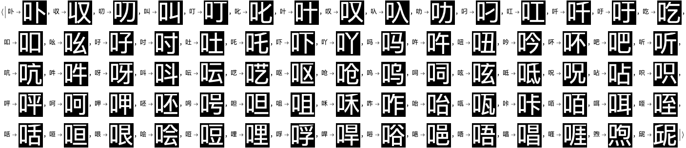
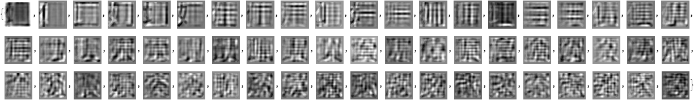
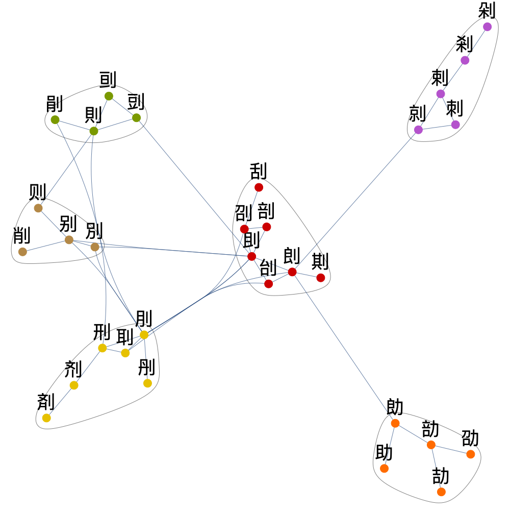
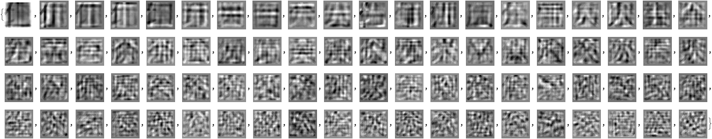
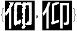

# Re-exploring the structure of Chinese character images

**Version 0.8**

Anton Antonov   
[MathematicaForPrediction at WordPress](http://mathematicaforprediction.wordpress.com)   
[MathematicaForPrediction at GitHub](https://github.com/antononcube/MathematicaForPrediction)   
April 2022  

## Introduction

In this notebook we show information retrieval and clustering techniques over images of Unicode collection of Chinese characters. Here is the outline of notebook's exposition:

1. Get Chinese character images.

1. Cluster "image vectors" and demonstrate that the obtained clusters have certain explainability elements.

1. Apply Latent Semantic Analysis (LSA) workflow to the character set.

1. Show visual thesaurus through a recommender system. (That uses Cosine similarity.)

1. Discuss graph and hierarchical clustering using LSA matrix factors.

1. Demonstrate approximation of "unseen" character images with an image basis obtained through LSA over a small set of (simple) images.

1. Redo character approximation with more "interpretable" image basis.

**Remark:** This notebook started as an (extended) comment for the Community discussion ["Exploring structure of Chinese characters through image processing"](https://community.wolfram.com/groups/-/m/t/2509775), [SH1]. (Hence the title.)

## Get Chinese character images

This code is a copy of the code in the [original Community post by Silvia Hao](https://community.wolfram.com/groups/-/m/t/2509775), [SH1]:


```mathematica
Module[{fsize = 50, width = 64, height = 64}, 
  lsCharIDs = Map[FromCharacterCode[#, "Unicode"] &, 16^^4E00 - 1 + Range[width height]]; 
 ]
```

```mathematica
charPage = Module[{fsize = 50, width = 64, height = 64}, 
    16^^4E00 - 1 + Range[width height] // pipe[
      FromCharacterCode[#, "Unicode"] & 
      , Characters, Partition[#, width] & 
      , Grid[#, Background -> Black, Spacings -> {0, 0}, ItemSize -> {1.5, 1.2}, Alignment -> {Center, Center}, Frame -> All, FrameStyle -> Directive[Red, AbsoluteThickness[3 \[Lambda]]]] & 
      , Style[#, White, fsize, FontFamily -> "Source Han Sans CN", FontWeight -> "ExtraLight"] & 
      , Rasterize[#, Background -> Black] & 
     ] 
   ];
chargrid = charPage // ColorDistance[#, Red] & // Image[#, "Byte"] & // Sign //Erosion[#, 5] &;
lmat = chargrid // MorphologicalComponents[#, Method -> "BoundingBox", CornerNeighbors -> False] &;
chars = ComponentMeasurements[{charPage // ColorConvert[#, "Grayscale"] &, lmat}, "MaskedImage", #Width > 10 &] // Values // Map@RemoveAlphaChannel;
chars = Module[{size = chars // Map@ImageDimensions // Max}, ImageCrop[#, {size, size}] & /@ chars];
```

Here is a sample of the obtained images:

```mathematica
SeedRandom[33];
RandomSample[chars, 5]
```


## Vector representation of images 

Define a function that represents an image into a linear vector space (of pixels):

```mathematica
Clear[ImageToVector];
ImageToVector[img_Image] := Flatten[ImageData[ColorConvert[img, "Grayscale"]]];
ImageToVector[img_Image, imgSize_] := Flatten[ImageData[ColorConvert[ImageResize[img, imgSize], "Grayscale"]]];
ImageToVector[___] := $Failed;
```

Show how vector represented images look like:

```mathematica
Table[BlockRandom[
   img = RandomChoice[chars]; 
   ListPlot[ImageToVector[img], Filling -> Axis, PlotRange -> All, PlotLabel -> img, ImageSize -> Medium, AspectRatio -> 1/6], 
   RandomSeeding -> rs], {rs, {33, 998}}]
```


```mathematica
\[AliasDelimiter]
```

## Data preparation

In this section we represent the images into a linear vector space. (In which each pixel is a basis vector.)

Make an association with images:

```mathematica
aCImages = AssociationThread[lsCharIDs -> chars];
Length[aCImages]

(*4096*)
```

Make flat vectors with the images:

```mathematica
AbsoluteTiming[
  aCImageVecs = ParallelMap[ImageToVector, aCImages]; 
 ]

(*{0.998162, Null}*)
```

Do matrix plots a random sample of the image vectors:

```mathematica
SeedRandom[32];
MatrixPlot[Partition[#, ImageDimensions[aCImages[[1]]][[2]]]] & /@ RandomSample[aCImageVecs, 6]
```


## Clustering over the image vectors

In this section we cluster "image vectors" and demonstrate that the obtained clusters have certain explainability elements. Expected Chinese character radicals are observed using image multiplication. 

Cluster the image vectors and show summary of the clusters lengths:

```mathematica
SparseArray[Values@aCImageVecs]
```


```mathematica
SeedRandom[334];
AbsoluteTiming[
  lsClusters = FindClusters[SparseArray[Values@aCImageVecs] -> Keys[aCImageVecs], 35, Method -> {"KMeans"}]; 
 ]
Length@lsClusters
ResourceFunction["RecordsSummary"][Length /@ lsClusters]

(*{24.6383, Null}*)

(*35*)
```


For each cluster:

- Take 30 different small samples of 7 images

- Multiply the images in each small sample

- Show three "most black" the multiplication results

```mathematica
SeedRandom[33];
Table[i -> TakeLargestBy[Table[ImageMultiply @@ RandomSample[KeyTake[aCImages, lsClusters[[i]]], UpTo[7]], 30], Total@ImageToVector[#] &, 3], {i, Length[lsClusters]}]
```


**Remark:** We can see that the clustering above produced "semantic" clusters -- most of the multiplied images show meaningful Chinese characters radicals and their "expected positions."

Here is one of the clusters with the radical "mouth":

```mathematica
KeyTake[aCImages, lsClusters[[26]]]
```



## LSAMon application

In this section we apply the "standard" LSA workflow, [AA1, AA4].

Make a matrix with named rows and columns from the image vectors:

```mathematica
mat = ToSSparseMatrix[SparseArray[Values@aCImageVecs], "RowNames" -> Keys[aCImageVecs], "ColumnNames" -> Automatic]
```


The following Latent Semantic Analysis (LSA) monadic pipeline is used in [AA2, AA2]:

```mathematica
SeedRandom[77];
AbsoluteTiming[
  lsaAllObj = 
    LSAMonUnit[]\[DoubleLongRightArrow]
     LSAMonSetDocumentTermMatrix[mat]\[DoubleLongRightArrow]
     LSAMonApplyTermWeightFunctions["None", "None", "Cosine"]\[DoubleLongRightArrow]
     LSAMonExtractTopics["NumberOfTopics" -> 60, Method -> "SVD", "MaxSteps" -> 15, "MinNumberOfDocumentsPerTerm" -> 0]\[DoubleLongRightArrow]
     LSAMonNormalizeMatrixProduct[Normalized -> Right]\[DoubleLongRightArrow]
     LSAMonEcho[Style["Obtained basis:", Bold, Purple]]\[DoubleLongRightArrow]
     LSAMonEchoFunctionContext[ImageAdjust[Image[Partition[#, ImageDimensions[aCImages[[1]]][[1]]]]] & /@SparseArray[#H] &]; 
 ]
```




```
(*{7.60828, Null}*)
```

**Remark:** LSAMon's corresponding theory and design are discussed in [AA1, AA4]:

Get the representation matrix:

```mathematica
W2 = lsaAllObj\[DoubleLongRightArrow]LSAMonNormalizeMatrixProduct[Normalized -> Right]\[DoubleLongRightArrow]LSAMonTakeW
```


Get the topics matrix:

```mathematica
H = lsaAllObj\[DoubleLongRightArrow]LSAMonNormalizeMatrixProduct[Normalized -> Right]\[DoubleLongRightArrow]LSAMonTakeH
```


Cluster the ***reduced dimension representations*** and show summary of the clusters lengths:

```mathematica
AbsoluteTiming[
  lsClusters = FindClusters[Normal[SparseArray[W2]] -> RowNames[W2], 40, Method -> {"KMeans"}]; 
 ]
Length@lsClusters
ResourceFunction["RecordsSummary"][Length /@ lsClusters]

(*{2.33331, Null}*)

(*40*)
```


Show cluster interpretations:

```mathematica
AbsoluteTiming[aAutoRadicals = Association@Table[i -> TakeLargestBy[Table[ImageMultiply @@ RandomSample[KeyTake[aCImages, lsClusters[[i]]], UpTo[8]], 30], Total@ImageToVector[#] &, 3], {i, Length[lsClusters]}]; 
 ]
aAutoRadicals

(*{0.878406, Null}*)
```


### Using FeatureExtraction

I experimented with clustering and approximation using WL's function [FeatureExtraction](https://reference.wolfram.com/language/ref/FeatureExtraction.html.en). Result are fairly similar as the above; timings a different (a few times slower.) 

## Visual thesaurus

In this section we use Cosine similarity to find visual nearest neighbors of Chinese character images.

```mathematica
matPixels = WeightTermsOfSSparseMatrix[lsaAllObj\[DoubleLongRightArrow]LSAMonTakeWeightedDocumentTermMatrix, "IDF", "None", "Cosine"];
matTopics = WeightTermsOfSSparseMatrix[lsaAllObj\[DoubleLongRightArrow]LSAMonNormalizeMatrixProduct[Normalized -> Left]\[DoubleLongRightArrow]LSAMonTakeW, "None", "None", "Cosine"];
```

```mathematica
smrObj = SMRMonUnit[]\[DoubleLongRightArrow]SMRMonCreate[<|"Topic" -> matTopics, "Pixel" -> matPixels|>];
```

Consider the character "團":

```mathematica
aCImages["團"]
```


Here are the nearest neighbors for that character found by using both image topics and image pixels:

```mathematica
(*focusItem=RandomChoice[Keys@aCImages];*)
  focusItem = {"團", "仼", "呔"}[[1]]; 
   smrObj\[DoubleLongRightArrow]
     SMRMonEcho[Style["Nearest neighbors by pixel topics:", Bold, Purple]]\[DoubleLongRightArrow]
     SMRMonSetTagTypeWeights[<|"Topic" -> 1, "Pixel" -> 0|>]\[DoubleLongRightArrow]
     SMRMonRecommend[focusItem, 8, "RemoveHistory" -> False]\[DoubleLongRightArrow]
     SMRMonEchoValue\[DoubleLongRightArrow]
     SMRMonEchoFunctionValue[AssociationThread[Values@KeyTake[aCImages, Keys[#]], Values[#]] &]\[DoubleLongRightArrow]
     SMRMonEcho[Style["Nearest neighbors by pixels:", Bold, Purple]]\[DoubleLongRightArrow]
     SMRMonSetTagTypeWeights[<|"Topic" -> 0, "Pixel" -> 1|>]\[DoubleLongRightArrow]
     SMRMonRecommend[focusItem, 8, "RemoveHistory" -> False]\[DoubleLongRightArrow]
     SMRMonEchoFunctionValue[AssociationThread[Values@KeyTake[aCImages, Keys[#]], Values[#]] &];
```


**Remark:** Of course, in the recommender pipeline above we can use both pixels and pixels topics. (With their contributions being weighted.)

## Graph clustering

In this section we demonstrate the use of graph communities to find similar groups of Chinese characters.

Here we take a sub-matrix of the reduced dimension matrix computed above:

```mathematica
W = lsaAllObj\[DoubleLongRightArrow]LSAMonNormalizeMatrixProduct[Normalized -> Right]\[DoubleLongRightArrow]LSAMonTakeW;
```

Here we find the similarity matrix between the characters and remove entries corresponding to "small" similarities:

```mathematica
matSym = Clip[W . Transpose[W], {0.78, 1}, {0, 1}];
```

Here we plot the obtained (clipped) similarity matrix:

```mathematica
MatrixPlot[matSym]
```


Here we:

- Take array rules of the sparse similarity matrix

- Drop the rules corresponding to the diagonal elements

- Convert the keys of rules into uni-directed graph edges

- Make the corresponding graph

- Find graph's connected components

- Show the number of connected components

- Show a tally of the number of nodes in the components

```mathematica
gr = Graph[UndirectedEdge @@@ DeleteCases[Union[Sort /@ Keys[SSparseMatrixAssociation[matSym]]], {x_, x_}]];
lsComps = ConnectedComponents[gr];
Length[lsComps]
ReverseSortBy[Tally[Length /@ lsComps], First]

(*138*)

(*{{1839, 1}, {31, 1}, {27, 1}, {16, 1}, {11, 2}, {9, 2}, {8, 1}, {7, 1}, {6, 5}, {5, 3}, {4, 8}, {3, 14}, {2, 98}}*)
```

Here we demonstrate the clusters of Chinese characters make sense:

```mathematica
aPrettyRules = Dispatch[Map[# -> Style[#, FontSize -> 36] &, Keys[aCImages]]]; CommunityGraphPlot[Subgraph[gr, TakeLargestBy[lsComps, Length, 10][[2]]], Method -> "SpringElectrical", VertexLabels -> Placed["Name", Above],AspectRatio -> 1, ImageSize -> 1000] /. aPrettyRules
```



**Remark:** By careful observation of the clusters and graph connections we can convince ourselves that the similarities are based on pictorial sub-elements (i.e. radicals) of the characters.

## Hierarchical clustering

In this section we apply hierarchical clustering to the reduced dimension representation of the Chinese character images.

Here we pick a cluster:

```mathematica
lsFocusIDs = lsClusters[[12]];
Magnify[ImageCollage[Values[KeyTake[aCImages, lsFocusIDs]]], 0.4]
```


Here is how we can make a dendrogram plot (not that useful here):

```mathematica
(*smat=W2\[LeftDoubleBracket]lsClusters\[LeftDoubleBracket]13\[RightDoubleBracket],All\[RightDoubleBracket];
Dendrogram[Thread[Normal[SparseArray[smat]]->Map[Style[#,FontSize->16]&,RowNames[smat]]],Top,DistanceFunction->EuclideanDistance]*)
```

Here is a heat-map plot with hierarchical clustering dendrogram (with tool-tips):

```mathematica
gr = HeatmapPlot[W2[[lsFocusIDs, All]], DistanceFunction -> {CosineDistance, None}, Dendrogram -> {True, False}];
gr /. Map[# -> Tooltip[Style[#, FontSize -> 16], Style[#, Bold, FontSize -> 36]] &, lsFocusIDs]
```


**Remark:** The plot above has tooltips with larger character images.

## Representing all characters with smaller set of basic ones

In this section we demonstrate that a relatively small set of simpler Chinese character images can be used to represent (or approxumate) the rest of the images.

**Remark:** We use the following heuristic: the simpler Chinese characters have the smallest amount of white pixels.

Obtain a training set of images -- that are the darkest -- and show a sample of that set :

```mathematica
{trainingInds, testingInds} = TakeDrop[Keys[SortBy[aCImages, Total[ImageToVector[#]] &]], 800];
SeedRandom[3];
RandomSample[KeyTake[aCImages, trainingInds], 12]
```


Show all training characters with an image collage:

```mathematica
Magnify[ImageCollage[Values[KeyTake[aCImages, trainingInds]], Background -> Gray, ImagePadding -> 1], 0.4]
```


Apply LSA monadic pipeline with the training characters only:

```mathematica
SeedRandom[77];
AbsoluteTiming[
  lsaPartialObj = 
    LSAMonUnit[]\[DoubleLongRightArrow]
     LSAMonSetDocumentTermMatrix[SparseArray[Values@KeyTake[aCImageVecs, trainingInds]]]\[DoubleLongRightArrow]
     LSAMonApplyTermWeightFunctions["None", "None", "Cosine"]\[DoubleLongRightArrow]
     LSAMonExtractTopics["NumberOfTopics" -> 80, Method -> "SVD", "MaxSteps" -> 120, "MinNumberOfDocumentsPerTerm" -> 0]\[DoubleLongRightArrow]
     LSAMonNormalizeMatrixProduct[Normalized -> Right]\[DoubleLongRightArrow]
     LSAMonEcho[Style["Obtained basis:", Bold, Purple]]\[DoubleLongRightArrow]
     LSAMonEchoFunctionContext[ImageAdjust[Image[Partition[#, ImageDimensions[aCImages[[1]]][[1]]]]] & /@SparseArray[#H] &]; 
 ]
```




```
(*{0.826489, Null}*)
```

Get the matrix and basis interpretation of the extracted image topics:

```mathematica
H = 
   lsaPartialObj\[DoubleLongRightArrow]
    LSAMonNormalizeMatrixProduct[Normalized -> Right]\[DoubleLongRightArrow]
    LSAMonTakeH;
lsBasis = ImageAdjust[Image[Partition[#, ImageDimensions[aCImages[[1]]][[1]]]]] & /@ SparseArray[H];
```

### Approximation of "unseen" characters

Pick a Chinese character image as a target image and pre-process it:

```mathematica
ind = RandomChoice[testingInds];
imgTest = aCImages[ind];
matImageTest = ToSSparseMatrix[SparseArray@List@ImageToVector[imgTest, ImageDimensions[aCImages[[1]]]], "RowNames" -> Automatic, "ColumnNames" -> Automatic];
imgTest
```


Find its representation with the chosen feature extractor (LSAMon object here):

```mathematica
matReprsentation = lsaPartialObj\[DoubleLongRightArrow]LSAMonRepresentByTopics[matImageTest]\[DoubleLongRightArrow]LSAMonTakeValue;
lsCoeff = Normal@SparseArray[matReprsentation[[1, All]]];
ListPlot[MapIndexed[Tooltip[#1, lsBasis[[#2[[1]]]]] &, lsCoeff], Filling -> Axis, PlotRange -> All]
```


Show representation coefficients outliers:

```mathematica
lsBasis[[OutlierPosition[Abs[lsCoeff], TopOutliers@*HampelIdentifierParameters]]]
```


Show the interpretation of the found representation:

```mathematica
vecReprsentation = lsCoeff . SparseArray[H];
reprImg = Image[Unitize@Clip[#, {0.45, 1}, {0, 1}] &@Rescale[Partition[vecReprsentation, ImageDimensions[aCImages[[1]]][[1]]]]];
{reprImg, imgTest}
```



See the closest characters using image distances:

```mathematica
KeyMap[# /. aCImages &, TakeSmallest[ImageDistance[reprImg, #] & /@ aCImages, 4]]
```


**Remark:** By applying the approximation procedure to all characters in testing set we can convince ourselves that small, training set provides good retrieval. (Not done here.)

## Finding more interpretable bases

In this section we show how to use LSA workflow with [Non-Negative Matrix Factorization (NNMF)](https://resources.wolframcloud.com/FunctionRepository/resources/NonNegativeMatrixFactorization) over an image set extended with already extracted "topic" images.

### Cleaner automatic radicals

```mathematica
aAutoRadicals2 = Map[Dilation[Binarize[DeleteSmallComponents[#]], 0.5] &, First /@ aAutoRadicals]
```


Here we take an image union in order to remove the "duplicated" radicals:

```mathematica
aAutoRadicals3 = AssociationThread[Range[Length[#]], #] &@Union[Values[aAutoRadicals2], SameTest -> (ImageDistance[#1, #2] < 14.5 &)]
```


### LSAMon pipeline with NNMF

Make a matrix with named rows and columns from the image vectors:

```mathematica
mat1 = ToSSparseMatrix[SparseArray[Values@aCImageVecs], "RowNames" -> Keys[aCImageVecs], "ColumnNames" -> Automatic]
```


Enhance the matrix with radicals instances:

```mathematica
mat2 = ToSSparseMatrix[SparseArray[Join @@ Map[Table[ImageToVector[#], 100] &, Values[aAutoRadicals3]]], "RowNames" -> Automatic, "ColumnNames" -> Automatic];
mat3 = RowBind[mat1, mat2];
```

Apply the LSAMon workflow pipeline with NNMF for topic extraction:

```mathematica
SeedRandom[77];
AbsoluteTiming[
  lsaAllExtendedObj = 
    LSAMonUnit[]\[DoubleLongRightArrow]
     LSAMonSetDocumentTermMatrix[mat3]\[DoubleLongRightArrow]
     LSAMonApplyTermWeightFunctions["None", "None", "Cosine"]\[DoubleLongRightArrow]
     LSAMonExtractTopics["NumberOfTopics" -> 60, Method -> "NNMF", "MaxSteps" -> 15, "MinNumberOfDocumentsPerTerm" -> 0]\[DoubleLongRightArrow]
     LSAMonNormalizeMatrixProduct[Normalized -> Right]\[DoubleLongRightArrow]
     LSAMonEcho[Style["Obtained basis:", Bold, Purple]]\[DoubleLongRightArrow]
     LSAMonEchoFunctionContext[ImageAdjust[Image[Partition[#, ImageDimensions[aCImages[[1]]][[1]]]]] & /@SparseArray[#H] &]; 
 ]
```


```
(*{155.289, Null}*)
```

**Remark:** Note that NNMF "found" the interpretable radical images we enhanced the original image set with.

Get the matrix and basis interpretation of the extracted image topics:

```mathematica
H = 
   lsaAllExtendedObj\[DoubleLongRightArrow]
    LSAMonNormalizeMatrixProduct[Normalized -> Right]\[DoubleLongRightArrow]
    LSAMonTakeH;
lsBasis = ImageAdjust[Image[Partition[#, ImageDimensions[aCImages[[1]]][[1]]]]] & /@ SparseArray[H];
```

### Approximation

Pick a Chinese character image as a target image and pre-process it:

```mathematica
SeedRandom[43];
ind = RandomChoice[testingInds];
imgTest = aCImages[ind];
matImageTest = ToSSparseMatrix[SparseArray@List@ImageToVector[imgTest, ImageDimensions[aCImages[[1]]]], "RowNames" -> Automatic, "ColumnNames" -> Automatic];
imgTest
```


Find its representation with the chosen feature extractor (LSAMon object here):

```mathematica
matReprsentation = lsaAllExtendedObj\[DoubleLongRightArrow]LSAMonRepresentByTopics[matImageTest]\[DoubleLongRightArrow]LSAMonTakeValue;
lsCoeff = Normal@SparseArray[matReprsentation[[1, All]]];
ListPlot[MapIndexed[Tooltip[#1, lsBasis[[#2[[1]]]]] &, lsCoeff], Filling -> Axis, PlotRange -> All]
```


Show representation coefficients outliers:

```mathematica
lsBasis[[OutlierPosition[Abs[lsCoeff], TopOutliers@*QuartileIdentifierParameters]]]
```


**Remark:** Note that ***expected*** radical images are in the outliers.

Show the interpretation of the found representation:

```mathematica
vecReprsentation = lsCoeff . SparseArray[H];
reprImg = Image[Unitize@Clip[#, {0.45, 1}, {0, 1}] &@Rescale[Partition[vecReprsentation, ImageDimensions[aCImages[[1]]][[1]]]]];
{reprImg, imgTest}
```


See the closest characters using image distances:

```mathematica
KeyMap[# /. aCImages &, TakeSmallest[ImageDistance[reprImg, #] & /@ aCImages, 4]]
```


## Setup

```mathematica
Import["https://raw.githubusercontent.com/antononcube/MathematicaForPrediction/master/MonadicProgramming/MonadicLatentSemanticAnalysis.m"];
Import["https://raw.githubusercontent.com/antononcube/MathematicaForPrediction/master/MonadicProgramming/MonadicSparseMatrixRecommender.m"];
Import["https://raw.githubusercontent.com/antononcube/MathematicaForPrediction/master/Misc/HeatmapPlot.m"]
```

## References

[SH1] Silvia Hao, ["Exploring structure of Chinese characters through image processing"](https://community.wolfram.com/groups/-/m/t/2509775), (2022), [Wolfram Community](https://community.wolfram.com).

[AA1] Anton Antonov, ["A monad for Latent Semantic Analysis workflows"](https://community.wolfram.com/groups/-/m/t/1789024), (2019), [Wolfram Community](https://community.wolfram.com).

[AA2] Anton Antonov, ["LSA methods comparison over random mandalas deconstruction -- WL"](https://community.wolfram.com/groups/-/m/t/2508248), (2022), [Wolfram Community](https://community.wolfram.com).

[AA3] Anton Antonov, ["Bethlehem stars: classifying randomly generated mandalas"](https://community.wolfram.com/groups/-/m/t/2143094), (2020), [Wolfram Community](https://community.wolfram.com).

[AAp1] Anton Antonov, [LSAMon for Image Collections Mathematica package](https://github.com/antononcube/MathematicaForPrediction/blob/master/Misc/LSAMonForImageCollections.m), (2022), [MathematicaForPrediction at GitHub](https://github.com/antononcube/MathematicaForPrediction).
