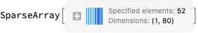

# Text similarities through bags of words

Anton Antonov
[SimplifiedMachineLearningWorkflow-book at GitHub](https://github.com/antononcube/SimplifiedMachineLearningWorkflows-book)
January 2020

## Introduction

In this notebook we discuss and exemplify different approaches for measuring similarities between texts. We disregard the sequential structure of the texts, we use the so called Bag-of-words model.

All methodological explanations are general -- they apply for any two texts. The illustrating examples are based on conference abstracts. A (preliminary) version of this document was published on [https://mathematica.stackexchange.com](https://mathematica.stackexchange.com); see [AA2].

### Problem formulation

We want to compare two texts and measure their degree of similarity. 

We want the similarity to be conditioned by (1) the contexts provided by the two texts and (2) a larger context of texts of similar type.

Remark: We call the two texts the “focus texts”. We call the large context texts the “external corpus”.

### Example texts

In this notebook we select two rstudio::conf 2019 abstracts, [AAd1],  to be the focus texts. 

The external corpus is made of $584$ Wolfram Technology Conference (WTC) abstracts. 

## Approaches

If we consider the applications of the models Bag-or-words and/or Linear vector space for doing Natural Language Processing (NLP) adequate -- meaning we can ignore the sequential order of the words -- then we can apply Latent Semantic Analysis (LSA) methods and techniques. The examples in this notebook use the package ["MonadicLatentSemanticAnalysis.m"](https://github.com/antononcube/MathematicaForPrediction/blob/master/MonadicProgramming/MonadicLatentSemanticAnalysis.m) (LSAMon below.) See [AA1, AAp1].

In this notebook are shown several approaches related to the Bag-or-words or Linear vector space models.

   + The out-of-the-box solution is the first approach, which uses Mathematica’s built-in (experimental) function FeatureExtraction. 

   + What happens under the hood in the first approach is explained and illustrated in the second and third approaches. 

The second and third approaches are also documented in [AA1, AAr1].

## Data

We have a “large” dataset of $584$ WTC abstracts, and a “small” dataset of $61$ rstudio::conf abstracts.

The abstracts datasets [AAd1] and [AAd2] are provided in [the data folder](https://github.com/antononcube/SimplifiedMachineLearningWorkflows-book/tree/master/Data) of the book repository, [[AAr1](https://github.com/antononcube/SimplifiedMachineLearningWorkflows-book/)].

### Read rstudio-conf-2019 abstracts

```mathematica
dsRSCAbstracts=ResourceFunction["ImportCSVToDataset"]["https://raw.githubusercontent.com/antononcube/SimplifiedMachineLearningWorkflows-book/master/Data/RStudio-conf-2019-abstracts.csv"];
    Length[dsRSCAbstracts]

(*61*)
```

```mathematica
RandomSample[dsRSCAbstracts,3]
```


### Read WTC-2019 abstracts

```mathematica
dsWTCAbstracts=ResourceFunction["ImportCSVToDataset"]["https://raw.githubusercontent.com/antononcube/SimplifiedMachineLearningWorkflows-book/master/Data/Wolfram-Technology-Conference-2016-to-2019-abstracts.csv"];
    Length[dsWTCAbstracts]

(*584*)
```

```mathematica
RandomSample[dsWTCAbstracts,3]
```


## Texts to compare

Here we select an rstudio::conf abstract:

```mathematica
txt1=dsRSCAbstracts[12,"Abstract"]

(*"RStudio Package Manager is the newest professional product that helps teams, departments, and entire enterprises organize and centralize package management. If you\[CloseCurlyQuote]ve ever struggled with IT to get access to a new (any?) R package, reproduce an old result, or share your code with others, RStudio Package Manager can help! We\[CloseCurlyQuote]ll introduce the new product, discuss how R repositories can be used to solve problems and take a sneak peek at what is coming in 2019."*)
```

Here we pick a second abstract:

```mathematica
txt2=dsRSCAbstracts[56,"Abstract"]

(*"My talk will discuss how R, the tidyverse, and the community around R helped me to learn to code and create my first R package. My positive experiences with the resources for learning R and the community itself led me to create a blog detailing my experiences with R as a way to pass along the knowledge that I gained. The next step was to develop my first package. The debkeepr package integrates non-decimal monetary systems of pounds, shillings, and pence into R, making it possible to accurately analyze and visualize historical account books. It is my hope that debkeepr can help bring to light crucial and interesting social interactions that are buried in economic manuscripts, making these stories accessible to a wider audience."*)
```

## Using the two texts only (FeatureExtraction)

This section shows direct application of Mathematica’s built-in NLP feature representation functionalities. Note the conceptual simplicity: we extract features and then compute the similarity of any two texts using the distance function derived from the feature representation.

```mathematica
text=StringJoin[txt1,txt2];
    sentences=StringSplit[text,{".","?","!",";"}];
```

```mathematica
fed=FeatureExtraction[DeleteStopwords@sentences,"TFIDF","FeatureDistance"]
```


```mathematica
fed[txt1,txt2]

(*0.306679*)
```

Remark: Note that below we use Cosine Similarity, not Euclidean Distance, which is used in this section.

## Using the two texts only (LSAMon)

   1. Join the texts and partition the result into sentences.

   2. For each sentence:

      1. extract words,

      2. delete stop words,

      3. stem the rest of the words.

   3. Make a sentence-word contingency matrix.

   4. Apply LSI weighting functions to the contingency matrix.

   5. Extract topics.

   6. Represent each of the texts into the space of sentence-word matrix.

   7. Represent each of the texts into the space of sentence-topic matrix.

   8. Using the representations compute similarities between the texts with Cosine similarity. (Or with other metrics.)

The steps above are easily done with the software monad LSAMon.

The topics extraction is done in order to put the sentence contexts into the similarity computation. (As requested by OP.)

Selecting different LSI functions and number of topics produces different results. The application of the weight functions {"IDF", "None", "Cosine"} corresponds to "TFIDF" used in [FeatureExtraction](https://reference.wolfram.com/language/ref/FeatureExtraction.html). (Although, I am not sure is the "Cosine" normalization applied or not.)

Below are given illustrating examples.

### Document-term matrix and topics

```mathematica
SeedRandom[234];
    lsaTwoTexts=
    LSAMonUnit[sentences]⟹
    LSAMonMakeDocumentTermMatrix[Automatic,Automatic]⟹
    LSAMonEchoDocumentTermMatrixStatistics⟹
    LSAMonApplyTermWeightFunctions["IDF","None","Cosine"]⟹
    LSAMonExtractTopics["NumberOfTopics"->4,"MinNumberOfDocumentsPerTerm"->1]⟹
    LSAMonEchoTopicsTable["NumberOfTableColumns"->4];
```


### Vector representation

```mathematica
sMat1=
    lsaTwoTexts⟹
    LSAMonRepresentByTerms[ToLowerCase@txt1]⟹
    LSAMonEchoFunctionValue[MatrixForm[#1[[All,Keys[Select[ColumnSumsAssociation[#1],#1>0&]]]]]&]⟹
    LSAMonTakeValue
```


```mathematica
sMat2=
    lsaTwoTexts⟹
    LSAMonRepresentByTerms[ToLowerCase@txt2]⟹
    LSAMonEchoFunctionValue[MatrixForm[#1[[All,Keys[Select[ColumnSumsAssociation[#1],#1>0&]]]]]&]⟹
    LSAMonTakeValue
```




```mathematica
Norm@*SparseArray/@{sMat1,sMat2}

(*{1.,1.}*)
```

```mathematica
MatrixForm[sMat1.Transpose[sMat2]]
```


### Topics representation

```mathematica
sMat1=
    lsaTwoTexts⟹
    LSAMonRepresentByTopics[txt1]⟹
    LSAMonEchoFunctionValue[MatrixForm[#1[[All,Keys[Select[ColumnSumsAssociation[#1],#1>0&]]]]]&]⟹
    LSAMonTakeValue;
    sMat1=WeightTermsOfSSparseMatrix[sMat1,"None","None","Cosine"]
```


```mathematica
TakeLargest[ColumnSumsAssociation[sMat1],UpTo[6]]

(*\[LeftAssociation]"manag-code-rstudio"->0.723883,"we\[CloseCurlyQuote]ll-us-solv"->0.642064,"access-you\[CloseCurlyQuote]ve-struggl"->0.250924,"step-develop-packag"->-0.0280111\[RightAssociation]*)
```

```mathematica
sMat2=
    lsaTwoTexts⟹
    LSAMonRepresentByTopics[txt2]⟹
    LSAMonEchoFunctionValue[MatrixForm[#1[[All,Keys[Select[ColumnSumsAssociation[#1],#1>0&]]]]]&]⟹
    LSAMonTakeValue;
    sMat2=WeightTermsOfSSparseMatrix[sMat2,"None","None","Cosine"]
```


```mathematica
TakeLargest[ColumnSumsAssociation[sMat2],UpTo[6]]

(*\[LeftAssociation]"access-you\[CloseCurlyQuote]ve-struggl"->0.647325,"manag-code-rstudio"->0.4847,"we\[CloseCurlyQuote]ll-us-solv"->0.481714,"step-develop-packag"->0.337621\[RightAssociation]*)
```

```mathematica
Norm@*SparseArray/@{sMat1,sMat2}

(*{1.,1.}*)
```

```mathematica
MatrixForm[sMat1.Transpose[sMat2]]
```


## External corpus LSA monad object

In this section we execute a standard LSAMon pipeline described in [AA1] over the external text corpus, the abstracts in [AAd2].

```mathematica
aWTCDesriptions=Association@Normal@dsWTCAbstracts[All,#ID->#Abstract&];
```

```mathematica
SeedRandom[132];
    lsaObjWTC=
    LSAMonUnit[aWTCDesriptions]⟹
    LSAMonMakeDocumentTermMatrix[{},Automatic]⟹
    LSAMonApplyTermWeightFunctions["IDF","TermFrequency","Cosine"]⟹
    LSAMonExtractTopics["NumberOfTopics"->24,"MinNumberOfDocumentsPerTerm"->2,Method->"NNMF",MaxSteps->12]⟹
    LSAMonEchoTopicsTable["NumberOfTableColumns"->6];
```


Note that the extracted topics do make sense!

## Using a large, external text corpus

In the sequence of steps above we can use an external, large text corpus to make a document-term matrix and to derive a document-topics matrix. The two texts are represented in the topic space of that matrix.

Below are given results using WTC abstracts.

Note that in the examples below the computed similarities values are much larger than the corresponding local-context-only values. Also, note that the similarity values based on topics representation is much large than the similarity value based on terms.

### Vector representation

```mathematica
sMat1=
    lsaObjWTC⟹
    LSAMonRepresentByTerms[ToLowerCase@txt1]⟹
    LSAMonEchoFunctionValue[MatrixForm[#1[[All,Keys[Select[ColumnSumsAssociation[#1],#1>0&]]]]]&]⟹
    LSAMonTakeValue
```


```mathematica
sMat2=
    lsaObjWTC⟹
    LSAMonRepresentByTerms[ToLowerCase@txt2]⟹
    LSAMonEchoFunctionValue[MatrixForm[#1[[All,Keys[Select[ColumnSumsAssociation[#1],#1>0&]]]]]&]⟹
    LSAMonTakeValue
```


```mathematica
Norm@*SparseArray/@{sMat1,sMat2}

(*{1.,1.}*)
```

```mathematica
MatrixForm[sMat1.Transpose[sMat2]]
```


### Topics representation

```mathematica
sMat1=
    lsaObjWTC⟹
    LSAMonRepresentByTopics[txt1]⟹
    LSAMonEchoFunctionValue[MatrixForm[#1[[All,Keys[Select[ColumnSumsAssociation[#1],#1>0&]]]]]&]⟹
    LSAMonTakeValue;
    sMat1=WeightTermsOfSSparseMatrix[sMat1,"None","None","Cosine"]
```


```mathematica
TakeLargest[ColumnSumsAssociation[sMat1],UpTo[6]]

(*\[LeftAssociation]"editor-database-package"->0.723932,"capabilities-system-modeler"->0.499792,"step-wolfram|alpha-come"->0.144043,"asymptotic-expansions-exact"->0.131599,"vector-evaluation-missing"->0.129976,"audio-sylva-educators"->0.122492\[RightAssociation]*)
```

```mathematica
sMat2=
    lsaObjWTC⟹
    LSAMonRepresentByTopics[txt2]⟹
    LSAMonEchoFunctionValue[MatrixForm[#1[[All,Keys[Select[ColumnSumsAssociation[#1],#1>0&]]]]]&]⟹
    LSAMonTakeValue;
    sMat2=WeightTermsOfSSparseMatrix[sMat2,"None","None","Cosine"]
```


```mathematica
TakeLargest[ColumnSumsAssociation[sMat2],UpTo[6]]

(*\[LeftAssociation]"step-wolfram|alpha-come"->0.662669,"editor-database-package"->0.471512,"audio-sylva-educators"->0.305272,"ios-player-attachments"->0.244223,"notations-boxes-workshop"->0.21123,"face-chain-gap"->0.179348\[RightAssociation]*)
```

```mathematica
Norm@*SparseArray/@{sMat1,sMat2}

(*{1.,1.}*)
```

```mathematica
MatrixForm[sMat1.Transpose[sMat2]]
```


## Using Neural Net encoding

Similar to the previous approach that uses an external corpus we can use some of the existing, popular Neural net encoders of texts and compute similarities based on those representations. (We are not doing that in this notebook.)

## References

### Articles

[AA1] Anton Antonov, [A monad for Latent Semantic Analysis workflows](https://github.com/antononcube/MathematicaForPrediction/blob/master/MarkdownDocuments/A-monad-for-Latent-Semantic-Analysis-workflows.md), (2019), [MathematicaForPrediction at GitHub](https://github.com/antononcube/MathematicaForPrediction).

[AA2] Anton Antonov, [MSE answer to "Compare two texts and find differences and similarities"](https://mathematica.stackexchange.com/a/207165/34008), (2019), [MathematicaStackExchange](https://mathematica.stackexchange.com).

### Data

[AAd1] Anton Antonov, [RStudio::conf-2019-abstracts.csv](https://github.com/antononcube/SimplifiedMachineLearningWorkflows-book/blob/master/Data/RStudio-conf-2019-abstracts.csv), (2020), [SimplifiedMachineLearningWorkflows-book at GitHub](https://github.com/antononcube/SimplifiedMachineLearningWorkflows-book).

[AAd2] Anton Antonov, [Wolfram-Technology-Conference-2016-to-2019-abstracts.csv](https://github.com/antononcube/SimplifiedMachineLearningWorkflows-book/blob/master/Data/Wolfram-Technology-Conference-2016-to-2019-abstracts.csv), (2020), [SimplifiedMachineLearningWorkflows-book at GitHub](https://github.com/antononcube/SimplifiedMachineLearningWorkflows-book).

### Packages & repositories

[AAp1] Anton Antonov, [Monadic Latent Semantic Analysis Mathematica packag](https://github.com/antononcube/MathematicaForPrediction/blob/master/MonadicProgramming/MonadicLatentSemanticAnalysis.m)e, (2017), [MathematicaForPrediction at GitHub](https://github.com/antononcube/MathematicaForPrediction).

[AAr1] Anton Antonov, [Simplified Machine Learning Workflows](https://github.com/antononcube/SimplifiedMachineLearningWorkflows-book), 2019, GitHub.

