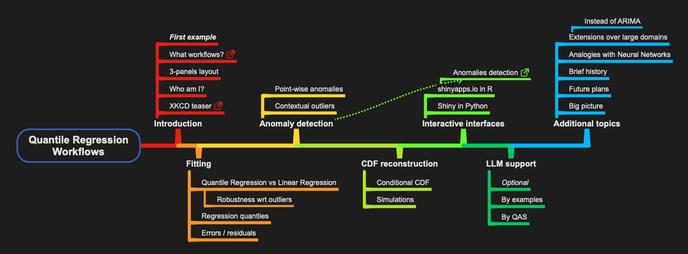

# Quantile Regression Workflows

[Presentation for **Data Science South FL 2025 Lightning Talks**](https://www.meetup.com/data-science-study-group-south-florida/events/303863864/)

January 25, 2025

ABSTRACT:

> This talk showcases and exemplifies the rapid specification and execution of Quantile Regression workflows. 
> Various use cases are discussed, including fitting, outlier detection, conditional CDFs, and simulations, using different types of time series data.
> Anomaly detection is discussed via interactive interface.

- [Presentation notebook](./DSSG-SouthFL-2025-Presentation.ipynb)

- ["Regressionizer" package features notebook](./Regressionizer-package-features.ipynb)

- [1D outlier identifiers notebook](./1D-outlier-identifiers.ipynb)

-----

## Mind-map of the presentation

----

## References

### Articles, books

[RK1] Roger Koenker,
[Quantile Regression](https://books.google.com/books/about/Quantile_Regression.html?id=hdkt7V4NXsgC),
Cambridge University Press, 2005.

[RK2] Roger Koenker,
["Quantile Regression in R: a vignette"](https://cran.r-project.org/web/packages/quantreg/vignettes/rq.pdf),
(2006),
[CRAN](https://cran.r-project.org/).

[AA1] Anton Antonov,
["A monad for Quantile Regression workflows"](https://github.com/antononcube/MathematicaForPrediction/blob/master/MarkdownDocuments/A-monad-for-Quantile-Regression-workflows.md),
(2018),
[MathematicaForPrediction at GitHub](https://github.com/antononcube/MathematicaForPrediction).

### Packages, paclets

[AAp1] Anton Antonov,
[Quantile Regression Python package](https://github.com/antononcube/Python-Regressionizer),
(2024),
[GitHub/antononcube](https://github.com/antononcube).

[AAp2] Anton Antonov,
[`QRMon-R`](https://github.com/antononcube/QRMon-R),
(2019),
[GitHub/antononcube](https://github.com/antononcube).

[AAp3] Anton Antonov,
[Quantile Regression WL paclet](https://github.com/antononcube/WL-QuantileRegression-paclet),
(2014-2023),
[GitHub/antononcube](https://github.com/antononcube).

[AAp4] Anton Antonov,
[Monadic Quantile Regression WL paclet](https://github.com/antononcube/WL-MonadicQuantileRegression-paclet),
(2018-2024),
[GitHub/antononcube](https://github.com/antononcube).

[AAf1] Anton Antonov,
[`QuantileRegression`](https://resources.wolframcloud.com/FunctionRepository/resources/QuantileRegression),
(2019),
[Wolfram Function Repository](https://resources.wolframcloud.com/FunctionRepository/resources/QuantileRegression).

[RKp1] Roger Koenker,
[`quantreg`](https://cran.r-project.org/web/packages/quantreg/index.html),
[CRAN](https://cran.r-project.org/).

### Repositories

[AAr1] Anton Antonov,
[DSL::English::QuantileRegressionWorkflows in Raku](https://github.com/antononcube/Raku-DSL-English-QuantileRegressionWorkflows),
(2020),
[GitHub/antononcube](https://github.com/antononcube/Raku-DSL-English-QuantileRegressionWorkflows).

### Videos

[AAv1] Anton Antonov,
["Boston useR! QuantileRegression Workflows 2019-04-18"](https://www.youtube.com/watch?v=a_Dk25xarvE),
(2019),
[Anton Antonov at YouTube](https://www.youtube.com/@AAA4Prediction).

[AAv2] Anton Antonov,
["useR! 2020: How to simplify Machine Learning workflows specifications"](https://www.youtube.com/watch?v=b9Uu7gRF5KY),
(2020),
[R Consortium at YouTube](https://www.youtube.com/channel/UC_R5smHVXRYGhZYDJsnXTwg).