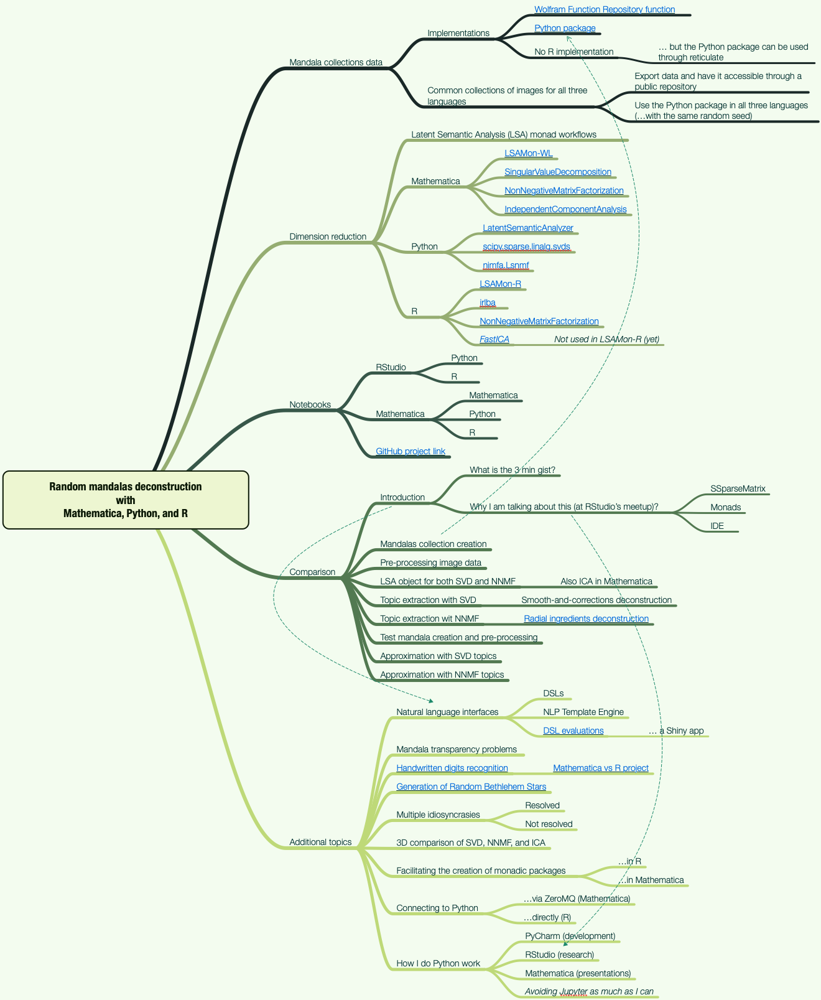
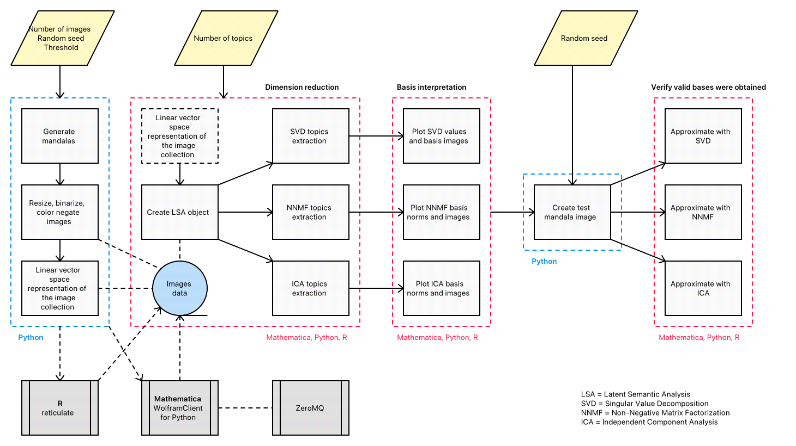

# Random mandalas deconstruction with R, Python, and Mathematica

***Presented by Anton Antonov***   
***[Boston useR Meetup](https://www.meetup.com/Boston-useR/events/284045968/)***   
***2022-02-28***

### Abstract 

In this presentation we discuss the application of different dimension reduction algorithms over collections of random mandalas.
We discuss and compare the derived image bases and show how those bases explain the underlying collection structure.
The presented techniques and insights (1) are applicable to any collection of images, and (2) can be included in larger,
more complicated machine learning workflows. The former is demonstrated with a handwritten digits recognition application;
the latter with the generation of random Bethlehem stars. The (parallel) walk-through of the core demonstration is in
all three programming languages: Mathematica, Python, and R.

### Speaker Bio 

Anton is an applied mathematician (Ph.D.) with 30+ years of experience in algorithm development,
scientific computing, mathematical modeling, natural language processing, combinatorial optimization, research and development programming,
machine learning, and data mining. In the last ten years, he focused on developing machine learning algorithms and workflows for
different industries (music, movies, recruiting, healthcare.)

-------

Here is the related RStudio project: ["RandomMandalasDeconstruction"](./RandomMandalasDeconstruction).

Here is a link to the R-computations notebook converted to HTML: 
["LSA methods comparison in R"](https://htmlpreview.github.io/?https://raw.githubusercontent.com/antononcube/SimplifiedMachineLearningWorkflows-book/master/Presentations/Greater-Boston-useR-Group-Meetup-2022/RandomMandalasDeconstruction/notebooks/LSA-methods-comparison-R.nb.html).

The Mathematica notebooks are placed in project's folder 
["notebooks-WL"](./RandomMandalasDeconstruction/notebooks-WL).

-------

See the work plan status in the [org-mode](https://orgmode.org) file 
["Random-mandalas-deconstruction-presentation-work-plan.org"](./org/Random-mandalas-deconstruction-presentation-work-plan.org).

Here is the mind-map for the presentation:

------

The comparison workflow implemented in the notebooks of this project is summarized in the following flow chart:

-------
Anton Antonov    
Florida, USA    
2022-02-27
