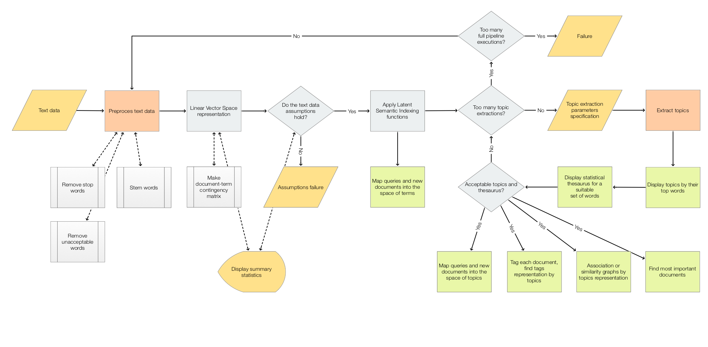
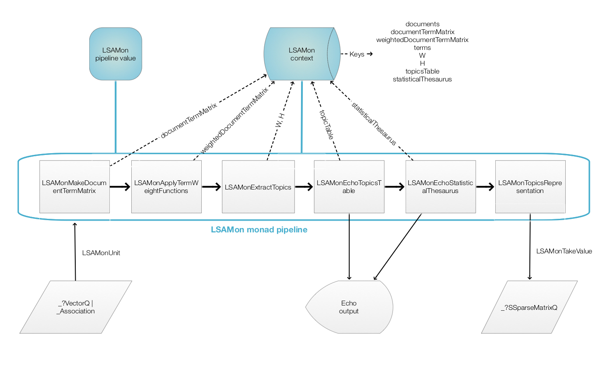

# Latent Semantic Analysis workflows 
***useR! Meetup Boston, April 2020***   
***Extended abstract***

## In brief

In this (tutorial) presentation  we are going to:
1. overview Latent Semantic Analysis (LSA) typical problems and basic workflows;
2. discus philosophical, scientific, and mathematical justifications; 
2. follow LSA's application to document collections in more detail;
3. discuss the theory behind the dimension reduction algorithms used (ICA, NNMF, SVD) and how they compare;
4. see applications to making or supporting search engines;
5. see applications to image collections classification and generation.

The presentation is based on the (monadic) R package LSAMon: 
https://github.com/antononcube/R-packages/tree/master/LSAMon-R .

(A large cycle of LSA tutorial lectures is given 
[here](https://github.com/antononcube/SimplifiedMachineLearningWorkflows-book/tree/master/Tutorials/WolframU-LSAMon-workflows).)

## Part 1 - Overview

The first part we are going to clarify the basics of LSA's theory and methodology by providing answers to 
the following list of questions.

   - What are the typical applications of LSA?   
   - Why use LSA?     
   - What it the fundamental philosophical or scientific assumption for LSA?   
   - What is the most important and/or fundamental step of LSA?   
   - What is the difference between LSA and Latent Semantic Indexing (LSI)?   
   - What are the alternatives?
     - Using Neural Networks instead?   
   - How is LSA used to derive similarities between two given texts?   
   - How is LSA used to evaluate the proximity of phrases?
     (That have different words, but close semantic meaning.)   
   - How the main dimension reduction methods compare? 

### Dimensional reduction algorithms

Here is a list of the 
[Dimensional reduction](https://en.wikipedia.org/wiki/Dimensionality_reduction) 
algorithms discussed in the tutorial (and used by `LSAMon`):

- [Independent Component Analysis](https://en.wikipedia.org/wiki/Independent_component_analysis),

- [Non-Negative Matrix Factorization (NNMF)](https://en.wikipedia.org/wiki/Non-negative_matrix_factorization),

- [Singular Value Decomposition (SVD)](https://en.wikipedia.org/wiki/Singular_value_decomposition).

(The most important is NNMF, the application of which is one of the primary reasons for developing `LSAMon`.)

## Part 2 - Applications

In the second part to the tutorial were a going to look into concrete applications
derived from different practical uses cases. 
(From digital content consumption, industry, academic research, and other fields.)  

A list of LSA applications examples follows.
 
- How to utilize LSA for document similarities evaluations?  
  (Like ["Conference Abstracts Similarities"](https://htmlpreview.github.io/?https://github.com/antononcube/MathematicaVsR/blob/master/Projects/ConferenceAbstactsSimilarities/R/ConferenceAbstractsSimilarities.nb.html).)

- How to apply LSA to image classification? 
  (Like ["Handwritten digits classification by matrix factorization"](https://cdn.rawgit.com/antononcube/MathematicaVsR/master/Projects/HandwrittenDigitsClassificationByMatrixFactorization/R/HandwrittenDigitsClassificationByMatrixFactorization.html).) 

- How to apply LSA to [Great Conversation](https://en.wikipedia.org/wiki/Great_Conversation) studies?

- How to derive a custom taxonomy over a document collection?

- How to use LSA for translation of natural languages?

- How to use LSA for making or improving search engines?

- (Others...)

## Data 

(Most of) the data used in the tutorial is available 
[here](../../Data). 

## Visual aids

Here is a flow chart diagram that tracks the LSA workflows:

Here is `LSAMon` pipeline diagram:

