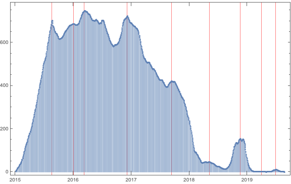
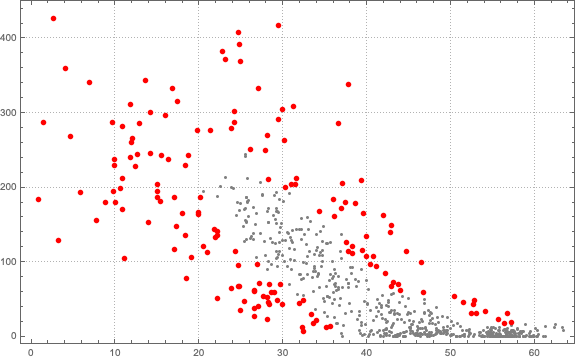
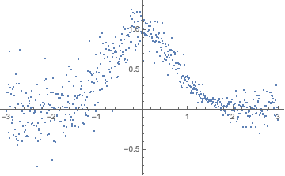

# Anomalies, breaks, and outliers detection in time series

**Anton Antonov**      
**Accendo Data LLC**   

 

---

## ABSTRACT  

In this presentation we show, explain, and compare methods for finding anomalies, breaks, and outliers in time series. 
We are interested in finding anomalies in both a single time series and a collection of time series.

We (mostly) employ non-parametric methods. First, we look at some motivational examples from well known datasets.
Then we look into definitions of anomalies and definitions for measuring success of time series anomaly detection. 

For a single time series we apply both WL built-in algorithms and additional, specialized algorithms. We discuss in more detail algorithms based on K-Nearest Neighbors (KNN), Dimension Reduction, Linear Regression, Quantile Regression, Prefix Trees.

For collections of time series we discuss: transformations into uniform representations, simple outlier finding based on variables distributions, anomalous trends finding, anomalies finding with KNN, and other related algorithms.

We are going to discuss how anomalies finding helps in producing faithful simulations of multi-variable datasets.

Concrete, real life time series are used in the examples.

See the related dedicated [MathematicaVsR](https://github.com/antononcube/MathematicaVsR) project [[AA1](https://github.com/antononcube/MathematicaVsR/tree/master/Projects/TimeSeriesAnomaliesBreaksAndOutliersDetection)].

---

## Outline / mind-map of the discussed topics


---

## In brief

### Why this slide?

There are other interesting presentations happening in parallel. So here is a brief introduction. 

Most of the topics are already discussed in detail in the [live Quantile Regression - coding sessions](https://community.wolfram.com/groups/-/m/t/1787896).

```mathematica
In[19]:= WebImage["https://community.wolfram.com/groups/-/m/t/1787896"]
```


### Most representative / interesting examples

```mathematica
In[20]:= qrmon2=ToQRMonWLCommand["
create from tsSP500;
delete missing;
echo data summary; 
compute quantile regression with 120 knots and probabilities 0.5; 
show date list plot; 
show absolute errors plot;
find anomalies by outlier identifier SPLUSQuartileIdentifierParameters;
echo pipeline value
",False]

(*Out[20]= Hold[QRMonUnit[tsSP500]⟹QRMonDeleteMissing[]⟹QRMonEchoDataSummary[]⟹QRMonQuantileRegression[Knots->120,Probabilities->{0.5}]⟹QRMonDateListPlot[]⟹QRMonErrorPlots[RelativeErrors->False]⟹QRMonFindAnomaliesByResiduals[OutlierIdentifier->SPLUSQuartileIdentifierParameters]⟹QRMonEchoValue]*)
```

```mathematica
In[21]:= qrmon2=
QRMonUnit[tsSP500]⟹
QRMonDeleteMissing[]⟹
QRMonEchoDataSummary[]⟹
QRMonQuantileRegression["Knots"->120,"Probabilities"->{0.5`}]⟹
QRMonPlot[]⟹
QRMonErrorPlots["RelativeErrors"->False]⟹
QRMonFindAnomaliesByResiduals["OutlierIdentifier"->SPLUSQuartileIdentifierParameters]⟹
QRMonEchoValue;
```


```mathematica
In[22]:= DateListPlot[{tsSP500,qrmon2⟹QRMonTakeValue},Joined->{True,False},PlotStyle->{{},{Red,PointSize[0.01]}},ImageSize->Large]
```


---

## Anomalies definitions

There are many ways to define anomalies in time series. Here we are going to list the ones we focus on in this presentation.

**Point Anomaly:** Simply an outlier of the values of the time series.

**Contextual Anomaly:** An anomaly that is local to some sub-sequence of the time series.

**Breakpoint / change-point:** A regressor value (time) of a time series where the mean of the values change. (Also, consider (i) shifts in trend, (ii) other changes in trend and/or, (iii) changes in variance.)

**Structural break:** Unexpected changes of the parameters of regression models.

---

## Too many people and algorithms doing time series anomaly detection

### Using a general anomalies finder

A general anomalies finder can be used. [Here is one in Python](https://github.com/yzhao062/Pyod):

```mathematica
In[23]:= WebImage["https://github.com/yzhao062/Pyod",Method->"Chrome"]
```


### Anomaly detection packages

Here are few examples:

```mathematica
In[24]:= WebImage["https://github.com/zhuyiche/awesome-anomaly-detection"]
```


```mathematica
In[25]:= WebImage["https://github.com/rob-med/awesome-TS-anomaly-detection",Method->"Chrome"]
```


```mathematica
In[26]:= WebImage["https://github.com/rob-med/awesome-TS-anomaly-detection",Method->"Chrome"]
```

### [Anomaly competition identification/benchmark](https://numenta.com/machine-intelligence-technology/numenta-anomaly-benchmark/)            

```mathematica
In[26]:= WebImage["https://numenta.com/machine-intelligence-technology/numenta-anomaly-benchmark/",Method->"Chrome"]
```


Some of the data used in this presentation is from [one of Numenta's GitHub NAB repositories](https://github.com/numenta/NAB): 

```mathematica
In[27]:= WebImage["https://github.com/numenta/NAB"]
```


### [Competition Forecasting M4](https://forecasters.org/blog/2017/11/10/m4-forecasting-competition/)

```mathematica
In[28]:= WebImage["https://forecasters.org/blog/2017/11/10/m4-forecasting-competition/",Method->"Chrome"]
```


---

## Examples of time series with anomalies: Numenta

### Ingest Numenta data

```mathematica
In[30]:= Import["https://raw.githubusercontent.com/antononcube/MathematicaVsR/master/Projects/TimeSeriesAnomaliesBreaksAndOutliersDetection/Mathematica/ReadNumentaData.m"]
```

```mathematica
In[31]:= numentaData=ReadNumentaData["~/GitHub/numenta/NAB/data"];

(*During evaluation of In[31]:= {1.57245,Null}*)

(*During evaluation of In[31]:= {{{timestamp,value},58}}*)

(*During evaluation of In[31]:= {153.631,Null}*)

(*During evaluation of In[31]:= {0.244557,Null}*)
```

### Plots

```mathematica
In[32]:= SeedRandom[9223];grs=KeyValueMap[Function[{k,v},DateListPlot[v,PlotLabel->k[[-1]],PlotRange->All,AspectRatio->1/3,PlotTheme->"Detailed",ImageSize->450]],RandomSample[numentaData["TimeSeries"],12]];
```

```mathematica
In[33]:= Magnify[#,0.7]&@Multicolumn[grs,3]
```


---

## Examples of time series with anomalies: NREL


---

## Enthusiasm instead of expertise

There are two many approaches and methods for time series anomalies detection, so it is hard to make complete overview in this kind of presentation.

We are going to look into a few methods in detail and discuss some of the most important ingredients of anomaly detection algorithms.

We are going to overview some techniques that are applicable.

I am writing a book called ["How to be a Data Scientist Impostor?"](https://github.com/antononcube/HowToBeADataScientistImpostor-book)

The presentation is **flavored** with some of the attitudes, methods, and skills acquisition I advocate in that book. 

In general we want to provide mental and software tools that allow enthusiasm to be a good substitute for expertise.

- Scaffolding (for development.)

- Early success measurement definitions and application.

- Quantile Regression.

- Using of non-parametric models.

- Using of simplified Machine Learning workflows.

```mathematica
In[30]:= WebImage["https://github.com/antononcube/HowToBeADataScientistImpostor-book"]
```


---

## Using WL’s `FindAnomalies`

Simple and direct application of the partitioning technique from the function page of FindAnomalies.

```mathematica
In[34]:= Inactivate[Manipulate[
tsp=numentaData["TimeSeries"][[ind]]["Path"];
pdata=Partition[tsp,k,k-1];
anomlies=FindAnomalies[pdata,AcceptanceThreshold->0.002];
p1=DateListPlot[tsp,PlotTheme->"Detailed",PlotRange->All];
p2=ListPlot[Flatten[anomlies,1],PlotStyle->{PointSize[0.015`],Opacity[0.5`],Red}];
Show[{p1, p2},ImageSize->800,AspectRatio->1/3],
{{ind,8,"Time series index"},1,Length[numentaData["TimeSeries"]],1},{{k,10,"Window size"},2,100,1}]]
```


### Screenshot


---

## 1D outlier finders

Assume we have a list of values: 

```mathematica
In[36]:= vals=QuantityMagnitude[tsData1["Path"][[All,2]]];
ResourceFunction["RecordsSummary"][vals]
```


Here is a plot of the sorted values plot:

```mathematica
In[38]:= vals=Sort[vals];
ListPlot[vals,PlotRange->All]
```


We have these three outlier detection algorithms:

```mathematica
In[40]:= vals2=Transpose[{Range[Length[vals]],vals}];
ListPlot[{vals2,vals2[[OutlierPosition[vals,#]]]},PlotLabel->#,ImageSize->Medium,PlotStyle->{{},{Red,PointSize[0.01]}}]&/@{HampelIdentifierParameters,SPLUSQuartileIdentifierParameters,QuartileIdentifierParameters}
```


---

## Variance anomalies

Maybe a more proper name is “skedastic anomalies”.

With Quantile Regression it is easy to estimate the variance at each regressor point. 
We  can use that to find anomalies. 

(At this point I have not “packaged” this approach yet.)

### Workflow

```mathematica
In[42]:= qrObj=
QRMonUnit[distData]⟹
QRMonQuantileRegression[12,{0.25,0.75}]⟹
QRMonPlot;
```


```mathematica
In[43]:= iqds=#[0.75]-#[0.25]&[qrObj⟹QRMonEvaluate[(qrObj⟹QRMonTakeData)[[All,1]]]⟹QRMonTakeValue];
ListPlot[iqds,PlotRange->All,PlotTheme->"Detailed"]
```


```mathematica
In[45]:= pos=OutlierPosition[iqds,HampelIdentifierParameters];
data=(qrObj⟹QRMonTakeData);
ListPlot[{data,data[[pos]]},PlotRange->All,PlotTheme->"Detailed"]
```


---

## Getting outliers by regression quantiles

The easiest way to get outliers is to use the Quantile Regression fits for probabilities close to 0 and 1.

```mathematica
In[48]:= qrmon1=ToQRMonWLCommand["
create from tsData1;
echo data summary; 
compute quantile regression with 12 knots and probabilities 0.05 and 0.95; 
compute and display outliers;
",True];
```


We can reduce the set of outliers by using appropriate probabilities:

```mathematica
In[49]:= qrmon1=ToQRMonWLCommand["
create from tsData1;
compute quantile regression with 20 knots and probabilities 0.01 and 0.99 and interpolation order 2; 
compute and display outliers;
",False]

(*Out[49]= Hold[QRMonUnit[tsData1]⟹QRMonQuantileRegression[Knots->20,Probabilities->{0.01,0.99},InterpolationOrder->2]⟹QRMonOutliersPlot[]]*)
```

```mathematica
In[50]:= QRMonUnit[tsData1]⟹
QRMonQuantileRegression["Knots"->20,"Probabilities"->{0.01`,0.99`},"InterpolationOrder"->2]⟹
QRMonOutliersPlot[DateListPlot->True,ImageSize->Large];
```


**Remark:** Note that the probabilities and the regression functions (knots and interpolation order) are **tuning parameters**.

---

## Getting outliers from regression errors 1

### Using S&P 500

```mathematica
In[51]:= DateListPlot[tsSP500]
```


### Workflow

A simple method is to do the following steps.

**1.** Do a fit (regression).
**2.** Find errors to the fitted curve.
**3.** Find 1D outliers in the list of errors.
**4.** Or just use a threshold.

Here is an example of 1-3:

```mathematica
In[52]:= qrmon2=ToQRMonWLCommand["
create from tsSP500;
delete missing;
echo data summary; 
compute quantile regression with 120 knots and probabilities 0.5; 
show date list plot; 
show absolute errors plot;
find anomalies by the SPLUSQuartileIdentifierParameters outlier identifier;
echo pipeline value
",True];
```


```mathematica
In[53]:= DateListPlot[{tsSP500,qrmon2⟹QRMonTakeValue},Joined->{True,False},PlotStyle->{{},{Red,PointSize[0.01]}},ImageSize->Large]
```


---

## Getting outliers from regression errors 2

Here is an example using steps 1,2, and 4:

```mathematica
In[54]:= qrmon2=ToQRMonWLCommand["
create from tsSP500;
delete missing;
echo data summary; 
compute quantile regression with 120 knots and probabilities 0.5; 
show date list plot; 
show absolute errors plot;
show relative errors plot;
find anomalies by the threshold 50;
echo pipeline value
",True];
```


```mathematica
In[55]:= DateListPlot[{tsSP500,qrmon2⟹QRMonTakeValue},Joined->{True,False},PlotStyle->{{},{Red,PointSize[0.01]}},ImageSize->Large]
```


---

## Measuring success

From the previous examples it should be obvious that the parameter selection should be automated in some way. 

Which leads to the question:

  How do we measure success of anomalies finding in time series? 

It turns out that different groups of people prefer different metrics, which might include both formulas and pre- and post-processing procedures.

In this presentation we use ROC, slight modifications of ROC, and ad-hoc metrics.

---

## Scaffolding

An important ability of a Machine Learning algorithms developer is to build an appropriate scaffolding framework for the development and testing of the algorithms.

This includes random data and appropriate metrics measurements of success, and unit tests.

### Test data - placing anomalies in time series

```mathematica
In[56]:= qrObj1=
QRMonUnit[tsData1]⟹
QRMonQuantileRegression[12,{0.10,0.5,0.90}]⟹
QRMonPlaceOutliers[{15,15},"Factor"->1.6,"Offset"->0]⟹
QRMonEchoValue;
```


```mathematica
In[57]:= qrObj1⟹QRMonDropRegressionFunctions⟹QRMonDateListPlot[ImageSize->Large,Epilog->{PointSize[0.016],Blue,Point@(qrObj1⟹QRMonTakeValue)["bottomOutliers"],Green,Point@(qrObj1⟹QRMonTakeValue)["topOutliers"]}];
```


### Test data - pulling out components

```mathematica
qrObj2=
QRMonUnit[tsData1]⟹
QRMonDateListPlot[Joined->True,ImageSize->Medium]⟹
QRMonComponentsPartition[5,"FactorRange"->{.8,1.2},"OffsetRange"->{5,6},"AlternateSigns"->True]⟹
QRMonAddToContext["components"]⟹
QRMonDateListPlot[Joined->True,ImageSize->Medium];
```


---

## ROC application

Let us apply the [Receiver Operating Characteristic (ROC) framework](https://en.wikipedia.org/wiki/Receiver_operating_characteristic).

### Test data and its outliers

Here is transformed data and the placed outliers:

```mathematica
In[59]:= data1=qrObj1⟹QRMonTakeData;
```

```mathematica
In[60]:= placedOutliers=Join@@Values[qrObj1⟹QRMonTakeValue];
```

```mathematica
In[61]:= DateListPlot[{data1,placedOutliers},Joined->False,PlotStyle->{{},{PointSize[0.015]}}]
```


### QRMon object

Here we find the median regression quantile and errors:

```mathematica
In[62]:= qrObj3=
QRMonUnit[data1]⟹
QRMonQuantileRegression[12,{0.5}]⟹
QRMonDateListPlot⟹
QRMonErrorPlots["RelativeErrors"->False]⟹
QRMonErrorPlots["RelativeErrors"->True]⟹
QRMonFindAnomaliesByResiduals["Threshold"->None,"OutlierIdentifier"->SPLUSQuartileIdentifierParameters,"RelativeErrors"->False]⟹
QRMonEchoValue;
```


### The parameters lists

Here we make list of parameter lists for the function `QRMonFindAnomaliesByResiduals`:

```mathematica
In[63]:= parameters=Flatten[Outer[List,{None,0.5,1,3,4,5,10},{HampelIdentifierParameters,SPLUSQuartileIdentifierParameters,QuartileIdentifierParameters},{True,False}],2];
parameters=Union[parameters/.{th_?NumberQ,_,r_}:>{th,None,r}];
Length[parameters]

(*Out[65]= 18*)
```

```mathematica
In[66]:= parameters

(*Out[66]= {{0.5,None,False},{0.5,None,True},{1,None,False},{1,None,True},{3,None,False},{3,None,True},{4,None,False},{4,None,True},{5,None,False},{5,None,True},{10,None,False},{10,None,True},{None,HampelIdentifierParameters,False},{None,HampelIdentifierParameters,True},{None,QuartileIdentifierParameters,False},{None,QuartileIdentifierParameters,True},{None,SPLUSQuartileIdentifierParameters,False},{None,SPLUSQuartileIdentifierParameters,True}}*)
```

### Finding the outliers

Here we find the outliers for each parameter list:

```mathematica
In[67]:= foundOutliers=
Association[
MapThread[
{#1,#2,#3}->qrObj3⟹QRMonFindAnomaliesByResiduals["Threshold"->#1,"OutlierIdentifier"->#2,"RelativeErrors"->#3]⟹QRMonTakeValue&,
Transpose[parameters]
]
];
```

```mathematica
In[68]:= res1=N@Map[Length[Intersection[placedOutliers,#]]/Length[placedOutliers]&,foundOutliers];
```

```mathematica
In[69]:= ListPlot[res1,ImageSize->Large,PlotRange->All]
```


### ROC plots

Here are the labels for the test data:

```mathematica
In[70]:= dataLabels=Map[MemberQ[placedOutliers,#]&,data1];
Tally[dataLabels]

(*Out[71]= {{False,1672},{True,30}}*)
```

Here are the labels for the found outliers with one parameter list:

```mathematica
In[72]:= foundLabels=Map[MemberQ[foundOutliers[[1]],#]&,data1];
Tally[foundLabels]

(*Out[73]= {{True,1428},{False,274}}*)
```

Here is the systematic labeling for all parameters lists and making ROC associations:

```mathematica
In[74]:= aROCs=Map[Function[{fo},
foundLabels=Map[MemberQ[fo,#]&,data1];
Tally[foundLabels];ToROCAssociation[{True,False},dataLabels,foundLabels]],foundOutliers];
```

```mathematica
In[75]:= Keys[foundOutliers]

(*Out[75]= {{0.5,None,False},{0.5,None,True},{1,None,False},{1,None,True},{3,None,False},{3,None,True},{4,None,False},{4,None,True},{5,None,False},{5,None,True},{10,None,False},{10,None,True},{None,HampelIdentifierParameters,False},{None,HampelIdentifierParameters,True},{None,QuartileIdentifierParameters,False},{None,QuartileIdentifierParameters,True},{None,SPLUSQuartileIdentifierParameters,False},{None,SPLUSQuartileIdentifierParameters,True}}*)
```

```mathematica
In[77]:= ROCPlot[Keys[foundOutliers],Values[aROCs],"PlotJoined"->False,"ROCPointCallouts"->False,"ROCPointTooltips"->True,GridLines->Automatic,PlotRange->{{0,1},{0,1}},ImageSize->Medium]
```


```mathematica
In[78]:= ROCPlot["PPV","Recall",Keys[foundOutliers],Values[aROCs],"PlotJoined"->False,"ROCPointCallouts"->False,"ROCPointTooltips"->True,GridLines->Automatic,PlotRange->{{0,1},{0,1}},ImageSize->Medium]
```


### Weighted ROC functions formula

We might want to do a weighed sum of True Positive Rate (TPR) and Positive Predictive Value (PPV):


(TPR is the same Recall.)

```mathematica
In[79]:= N@Map[3/5ROCFunctions["TPR"][#]+2/5ROCFunctions["PPV"][#]&,aROCs]

(*Out[79]= <|{0.5,None,False}->0.608403,{0.5,None,True}->0.608403,{1,None,False}->0.610354,{1,None,True}->0.610354,{3,None,False}->0.606244,{3,None,True}->0.606244,{4,None,False}->0.539063,{4,None,True}->0.539063,{5,None,False}->0.490286,{5,None,True}->0.490286,{10,None,False}->0.3,{10,None,True}->0.3,{None,HampelIdentifierParameters,False}->0.567342,{None,HampelIdentifierParameters,True}->0.483116,{None,QuartileIdentifierParameters,False}->0.537736,{None,QuartileIdentifierParameters,True}->0.489393,{None,SPLUSQuartileIdentifierParameters,False}->0.406667,{None,SPLUSQuartileIdentifierParameters,True}->0.336585|>*)
```

```mathematica
In[80]:= Manipulate[
ListPlot[Map[\[Theta] ROCFunctions["TPR"][#]+(1-\[Theta])ROCFunctions["PPV"][#]&,aROCs],PlotRange->{0,1},PlotLabel->Row[{\[Theta],Spacer[1],"TPR +",(1-\[Theta]),Spacer[1],"PPV"}],ImageSize->Large],
{{\[Theta],0.65,"\[Theta]"},0,1,Appearance->{"Open"}}]
```


---

## Structural breaks before components determination

Consider this time series components test data.

Before discussing the finding of time series components of we discuss the finding of structural breaks first.

```mathematica
In[81]:= qrObj2=
QRMonUnit[tsData1]⟹
QRMonComponentsPartition[7,"FactorRange"->{.8,1.2},"OffsetRange"->{10,14},"AlternateSigns"->True]⟹
QRMonAddToContext["components"]⟹
QRMonDateListPlot[Joined->True];
```


```mathematica
In[82]:= comps=(qrObj2⟹QRMonTakeContext)["components"];
```

```mathematica
In[83]:= DateListPlot[comps]
```


---

## Structural breaks finding

### What is a structural break?

A splitting point in time series that produces two parts with different model properties. 

The model is linear regression with some simple functions, say, $\{1,x\}$.

### Data

Here is S&P 500 time series:

```mathematica
In[84]:= DateListPlot[tsSP500]
```


### Find the local maxima of the [Chow Test statistic](https://en.wikipedia.org/wiki/Chow_test)

Chose functions for the structural breaks (usually linear.)

```mathematica
In[85]:= fitFuncs={1,x};
```

Find the structural breaks using systematic application of Chow test and a **semi-symbolic algorithm** for finding the fuzzy local maxima.

```mathematica
In[86]:= qrObj=
QRMonUnit[tsSP500]⟹
QRMonFindChowTestLocalMaxima["Knots"->60,"NearestWithOutliers"->True,"NumberOfProximityPoints"->5,"EchoPlots"->True,"DateListPlot"->True]⟹
QRMonEchoValue;
```





### Plot the structural breaks

```mathematica
In[87]:= qrObj⟹QRMonPlotStructuralBreakSplits[ImageSize->300,"DateListPlot"->True];
```


---

## Structural breaks vs components

The following workflow shows time series components finding using structural breaks finding.
Note that the components found are not that precise.

### Test data

```mathematica
In[143]:= qrObj2=
QRMonUnit[tsData1]⟹
QRMonComponentsPartition[7,"FactorRange"->{.8,1.2},"OffsetRange"->{10,14},"AlternateSigns"->True]⟹
QRMonAddToContext["components"]⟹
QRMonDateListPlot[Joined->True];
```


```mathematica
In[144]:= comps=(qrObj2⟹QRMonTakeContext)["components"];
```

```mathematica
In[145]:= DateListPlot[comps]
```


### Finding the components

```mathematica
In[146]:= qrObj2=
qrObj2⟹
QRMonFindChowTestLocalMaxima["Knots"->50,InterpolationOrder->2,"NearestWithOutliers"->True,"NumberOfProximityPoints"->15,"DateListPlot"->True,"EchoPlots"->True]⟹QRMonEchoValue⟹
QRMonPlotStructuralBreakSplits[ImageSize->300,"DateListPlot"->True];

```


```mathematica
In[147]:= breakPoints=Keys[qrObj2⟹QRMonTakeValue]

(*Out[147]= {{3.65005*10^9,439.385},{3.67114*10^9,468.919},{3.69213*10^9,308.323},{3.71313*10^9,272.679},{3.73516*10^9,465.876},{3.75512*10^9,400.459}}*)
```

```mathematica
In[148]:= data2=qrObj2⟹QRMonTakeData;
```

### The found components

Here are the found components:

```mathematica
In[149]:= comps2=Map[Function[{bp},Select[data2,bp[[1]]<=#[[1]]<=bp[[2]]&]],Partition[knots,2,1]];
DateListPlot[comps2]
```


### Measuring success

How do we measure good component finding?

One way is to use intersection fractions.

```mathematica
In[151]:= commonPoints=N@Outer[Length[Intersection[#1,#2]]/Length[#1]&,comps,comps2,1];
```

```mathematica
In[152]:= ResourceFunction["RecordsSummary"][Max/@N[commonPoints]]
```


```mathematica
In[153]:= TableForm[N@commonPoints,TableHeadings->{Range[Length[comps]],Range[Length[comps2]]}]
```


### The opportunistic zero-order fit

With the found structural breaks we can a quantile regression fit that outlines the components.

```mathematica
In[154]:= knots=N@Join[{Min@data2[[All,1]]},breakPoints[[All,1]],{Max@data2[[All,1]]}]

(*Out[154]= {3.62906*10^9,3.65005*10^9,3.67114*10^9,3.69213*10^9,3.71313*10^9,3.73516*10^9,3.75512*10^9,3.77603*10^9}*)
```

```mathematica
In[155]:= QRMonUnit[data2]⟹
QRMonSetRegressionFunctionsPlotOptions[{PlotStyle->Blue}]⟹
QRMonQuantileRegression[knots,0.5,InterpolationOrder->0]⟹
QRMonDateListPlot[ImageSize->Medium];
```


---

## Using NLP techniques: sequential representation

```mathematica
In[159]:= qrObj4=QRMonUnit[tsData1]⟹QRMonQuantileRegression[12,Range[0.25,0.75,0.25]]⟹QRMonDateListPlot[ImageSize->Medium];
```


```mathematica
In[160]:= seq=qrObj4⟹QRMonBandsSequence⟹QRMonTakeValue;
Short[seq]
```


```mathematica
In[162]:= (*seq=qrObj4⟹QRMonGridSequence[12]⟹QRMonTakeValue;*)
```

```mathematica
In[163]:= seq=ToString/@seq;
```

```mathematica
In[164]:= ResourceFunction["CrossTabulate"][Partition[seq,2,1]]
```


```mathematica
In[165]:= MosaicPlot[Partition[seq,4,1]]
```


```mathematica
In[166]:= TrieForm[TrieNodeProbabilities@TrieCreate[Partition[seq,2,1]],AspectRatio->1]
```


```mathematica
In[167]:= tr=TrieNodeProbabilities@TrieCreate[Partition[seq,3,1]];
```

```mathematica
In[168]:= TrieRootToLeafPathRules[TrieSubTrie[tr,{"3","2"}]]

(*Out[168]= <|{2,2}->0.397849,{2,1}->0.268817,{2,4}->0.0860215,{2,3}->0.247312|>*)
```

```mathematica
In[169]:= pos=FindAnomalies[Partition[seq,3,1],"AnomalyPositions"]

(*Out[169]= {181,229,576,928,929,945,1255,1286,1287,1310,1336,1598,1630}*)
```

```mathematica
In[170]:= posTimes=tsData1["Times"][[pos]]

(*Out[170]= {3644611200,3648758400,3678825600,3709238400,3709324800,3710707200,3737491200,3740169600,3740256000,3742243200,3744489600,3767126400,3769891200}*)
```

```mathematica
In[171]:= Partition[tsData1["Values"],3,1][[pos]]
```


```mathematica
In[172]:= qrObj4⟹QRMonDateListPlot[GridLines->{posTimes,None}];
```


---

## Using dimension reduction

### Generation data

Here is the data that generated the time series:

```mathematica
In[118]:= k=200;
SeedRandom[14];
imgs=
MapThread[(ResourceFunction["RandomMandala"]["RotationalSymmetryOrder"->6,"ConnectingFunction"->FilledCurve@*BezierCurve])&,{RandomChoice[{18,17,4243,1,113,4818},k],RandomChoice[{6,3},k]}];
```

```mathematica
In[121]:= Magnify[Multicolumn[imgs,20],0.4]
```


### Data preparation

```mathematica
In[122]:= AbsoluteTiming[
imgs2=ImageResize[#,{100,100}]&/@imgs;
]

(*Out[122]= {10.0938,Null}*)
```

```mathematica
In[123]:= imgVecs=Flatten[ImageData[Binarize@ColorNegate@ColorConvert[#,"Grayscale"]]]&/@imgs2;
```

### Data interpretation

Assume we have time series that look like these:

```mathematica
In[124]:= ColumnForm[ListLinePlot[#,PlotRange->All,AspectRatio->1/6,ImageSize->Large]&/@RandomSample[imgVecs,4]]
```


### Dimension reduction

```mathematica
In[125]:= AbsoluteTiming[
lsaObj=
LSAMonUnit[]⟹
LSAMonSetDocumentTermMatrix[SparseArray[imgVecs]]⟹
LSAMonApplyTermWeightFunctions["None","None","Cosine"]⟹
LSAMonExtractTopics["NumberOfTopics"->40,Method->"NNMF","MaxSteps"->12,"MinNumberOfDocumentsPerTerm"->0]⟹
LSAMonNormalizeMatrixProduct[Normalized->Left];
]

(*Out[125]= {55.8942,Null}*)
```

```mathematica
In[126]:= ListPlot[Norm/@SparseArray[lsaObj⟹LSAMonTakeH],Filling->Axis,PlotRange->All,PlotTheme->"Scientific"]
```


```mathematica
In[127]:= lsaObj⟹
LSAMonNormalizeMatrixProduct[Normalized->Right]⟹
LSAMonEchoFunctionContext[ImageAdjust[Image[Partition[#,ImageDimensions[imgs2[[1]]][[1]]]]]&/@SparseArray[#H]&];
```


### Approximation

```mathematica
In[128]:= ind=RandomChoice[Range[Length[imgs2]]]
imgTest=imgs2[[ind]]

(*Out[128]= 19*)
```


Or generate a new random mandala:

```mathematica
In[130]:= testMandala=ResourceFunction["RandomMandala"]["ConnectingFunction"->FilledCurve@*BezierCurve];
imgTest=ImageResize[Image[testMandala],{100,100}]
```


```mathematica
In[132]:= imgTestVec=Flatten[ImageData[ColorNegate[ColorConvert[ImageResize[imgTest,ImageDimensions[imgs2[[1]]]],"Grayscale"]]]];
Length[imgTestVec]

(*Out[133]= 10000*)
```

```mathematica
In[134]:= matTest=ToSSparseMatrix[SparseArray[{imgTestVec}],"RowNames"->{"TestImage"},"ColumnNames"->Map[ToString,Range[Length[imgTestVec]]]];
```

```mathematica
In[135]:= matReprsentation=lsaObj⟹LSAMonRepresentByTopics[matTest]⟹LSAMonTakeValue;
```

```mathematica
In[136]:= lsCoeff=Normal@SparseArray[matReprsentation[[1,All]]];
ListPlot[lsCoeff,Filling->Axis,PlotRange->All];
```

```mathematica
In[138]:= H=SparseArray[lsaObj⟹LSAMonNormalizeMatrixProduct[Normalized->Right]⟹LSAMonTakeH];
```

```mathematica
In[139]:= vecReprsentation=lsCoeff.H;
```

```mathematica
In[140]:= ImageAdjust@ColorNegate@Image[Rescale[Partition[vecReprsentation,ImageDimensions[imgs2[[1]]][[1]]]]]
```


```mathematica
 
```

---

## Rejecting simulation points

### Simulations of the time series

```mathematica
In[269]:= aQRObjs[[1]]⟹QRMonDropRegressionFunctions⟹QRMonDateListPlot[ImageSize->Large,AspectRatio->1/4,Joined->True];
```


```mathematica
In[270]:= aQRObjs[[1]]⟹
QRMonSimulate[365]⟹
QRMonEchoFunctionValue["Plot:",DateListPlot[#,ImageSize->Large,AspectRatio->1/4]&];
```


```mathematica
In[271]:= aQRObjs[[4]]⟹QRMonDropRegressionFunctions⟹QRMonDateListPlot[ImageSize->Large,AspectRatio->1/4,Joined->True];
```


```mathematica
In[272]:= aQRObjs[[4]]⟹
QRMonSimulate[365]⟹
QRMonEchoFunctionValue["Plot:",DateListPlot[#,ImageSize->Large,AspectRatio->1/4]&];
```


### Paired data simulations

```mathematica
In[273]:= aSimulated=Map[#⟹QRMonSimulate[2*360]⟹QRMonTakeValue&,aQRObjs];
```

```mathematica
In[274]:= ds2=Transpose[{aSimulated[[1]][[All,2]],aSimulated[[4]][[All,2]]}];
```

```mathematica
In[275]:= ListPlot[ds2,PlotRange->All]
```


```mathematica
In[276]:= lsPos=FindAnomalies[ad,ds2,"AnomalyPositions"]

(*Out[276]= {19,20,23,24,28,30,31,32,36,38,39,40,41,43,64,65,68,71,74,77,78,80,81,82,83,86,87,88,89,92,96,97,100,132,133,138,168,202,204,209,506,511,571,572,575,583,587,589,592,596,597,598,599,605,607,625,626,629,632,646,648,653,655,656,658,659,662,663,665,666,667,669,670,676,677,678,679,681,682,687,688,690,716}*)
```

```mathematica
In[277]:= ListPlot[{ds2,ds2[[lsPos]]},PlotStyle->{{},{PointSize[0.01]}}]
```


### Alternative filtering of Cartesian product outliers

```mathematica
In[278]:= mms=MinMax/@Transpose[points]

(*Out[278]= {{0.375,64.0833},{0.,463.085}}*)
```

```mathematica
In[292]:= gnnObj=
GNNMonUnit[points]⟹
GNNMonMakeNearestFunction[DistanceFunction->EuclideanDistance]⟹
GNNMonComputeThresholds[10,"OutlierIdentifier"->SPLUSQuartileIdentifierParameters]⟹
GNNMonEchoFunctionContext[ListPlot[Values[#data],PlotRange->All]&];
```


```mathematica
In[280]:= Keys[gnnObj⟹GNNMonTakeContext]

(*Out[280]= {data,nearestFunction,nearestIndexDistanceFunction,distanceFunction,nearestNeighborDistances,numberOfNNs,radius,aggregationFunction,lowerThreshold,upperThreshold}*)
```

```mathematica
In[281]:= gnnObj⟹GNNMonFindNearest[ds2[[12]],3,"Indices"]⟹GNNMonTakeValue

(*Out[281]= {232,203,1287}*)
```

Here are properties that can be retrieved:

```mathematica
In[282]:= clRes=gnnObj⟹
GNNMonClassify[ds2,"Properties","UpperThresholdFactor"->2]⟹
GNNMonTakeValue
```


```
(*Out[282]= {Decision,Distances,Probabilities,Properties}*)
```

Find anomalies with a higher threshold:

```mathematica
In[286]:= gnnObj⟹
GNNMonFindAnomalies[ds2,"AnomalyPositions","UpperThresholdFactor"->2.7]⟹
GNNMonTakeValue

(*Out[286]= {11,18,19,20,21,23,24,25,26,27,28,29,30,31,32,33,34,35,36,38,39,40,41,43,45,64,65,68,69,70,71,73,74,75,77,78,80,81,82,83,85,86,87,88,89,92,96,97,100,132,133,138,168,202,204,209,278,284,315,335,502,506,511,571,572,575,583,587,589,592,596,597,598,601,605,607,624,625,626,632,646,648,653,655,656,658,659,660,662,663,666,667,669,670,672,673,676,677,678,679,681,682,683,684,685,687,688,690,716}*)
```

```mathematica
In[284]:= outliers=
gnnObj⟹
GNNMonFindAnomalies[ds2,"Anomalies","UpperThresholdFactor"->1.7]⟹
GNNMonTakeValue;
```

Plot the data and the outliers:

```mathematica
In[285]:= ListPlot[{ds2,outliers},PlotRange->All,PlotStyle->{{Gray},{Red,PointSize[0.01]}},ImageSize->Large,PlotTheme->"Detailed"]
```



---

## Other anomaly finders

I programmed two other anomaly finders: one based on Nearest, the other based on a Sparse Matrix Recommender (SMR) system which uses (mostly) Cosine Similarity.

```mathematica
In[383]:= ToSMRMonWLCommand["
use recommender object smrTitanic;
compute 12 recommendations for the profile male, survived;
echo pipeline value;
join across with dfTitanic;
echo pipeline value
",False]

(*Out[383]= Hold[smrTitanic⟹SMRMonRecommendByProfile[{male,survived},12]⟹SMRMonEchoValue[]⟹SMRMonJoinAcross[dfTitanic]⟹SMRMonEchoValue[]]*)
```

```mathematica
In[397]:= ToSMRMonWLCommand["
use recommender object smrTitanic;
find anomalies;
echo pipeline value;
",False]

(*Out[397]= Hold[smrTitanic⟹SMRMonFindAnomalies[NumberOfNearestNeighbors->12,AggregationFunction->Mean,OutlierIdentifier->HampelIdentifierParameters]⟹SMRMonEchoValue[]]*)
```

```mathematica
In[400]:= dsAnomalies=smrTitanic⟹SMRMonFindAnomalies["NumberOfNearestNeighbors"->12,"AggregationFunction"->Mean,"OutlierIdentifier"->TopOutliers@*HampelIdentifierParameters]⟹SMRMonEchoValue[]⟹SMRMonTakeValue;
```


```mathematica
In[528]:= MatrixForm[dsAnomalies[[1;;12,All]]]
```


---

## Anomalies within collections

### Assumptions about the time series collection

### The simplest non-parametric method

---

## Trend search

### Triangular trend

```mathematica
In[78]:= p2⟹
SMRMonRecommendByCorrelation[svec,12,"SMRNumberOfRecommendations"->600]⟹
SMRMonEchoValue⟹
SMRMonEchoFunctionValue[Map[ListPlot[{Rescale[svec,MinMax[svec],MinMax[SparseArray[tsSMat[[#,All]]]]],SparseArray[tsSMat[[#,All]]]},PlotLabel->#]&,Keys[#]]&];
```


### Exponential trend

```mathematica
In[78]:= p2⟹
SMRMonRecommendByCorrelation[svec,12,"SMRNumberOfRecommendations"->600]⟹
SMRMonEchoValue⟹
SMRMonEchoFunctionValue[Map[ListPlot[{Rescale[svec,MinMax[svec],MinMax[SparseArray[tsSMat[[#,All]]]]],SparseArray[tsSMat[[#,All]]]},PlotLabel->#]&,Keys[#]]&];
```


---

## References

### General

[AA1] Anton Antonov, [Anomalies, breaks, and outliers detection in time series](https://github.com/antononcube/MathematicaVsR/tree/master/Projects/TimeSeriesAnomaliesBreaksAndOutliersDetection), (2019), [at GitHub MathematicaVsR](https://github.com/antononcube/MathematicaVsR).

[AA2] Anton Antonov, [A for monad Quantile Regression workflows](https://mathematicaforprediction.wordpress.com/2018/08/01/a-monad-for-quantile-regression-workflows/), (2018), [at MathematicaForPrediction WordPress](https://mathematicaforprediction.wordpress.com).

[AA3] Anton Antonov, 
[Parametrized event records data transformations](https://mathematicaforprediction.wordpress.com/2018/10/05/parametrized-event-records-data-transformations/), 
(2018), 
[MathematicaForPrediction at WordPress](https://mathematicaforprediction.wordpress.com).

[Nu2] Numenta, [The Numenta Anomaly Benchmark](https://github.com/numenta/NAB), GitHub. 
       URL: https://github.com/numenta/NAB .

### Packages

[AAp1] Anton Antonov, 
[Implementation of one dimensional outlier identifying algorithms in Mathematica](https://github.com/antononcube/MathematicaForPrediction/blob/master/OutlierIdentifiers.m), 
(2013),
[MathematicaForPrediction at GitHub](https://github.com/antononcube/MathematicaForPrediction).

[AAp2] Anton Antonov, 
[Monadic Quantile Regression Mathematica package](https://github.com/antononcube/MathematicaForPrediction/blob/master/MonadicProgramming/MonadicQuantileRegression.m),
(2018),
[MathematicaForPrediction at GitHub](https://github.com/antononcube/MathematicaForPrediction).
 
[AAp3] Anton Antonov, 
[Monadic Event Records Transformations Mathematica package](https://github.com/antononcube/MathematicaForPrediction/blob/master/MonadicProgramming/MonadicEventRecordsTransformations.m),
(2018),
[MathematicaForPrediction at GitHub](https://github.com/antononcube/MathematicaForPrediction).

---

## Initialization code

```mathematica
In[4]:= localLoadQ=False;
```

### Data load

#### Distribution data




#### Temperature data

```mathematica
In[7]:= tsData1=WeatherData[{"Orlando","Florida"},"Temperature",{{2015,1,1},{2019,8,30},"Day"}]
```


```mathematica
In[8]:= DateListPlot[tsData1, AspectRatio->1/4,ImageSize->700]
```


```mathematica
In[9]:= tsData2=WeatherData[{"Chicago","Illinois"},"Temperature",{{2015,1,1},{2019,8,30},"Day"}]
```


```mathematica
In[10]:= DateListPlot[tsData2, AspectRatio->1/4,ImageSize->700]
```


#### Financial data


```mathematica
In[12]:= DateListPlot[finData1]
```


```mathematica
In[13]:= finData2=FinancialData["GE",{{2015,1,1},{2019,8,30},"Day"}]
```


```mathematica
In[14]:= DateListPlot[finData2]
```


#### S&P 500


#### Components data

Taken from [http://mathematica.stackexchange.com/questions/104950/detecting-components-in-timeseries](http://mathematica.stackexchange.com/questions/104950/detecting-components-in-timeseries) .

```mathematica
In[16]:= pathComponents={{1.`,2.2`},{2.`,2.6`},{3.`,2.92`},{4.`,3.`},{5.`,3.`},{6.`,3.`},{7.`,3.`},{8.`,3.`},{9.`,3.`},{10.`,3.`},{11.`,3.`},{12.`,2.96`},{13.`,2.8`},{14.`,2.56`},{15.`,2.24`},{16.`,2.`},{17.`,1.84`},{18.`,1.8`},{19.`,1.84`},{20.`,1.96`},{21.`,2.`},{22.`,2.`},{23.`,2.`},{24.`,2.`},{25.`,2.16`},{26.`,2.8`},{27.`,3.64`},{28.`,4.6`},{29.`,5.6`},{30.`,6.44`},{31.`,6.8`},{32.`,7.`},{33.`,7.2`},{34.`,7.4`},{35.`,7.6`},{36.`,7.8`},{37.`,7.92`},{38.`,7.8`},{39.`,7.6`},{40.`,7.4`},{41.`,7.2`},{42.`,7.04`},{43.`,7.`},{44.`,6.96`},{45.`,6.8`},{46.`,6.6`},{47.`,6.4`},{48.`,6.2`},{49.`,6.04`},{50.`,6.`},{51.`,6.`},{52.`,5.92`},{53.`,5.6`},{54.`,5.2`},{55.`,4.8`},{56.`,4.4`},{57.`,4.16`},{58.`,4.8`},{59.`,7.78`},{60.`,15.78`},{61.`,34.01`},{62.`,53.59`},{63.`,72.94`},{64.`,90.63`},{65.`,104.94`},{66.`,114.34`},{67.`,123.88`},{68.`,134.`},{69.`,143.93`},{70.`,151.81`},{71.`,157.07`},{72.`,161.96`},{73.`,166.76`},{74.`,171.54`},{75.`,176.62`},{76.`,181.01`},{77.`,184.79`},{78.`,189.04`},{79.`,193.6`},{80.`,198.24`},{81.`,202.96`},{82.`,207.34`},{83.`,210.84`},{84.`,214.16`},{85.`,217.25`},{86.`,219.48`},{87.`,220.`},{88.`,218.13`},{89.`,214.54`},{90.`,209.87`},{91.`,205.02`},{92.`,199.96`},{93.`,196.11`},{94.`,193.27`},{95.`,191.13`},{96.`,188.59`},{97.`,186.48`},{98.`,184.49`},{99.`,181.38`},{100.`,177.06`},{101.`,172.07`},{102.`,167.5`},{103.`,164.47`},{104.`,163.`},{105.`,161.84`},{106.`,161.8`},{107.`,161.92`},{108.`,161.16`},{109.`,160.32`},{110.`,160.36`},{111.`,160.64`},{112.`,161.`},{113.`,161.36`},{114.`,161.64`},{115.`,161.8`},{116.`,161.48`},{117.`,161.`},{118.`,159.96`},{119.`,158.29`},{120.`,155.91`},{121.`,154.4`},{122.`,154.47`},{123.`,156.49`},{124.`,158.28`},{125.`,159.84`},{126.`,160.64`},{127.`,159.69`},{128.`,157.07`},{129.`,154.61`},{130.`,151.69`},{131.`,148.43`},{132.`,146.04`},{133.`,144.76`},{134.`,144.36`},{135.`,144.88`},{136.`,146.4`},{137.`,148.`},{138.`,148.88`},{139.`,149.44`},{140.`,150.87`},{141.`,153.17`},{142.`,155.`},{143.`,156.72`},{144.`,158.8`},{145.`,160.36`},{146.`,160.28`},{147.`,160.6`},{148.`,161.68`},{149.`,162.48`},{150.`,162.92`},{151.`,163.52`},{152.`,163.76`},{153.`,163.24`},{154.`,162.84`},{155.`,163.44`},{156.`,164.76`},{157.`,165.64`},{158.`,166.32`},{159.`,166.96`},{160.`,167.8`},{161.`,168.48`},{162.`,170.11`},{163.`,173.37`},{164.`,177.72`},{165.`,180.88`},{166.`,183.68`},{167.`,186.43`},{168.`,189.53`},{169.`,192.38`},{170.`,196.42`},{171.`,201.67`},{172.`,207.12`},{173.`,211.99`},{174.`,217.43`},{175.`,220.85`},{176.`,222.36`},{177.`,222.72`},{178.`,222.16`},{179.`,221.23`},{180.`,223.78`},{181.`,230.41`},{182.`,238.88`},{183.`,248.08`},{184.`,257.33`},{185.`,263.98`},{186.`,268.49`},{187.`,271.89`},{188.`,274.08`},{189.`,275.64`},{190.`,276.52`},{191.`,275.4`},{192.`,273.8`},{193.`,273.4`},{194.`,275.`},{195.`,277.76`},{196.`,282.4`},{197.`,287.93`},{198.`,293.83`},{199.`,296.4`},{200.`,297.16`},{201.`,297.08`},{202.`,296.45`},{203.`,294.39`},{204.`,292.28`},{205.`,289.85`},{206.`,286.65`},{207.`,282.84`},{208.`,278.82`},{209.`,274.16`},{210.`,268.93`},{211.`,262.44`},{212.`,255.19`},{213.`,248.84`},{214.`,243.82`},{215.`,240.18`},{216.`,238.79`},{217.`,240.47`},{218.`,243.65`},{219.`,246.83`},{220.`,250.67`},{221.`,254.11`},{222.`,254.06`},{223.`,250.55`},{224.`,244.89`},{225.`,236.66`},{226.`,227.34`},{227.`,218.72`},{228.`,211.26`},{229.`,206.21`},{230.`,203.04`},{231.`,200.32`},{232.`,197.4`},{233.`,194.55`},{234.`,192.12`},{235.`,189.95`},{236.`,189.32`},{237.`,190.64`},{238.`,192.4`},{239.`,193.6`},{240.`,194.4`},{241.`,194.56`},{242.`,194.64`},{243.`,195.68`},{244.`,197.88`},{245.`,200.64`},{246.`,202.93`},{247.`,203.44`},{248.`,203.96`},{249.`,204.96`},{250.`,209.03`},{251.`,235.28`},{252.`,270.54`},{253.`,308.59`},{254.`,346.92`},{255.`,388.77`},{256.`,407.16`},{257.`,424.51`},{258.`,437.86`},{259.`,449.1`},{260.`,455.87`},{261.`,459.69`},{262.`,462.49`},{263.`,467.04`},{264.`,474.07`},{265.`,482.98`},{266.`,493.13`},{267.`,502.63`},{268.`,509.9`},{269.`,515.12`},{270.`,518.44`},{271.`,521.4`},{272.`,524.13`},{273.`,526.12`},{274.`,528.35`},{275.`,531.78`},{276.`,537.5`},{277.`,544.61`},{278.`,553.22`},{279.`,559.09`},{280.`,561.85`},{281.`,560.69`},{282.`,554.91`},{283.`,547.03`},{284.`,536.22`},{285.`,527.16`},{286.`,517.99`},{287.`,511.46`},{288.`,503.4`},{289.`,497.73`},{290.`,488.14`},{291.`,475.53`},{292.`,462.21`},{293.`,450.64`},{294.`,440.63`},{295.`,436.06`},{296.`,435.24`},{297.`,437.19`},{298.`,440.32`},{299.`,443.77`},{300.`,448.11`},{301.`,450.85`},{302.`,450.8`},{303.`,450.44`},{304.`,448.17`},{305.`,443.13`},{306.`,437.52`},{307.`,432.58`},{308.`,427.16`},{309.`,424.44`},{310.`,424.32`},{311.`,426.28`},{312.`,428.81`},{313.`,429.81`},{314.`,427.52`},{315.`,423.22`},{316.`,415.46`},{317.`,405.`},{318.`,394.66`},{319.`,386.49`},{320.`,377.84`},{321.`,371.73`},{322.`,366.14`},{323.`,361.11`},{324.`,357.33`},{325.`,355.23`},{326.`,351.55`},{327.`,348.14`},{328.`,346.52`},{329.`,344.63`},{330.`,341.49`},{331.`,339.72`},{332.`,337.57`},{333.`,334.51`},{334.`,331.64`},{335.`,328.88`},{336.`,326.31`},{337.`,324.96`},{338.`,323.21`},{339.`,320.95`},{340.`,319.44`},{341.`,317.42`},{342.`,314.19`},{343.`,311.71`},{344.`,310.92`},{345.`,310.36`},{346.`,310.`},{347.`,310.52`},{348.`,310.36`},{349.`,308.96`},{350.`,306.95`},{351.`,306.12`},{352.`,307.29`},{353.`,311.07`},{354.`,315.94`},{355.`,321.96`},{356.`,330.8`},{357.`,341.25`},{358.`,351.03`},{359.`,360.37`},{360.`,367.29`},{361.`,372.19`},{362.`,374.65`},{363.`,374.4`},{364.`,373.76`},{365.`,374.04`},{366.`,374.12`},{367.`,374.47`},{368.`,376.72`},{369.`,379.52`},{370.`,382.41`},{371.`,384.99`},{372.`,387.73`},{373.`,389.8`},{374.`,391.48`},{375.`,392.68`},{376.`,393.91`},{377.`,396.97`},{378.`,401.8`},{379.`,407.68`},{380.`,416.55`},{381.`,425.38`},{382.`,431.24`},{383.`,432.92`},{384.`,431.14`},{385.`,424.77`},{386.`,415.15`},{387.`,404.78`},{388.`,394.`},{389.`,381.74`},{390.`,369.15`},{391.`,358.9`},{392.`,348.55`},{393.`,339.38`},{394.`,332.58`},{395.`,327.75`},{396.`,323.88`},{397.`,320.95`},{398.`,320.4`},{399.`,322.24`},{400.`,324.95`},{401.`,328.42`},{402.`,332.84`},{403.`,337.56`},{404.`,342.24`},{405.`,346.63`},{406.`,349.45`},{407.`,351.19`},{408.`,353.33`},{409.`,354.2`},{410.`,354.2`},{411.`,354.68`},{412.`,355.28`},{413.`,355.36`},{414.`,356.51`},{415.`,359.78`},{416.`,366.14`},{417.`,373.19`},{418.`,380.81`},{419.`,387.77`},{420.`,394.33`},{421.`,400.63`},{422.`,406.86`},{423.`,412.53`},{424.`,417.43`},{425.`,420.77`},{426.`,423.38`},{427.`,426.22`},{428.`,427.2`},{429.`,428.28`},{430.`,429.92`},{431.`,430.12`},{432.`,429.32`},{433.`,428.88`},{434.`,427.12`},{435.`,422.28`},{436.`,414.31`},{437.`,404.2`},{438.`,394.09`},{439.`,385.82`},{440.`,379.29`},{441.`,374.99`},{442.`,371.99`},{443.`,369.49`},{444.`,366.51`},{445.`,363.93`},{446.`,361.39`},{447.`,360.16`},{448.`,358.49`},{449.`,355.52`},{450.`,352.08`},{451.`,348.58`},{452.`,344.51`},{453.`,340.83`},{454.`,338.47`},{455.`,338.24`},{456.`,339.44`},{457.`,340.55`},{458.`,343.26`},{459.`,347.85`},{460.`,354.2`},{461.`,360.06`},{462.`,365.16`},{463.`,370.4`},{464.`,376.61`},{465.`,381.07`},{466.`,385.42`},{467.`,390.24`},{468.`,393.77`},{469.`,396.65`},{470.`,401.05`},{471.`,407.29`},{472.`,415.74`},{473.`,423.14`},{474.`,428.88`},{475.`,433.16`},{476.`,436.89`},{477.`,440.31`},{478.`,444.04`},{479.`,447.81`},{480.`,451.23`},{481.`,454.5`},{482.`,455.72`},{483.`,455.22`},{484.`,452.05`},{485.`,446.89`},{486.`,438.96`},{487.`,431.9`},{488.`,425.35`},{489.`,420.95`},{490.`,418.03`},{491.`,416.09`},{492.`,413.43`},{493.`,411.68`},{494.`,410.32`},{495.`,408.05`},{496.`,405.27`},{497.`,402.67`},{498.`,398.49`},{499.`,393.58`},{500.`,388.69`},{501.`,382.16`},{502.`,376.23`},{503.`,372.08`},{504.`,368.68`},{505.`,365.99`},{506.`,364.21`},{507.`,361.45`},{508.`,357.62`},{509.`,352.96`},{510.`,348.33`},{511.`,344.65`},{512.`,340.51`},{513.`,335.23`},{514.`,329.66`},{515.`,322.85`},{516.`,312.14`},{517.`,301.89`},{518.`,293.01`},{519.`,282.27`},{520.`,272.23`},{521.`,265.68`},{522.`,261.29`},{523.`,259.56`},{524.`,260.76`},{525.`,263.08`},{526.`,264.88`},{527.`,265.24`},{528.`,264.2`},{529.`,262.49`},{530.`,260.31`},{531.`,259.8`},{532.`,261.54`},{533.`,265.51`},{534.`,270.71`},{535.`,277.42`},{536.`,285.43`},{537.`,293.49`},{538.`,300.45`},{539.`,308.37`},{540.`,317.17`},{541.`,325.33`},{542.`,335.46`},{543.`,349.5`},{544.`,363.1`},{545.`,377.37`},{546.`,389.37`},{547.`,398.97`},{548.`,405.33`},{549.`,410.44`},{550.`,414.99`},{551.`,421.71`},{552.`,427.47`},{553.`,433.56`},{554.`,439.2`},{555.`,445.05`},{556.`,450.43`},{557.`,457.44`},{558.`,462.98`},{559.`,468.67`},{560.`,474.99`},{561.`,482.59`},{562.`,492.24`},{563.`,501.7`},{564.`,512.98`},{565.`,525.47`},{566.`,533.38`},{567.`,536.51`},{568.`,537.7`},{569.`,532.54`},{570.`,517.1`},{571.`,501.8`},{572.`,486.64`},{573.`,472.46`},{574.`,462.63`},{575.`,455.6`},{576.`,446.33`},{577.`,435.84`},{578.`,424.49`},{579.`,414.8`},{580.`,406.05`},{581.`,401.`},{582.`,399.12`},{583.`,397.49`},{584.`,395.35`},{585.`,394.2`},{586.`,391.8`},{587.`,387.14`},{588.`,382.33`},{589.`,376.77`},{590.`,368.46`},{591.`,359.8`},{592.`,350.67`},{593.`,337.89`},{594.`,323.48`},{595.`,309.69`},{596.`,294.91`},{597.`,282.1`},{598.`,275.33`},{599.`,272.23`},{600.`,272.75`},{601.`,275.84`},{602.`,279.14`},{603.`,280.92`},{604.`,281.56`},{605.`,281.04`},{606.`,281.16`},{607.`,282.52`},{608.`,283.48`},{609.`,282.68`},{610.`,280.58`},{611.`,276.42`},{612.`,269.76`},{613.`,264.24`},{614.`,262.4`},{615.`,261.92`},{616.`,262.56`},{617.`,264.23`},{618.`,266.57`},{619.`,268.32`},{620.`,269.72`},{621.`,271.04`},{622.`,271.52`},{623.`,272.24`},{624.`,273.88`},{625.`,276.08`},{626.`,279.39`},{627.`,285.33`},{628.`,290.52`},{629.`,294.28`},{630.`,299.4`},{631.`,305.42`},{632.`,310.05`},{633.`,313.91`},{634.`,318.`},{635.`,322.24`},{636.`,326.81`},{637.`,332.3`},{638.`,338.33`},{639.`,344.4`},{640.`,350.68`},{641.`,354.82`},{642.`,357.16`},{643.`,359.19`},{644.`,361.41`},{645.`,362.64`},{646.`,363.72`},{647.`,365.24`},{648.`,366.96`},{649.`,368.52`},{650.`,369.96`},{651.`,372.64`},{652.`,378.53`},{653.`,385.54`},{654.`,392.01`},{655.`,399.79`},{656.`,406.44`},{657.`,410.61`},{658.`,413.52`},{659.`,415.68`},{660.`,417.53`},{661.`,421.44`},{662.`,426.09`},{663.`,429.98`},{664.`,432.04`},{665.`,432.2`},{666.`,430.38`},{667.`,427.1`},{668.`,425.15`},{669.`,426.07`},{670.`,428.01`},{671.`,428.88`},{672.`,430.72`},{673.`,432.85`},{674.`,433.12`},{675.`,432.32`},{676.`,431.72`},{677.`,429.85`},{678.`,427.08`},{679.`,424.02`},{680.`,419.39`},{681.`,412.48`},{682.`,403.38`},{683.`,392.67`},{684.`,382.65`},{685.`,375.82`},{686.`,372.68`},{687.`,371.52`},{688.`,371.52`},{689.`,371.12`},{690.`,368.41`},{691.`,362.92`},{692.`,358.64`},{693.`,355.15`},{694.`,352.83`},{695.`,354.17`},{696.`,361.83`},{697.`,369.75`},{698.`,375.93`},{699.`,382.77`},{700.`,388.02`},{701.`,391.09`},{702.`,398.47`},{703.`,411.28`},{704.`,422.45`},{705.`,435.32`},{706.`,448.82`},{707.`,456.77`},{708.`,462.6`},{709.`,469.44`},{710.`,475.47`},{711.`,479.51`},{712.`,482.94`},{713.`,484.76`},{714.`,485.04`},{715.`,484.`},{716.`,483.12`},{717.`,483.6`},{718.`,483.72`},{719.`,482.76`},{720.`,481.76`},{721.`,480.27`},{722.`,474.26`},{723.`,468.71`},{724.`,464.`},{725.`,459.12`},{726.`,454.33`},{727.`,452.6`},{728.`,450.96`},{729.`,449.01`},{730.`,446.19`},{731.`,443.33`},{732.`,439.84`},{733.`,435.57`},{734.`,429.55`},{735.`,425.15`},{736.`,421.72`},{737.`,418.13`},{738.`,414.7`},{739.`,412.72`},{740.`,410.77`},{741.`,408.`},{742.`,405.`},{743.`,402.67`},{744.`,403.1`},{745.`,405.42`},{746.`,405.48`},{747.`,405.28`},{748.`,406.6`},{749.`,408.04`},{750.`,409.85`},{751.`,416.46`},{752.`,424.49`},{753.`,431.42`},{754.`,438.97`},{755.`,447.54`},{756.`,463.53`},{757.`,479.55`},{758.`,498.21`},{759.`,517.43`},{760.`,536.5`},{761.`,545.29`},{762.`,553.89`},{763.`,559.54`},{764.`,561.2`},{765.`,560.4`},{766.`,559.68`},{767.`,559.28`},{768.`,558.88`},{769.`,559.36`},{770.`,560.04`},{771.`,558.66`},{772.`,555.5`},{773.`,553.52`},{774.`,552.24`},{775.`,551.7`},{776.`,554.72`},{777.`,559.41`},{778.`,562.44`},{779.`,565.04`},{780.`,567.13`},{781.`,567.28`},{782.`,567.48`},{783.`,569.69`},{784.`,574.28`},{785.`,580.3`},{786.`,585.02`},{787.`,585.92`},{788.`,585.22`},{789.`,581.84`},{790.`,576.61`},{791.`,572.85`},{792.`,572.44`},{793.`,572.76`},{794.`,573.48`},{795.`,573.77`},{796.`,571.56`},{797.`,568.07`},{798.`,563.4`},{799.`,558.77`},{800.`,555.75`},{801.`,554.24`},{802.`,553.36`},{803.`,552.68`},{804.`,550.74`},{805.`,547.07`},{806.`,542.58`},{807.`,536.2`},{808.`,531.02`},{809.`,526.82`},{810.`,521.89`},{811.`,515.35`},{812.`,507.11`},{813.`,496.72`},{814.`,484.06`},{815.`,471.77`},{816.`,461.29`},{817.`,454.46`},{818.`,451.28`},{819.`,448.71`},{820.`,444.13`},{821.`,436.91`},{822.`,427.58`},{823.`,416.58`},{824.`,405.39`},{825.`,395.62`},{826.`,387.51`},{827.`,381.07`},{828.`,375.56`},{829.`,371.4`},{830.`,368.18`},{831.`,366.92`},{832.`,366.36`},{833.`,365.76`},{834.`,367.06`},{835.`,369.94`},{836.`,372.26`},{837.`,375.6`},{838.`,379.36`},{839.`,383.07`},{840.`,387.52`},{841.`,394.15`},{842.`,402.06`},{843.`,410.4`},{844.`,418.11`},{845.`,423.`},{846.`,427.16`},{847.`,431.35`},{848.`,435.74`},{849.`,440.13`},{850.`,446.81`},{851.`,452.6`},{852.`,454.53`},{853.`,452.44`},{854.`,447.4`},{855.`,441.07`},{856.`,434.87`},{857.`,429.4`},{858.`,425.67`},{859.`,423.44`},{860.`,422.`},{861.`,420.2`},{862.`,418.01`},{863.`,415.32`},{864.`,412.92`},{865.`,411.6`},{866.`,412.63`},{867.`,416.36`},{868.`,423.75`},{869.`,433.89`},{870.`,445.24`},{871.`,458.51`},{872.`,471.05`},{873.`,482.58`},{874.`,495.3`},{875.`,506.58`},{876.`,514.3`},{877.`,525.65`},{878.`,533.88`},{879.`,539.07`},{880.`,542.56`},{881.`,544.38`},{882.`,543.07`},{883.`,542.16`},{884.`,540.44`},{885.`,538.23`},{886.`,537.2`},{887.`,536.72`},{888.`,536.8`},{889.`,537.68`},{890.`,538.44`},{891.`,537.1`},{892.`,532.73`},{893.`,523.87`},{894.`,511.92`},{895.`,499.23`},{896.`,488.66`},{897.`,481.57`},{898.`,477.88`},{899.`,475.12`},{900.`,471.62`},{901.`,465.49`},{902.`,456.18`},{903.`,444.48`},{904.`,426.78`},{905.`,376.56`},{906.`,328.36`},{907.`,281.71`},{908.`,238.77`},{909.`,208.55`},{910.`,206.44`},{911.`,206.88`},{912.`,208.32`},{913.`,209.24`},{914.`,209.32`},{915.`,209.44`},{916.`,210.48`},{917.`,211.24`},{918.`,212.08`},{919.`,212.04`},{920.`,211.`},{921.`,209.12`},{922.`,206.5`},{923.`,203.1`},{924.`,200.84`},{925.`,200.32`},{926.`,200.68`},{927.`,201.2`},{928.`,201.52`},{929.`,202.36`},{930.`,203.27`},{931.`,205.78`},{932.`,210.21`},{933.`,216.`},{934.`,222.39`},{935.`,226.99`},{936.`,229.52`},{937.`,230.72`},{938.`,231.`},{939.`,230.95`},{940.`,233.17`},{941.`,235.56`},{942.`,237.52`},{943.`,239.04`},{944.`,239.56`},{945.`,238.88`},{946.`,238.6`},{947.`,238.64`},{948.`,239.04`},{949.`,240.32`},{950.`,242.36`},{951.`,244.96`},{952.`,247.52`},{953.`,250.03`},{954.`,253.2`},{955.`,256.25`},{956.`,257.96`},{957.`,258.4`},{958.`,257.84`},{959.`,256.6`},{960.`,255.68`},{961.`,256.2`},{962.`,257.59`},{963.`,259.97`},{964.`,261.52`},{965.`,261.28`},{966.`,260.16`},{967.`,258.53`},{968.`,256.`},{969.`,253.51`},{970.`,252.`},{971.`,251.12`},{972.`,251.28`},{973.`,252.24`},{974.`,254.35`},{975.`,257.69`},{976.`,261.04`},{977.`,264.62`},{978.`,269.07`},{979.`,273.93`},{980.`,278.56`},{981.`,283.38`},{982.`,289.29`},{983.`,294.25`},{984.`,298.06`},{985.`,299.92`},{986.`,298.68`},{987.`,294.33`},{988.`,289.`},{989.`,283.27`},{990.`,276.86`},{991.`,272.71`},{992.`,269.83`},{993.`,267.3`},{994.`,263.78`},{995.`,260.51`},{996.`,255.66`},{997.`,248.82`},{998.`,241.08`},{999.`,234.5`},{1000.`,229.07`},{1001.`,225.55`},{1002.`,223.32`},{1003.`,222.24`},{1004.`,221.56`},{1005.`,220.88`},{1006.`,221.11`},{1007.`,223.6`},{1008.`,227.13`},{1009.`,231.27`},{1010.`,233.84`},{1011.`,235.`},{1012.`,234.76`},{1013.`,233.57`},{1014.`,231.47`},{1015.`,230.28`},{1016.`,229.16`},{1017.`,227.68`},{1018.`,225.61`},{1019.`,222.92`},{1020.`,220.64`},{1021.`,218.81`},{1022.`,216.12`},{1023.`,213.64`},{1024.`,212.52`},{1025.`,213.04`},{1026.`,214.15`},{1027.`,216.68`},{1028.`,219.28`},{1029.`,220.72`},{1030.`,220.2`},{1031.`,219.8`},{1032.`,220.2`},{1033.`,220.8`},{1034.`,221.24`},{1035.`,220.88`},{1036.`,219.02`},{1037.`,215.45`},{1038.`,211.18`},{1039.`,207.75`},{1040.`,205.88`},{1041.`,205.04`},{1042.`,204.32`},{1043.`,204.32`},{1044.`,204.36`},{1045.`,204.08`},{1046.`,203.88`},{1047.`,204.96`},{1048.`,206.36`},{1049.`,208.29`},{1050.`,212.4`},{1051.`,217.24`},{1052.`,222.37`},{1053.`,228.27`},{1054.`,233.64`},{1055.`,236.11`},{1056.`,238.05`},{1057.`,238.56`},{1058.`,238.52`},{1059.`,239.35`},{1060.`,241.57`},{1061.`,243.62`},{1062.`,247.05`},{1063.`,250.37`},{1064.`,253.14`},{1065.`,256.76`},{1066.`,259.74`},{1067.`,260.12`},{1068.`,260.`},{1069.`,258.97`},{1070.`,255.08`},{1071.`,252.27`},{1072.`,251.36`},{1073.`,251.`},{1074.`,251.97`},{1075.`,255.49`},{1076.`,259.51`},{1077.`,263.61`},{1078.`,267.31`},{1079.`,271.16`},{1080.`,275.`},{1081.`,278.42`},{1082.`,280.28`},{1083.`,281.`},{1084.`,282.08`},{1085.`,283.44`},{1086.`,284.83`},{1087.`,287.36`},{1088.`,289.89`},{1089.`,291.12`},{1090.`,291.2`},{1091.`,291.12`},{1092.`,291.99`},{1093.`,294.8`},{1094.`,298.24`},{1095.`,301.87`},{1096.`,305.18`},{1097.`,306.24`},{1098.`,305.02`},{1099.`,301.83`},{1100.`,298.65`},{1101.`,295.55`},{1102.`,293.72`},{1103.`,293.79`},{1104.`,295.81`},{1105.`,297.64`},{1106.`,298.72`},{1107.`,299.52`},{1108.`,299.62`},{1109.`,296.62`},{1110.`,292.04`},{1111.`,287.15`},{1112.`,280.94`},{1113.`,272.7`},{1114.`,265.85`},{1115.`,261.22`},{1116.`,258.27`},{1117.`,257.36`},{1118.`,258.54`},{1119.`,261.22`},{1120.`,262.4`},{1121.`,261.93`},{1122.`,259.92`},{1123.`,258.`},{1124.`,256.76`},{1125.`,255.64`},{1126.`,254.96`},{1127.`,254.92`},{1128.`,253.68`},{1129.`,251.41`},{1130.`,248.25`},{1131.`,244.15`},{1132.`,239.11`},{1133.`,234.16`},{1134.`,229.53`},{1135.`,225.85`},{1136.`,222.23`},{1137.`,219.36`},{1138.`,217.24`},{1139.`,215.48`},{1140.`,214.64`},{1141.`,216.15`},{1142.`,219.86`},{1143.`,225.17`},{1144.`,229.05`},{1145.`,230.96`},{1146.`,230.57`},{1147.`,227.14`},{1148.`,220.7`},{1149.`,214.24`},{1150.`,208.94`},{1151.`,205.09`},{1152.`,203.96`},{1153.`,204.72`},{1154.`,205.88`},{1155.`,206.36`},{1156.`,206.76`},{1157.`,206.48`},{1158.`,205.92`},{1159.`,206.59`},{1160.`,208.6`},{1161.`,210.2`},{1162.`,210.92`},{1163.`,210.92`},{1164.`,209.76`},{1165.`,207.6`},{1166.`,205.32`},{1167.`,203.09`},{1168.`,200.08`},{1169.`,197.19`},{1170.`,195.24`},{1171.`,193.88`},{1172.`,192.28`},{1173.`,191.72`},{1174.`,191.4`},{1175.`,190.84`},{1176.`,190.55`},{1177.`,192.24`},{1178.`,194.2`},{1179.`,195.84`},{1180.`,197.04`},{1181.`,197.92`},{1182.`,198.08`},{1183.`,198.28`},{1184.`,198.96`},{1185.`,200.28`},{1186.`,201.6`},{1187.`,201.84`},{1188.`,201.76`},{1189.`,201.56`},{1190.`,201.2`},{1191.`,201.2`},{1192.`,202.63`},{1193.`,205.24`},{1194.`,208.46`},{1195.`,212.56`},{1196.`,216.54`},{1197.`,219.56`},{1198.`,222.35`},{1199.`,225.52`},{1200.`,228.56`},{1201.`,231.44`},{1202.`,234.28`},{1203.`,236.64`},{1204.`,237.8`},{1205.`,237.`},{1206.`,235.4`},{1207.`,232.86`},{1208.`,228.78`},{1209.`,224.24`},{1210.`,221.64`},{1211.`,220.`},{1212.`,219.64`},{1213.`,221.48`},{1214.`,223.93`},{1215.`,225.72`},{1216.`,227.98`},{1217.`,231.6`},{1218.`,235.53`},{1219.`,239.01`},{1220.`,241.64`},{1221.`,243.12`},{1222.`,242.53`},{1223.`,240.27`},{1224.`,238.44`},{1225.`,236.69`},{1226.`,234.27`},{1227.`,232.6`},{1228.`,231.56`},{1229.`,229.88`},{1230.`,227.92`},{1231.`,226.37`},{1232.`,223.99`},{1233.`,222.04`},{1234.`,221.28`},{1235.`,221.6`},{1236.`,222.4`},{1237.`,223.36`},{1238.`,223.2`},{1239.`,222.36`},{1240.`,220.38`},{1241.`,217.3`},{1242.`,215.84`},{1243.`,215.88`},{1244.`,215.4`},{1245.`,214.72`},{1246.`,213.51`},{1247.`,209.23`},{1248.`,202.76`},{1249.`,196.7`},{1250.`,191.31`},{1251.`,186.77`},{1252.`,183.79`},{1253.`,182.36`},{1254.`,183.11`},{1255.`,185.48`},{1256.`,188.59`},{1257.`,192.29`},{1258.`,195.57`},{1259.`,197.84`},{1260.`,199.28`},{1261.`,200.48`},{1262.`,202.55`},{1263.`,205.01`},{1264.`,206.68`},{1265.`,209.18`},{1266.`,213.41`},{1267.`,218.73`},{1268.`,224.2`},{1269.`,230.12`},{1270.`,235.05`},{1271.`,238.78`},{1272.`,241.04`},{1273.`,242.88`},{1274.`,244.28`},{1275.`,245.24`},{1276.`,245.76`},{1277.`,245.`},{1278.`,244.04`},{1279.`,244.2`},{1280.`,245.64`},{1281.`,247.28`},{1282.`,249.44`},{1283.`,251.36`},{1284.`,252.32`},{1285.`,251.4`},{1286.`,250.36`},{1287.`,250.27`},{1288.`,252.25`},{1289.`,253.64`},{1290.`,254.64`},{1291.`,254.16`},{1292.`,252.1`},{1293.`,247.28`},{1294.`,242.15`},{1295.`,235.94`},{1296.`,230.74`},{1297.`,226.4`},{1298.`,222.06`},{1299.`,217.76`},{1300.`,215.08`},{1301.`,212.6`},{1302.`,210.04`},{1303.`,208.04`},{1304.`,207.36`},{1305.`,207.12`},{1306.`,206.88`},{1307.`,205.76`},{1308.`,203.89`},{1309.`,201.19`},{1310.`,199.2`},{1311.`,198.84`},{1312.`,199.95`},{1313.`,202.63`},{1314.`,206.36`},{1315.`,209.85`},{1316.`,212.`},{1317.`,213.`},{1318.`,213.4`},{1319.`,214.28`},{1320.`,215.6`},{1321.`,217.04`},{1322.`,218.44`},{1323.`,219.`},{1324.`,218.12`},{1325.`,216.8`},{1326.`,216.04`},{1327.`,215.84`},{1328.`,216.52`},{1329.`,217.92`},{1330.`,219.56`},{1331.`,220.88`},{1332.`,222.95`},{1333.`,225.91`},{1334.`,229.32`},{1335.`,232.71`},{1336.`,236.13`},{1337.`,238.2`},{1338.`,237.81`},{1339.`,235.56`},{1340.`,232.65`},{1341.`,229.24`},{1342.`,225.95`},{1343.`,223.12`},{1344.`,220.32`},{1345.`,217.8`},{1346.`,215.32`},{1347.`,212.64`},{1348.`,210.2`},{1349.`,208.24`},{1350.`,205.81`},{1351.`,202.6`},{1352.`,199.67`},{1353.`,198.6`},{1354.`,199.16`},{1355.`,200.43`},{1356.`,203.08`},{1357.`,206.01`},{1358.`,207.01`},{1359.`,205.2`},{1360.`,202.3`},{1361.`,198.63`},{1362.`,195.48`},{1363.`,193.19`},{1364.`,192.2`},{1365.`,191.76`},{1366.`,191.52`},{1367.`,190.44`},{1368.`,188.72`},{1369.`,187.36`},{1370.`,186.96`},{1371.`,188.08`},{1372.`,190.48`},{1373.`,193.48`},{1374.`,196.72`},{1375.`,199.95`},{1376.`,203.56`},{1377.`,207.7`},{1378.`,213.91`},{1379.`,221.97`},{1380.`,230.17`},{1381.`,238.14`},{1382.`,245.4`},{1383.`,250.59`},{1384.`,253.69`},{1385.`,254.8`},{1386.`,253.96`},{1387.`,252.53`},{1388.`,249.65`},{1389.`,246.26`},{1390.`,244.08`},{1391.`,241.88`},{1392.`,239.39`},{1393.`,237.48`},{1394.`,235.76`},{1395.`,233.68`},{1396.`,232.`},{1397.`,230.68`},{1398.`,231.44`},{1399.`,233.36`},{1400.`,234.84`},{1401.`,236.2`},{1402.`,236.96`},{1403.`,235.34`},{1404.`,231.83`},{1405.`,228.68`},{1406.`,225.92`},{1407.`,223.31`},{1408.`,221.52`},{1409.`,219.96`},{1410.`,218.45`},{1411.`,215.89`},{1412.`,212.6`},{1413.`,209.59`},{1414.`,207.53`},{1415.`,205.91`},{1416.`,207.07`},{1417.`,210.15`},{1418.`,213.89`},{1419.`,217.55`},{1420.`,221.37`},{1421.`,224.75`},{1422.`,228.62`},{1423.`,233.36`},{1424.`,238.34`},{1425.`,243.48`},{1426.`,247.67`},{1427.`,251.34`},{1428.`,254.02`},{1429.`,257.64`},{1430.`,261.91`},{1431.`,266.56`},{1432.`,271.31`},{1433.`,275.72`},{1434.`,277.72`},{1435.`,277.8`},{1436.`,276.76`},{1437.`,276.48`},{1438.`,277.5`},{1439.`,280.34`},{1440.`,282.67`},{1441.`,285.01`},{1442.`,286.12`},{1443.`,285.57`},{1444.`,283.56`},{1445.`,281.41`},{1446.`,278.99`},{1447.`,277.12`},{1448.`,276.08`},{1449.`,276.16`},{1450.`,277.04`},{1451.`,278.04`},{1452.`,278.88`},{1453.`,279.96`},{1454.`,280.32`},{1455.`,281.08`},{1456.`,281.6`},{1457.`,281.72`},{1458.`,282.72`},{1459.`,284.`},{1460.`,284.91`},{1461.`,288.17`},{1462.`,293.12`},{1463.`,295.2`},{1464.`,297.15`},{1465.`,299.89`},{1466.`,301.16`},{1467.`,301.83`},{1468.`,304.08`},{1469.`,306.56`},{1470.`,308.68`},{1471.`,309.84`},{1472.`,309.08`},{1473.`,307.6`},{1474.`,306.44`},{1475.`,304.58`},{1476.`,300.84`},{1477.`,295.08`},{1478.`,287.6`},{1479.`,279.96`},{1480.`,273.24`},{1481.`,268.16`},{1482.`,265.48`},{1483.`,263.89`},{1484.`,261.45`},{1485.`,258.24`},{1486.`,254.53`},{1487.`,248.94`},{1488.`,241.77`},{1489.`,234.14`},{1490.`,226.35`},{1491.`,219.65`},{1492.`,215.02`},{1493.`,212.19`},{1494.`,211.64`},{1495.`,212.24`},{1496.`,212.48`},{1497.`,212.48`},{1498.`,213.08`},{1499.`,213.92`},{1500.`,216.02`},{1501.`,219.18`},{1502.`,220.76`},{1503.`,221.36`},{1504.`,220.46`},{1505.`,216.75`},{1506.`,212.27`},{1507.`,210.76`},{1508.`,211.28`},{1509.`,212.71`},{1510.`,215.28`},{1511.`,218.51`},{1512.`,221.97`},{1513.`,224.92`},{1514.`,227.92`},{1515.`,230.76`},{1516.`,232.73`},{1517.`,232.44`},{1518.`,230.54`},{1519.`,227.54`},{1520.`,225.88`},{1521.`,225.2`},{1522.`,225.04`},{1523.`,225.39`},{1524.`,227.33`},{1525.`,227.8`},{1526.`,226.92`},{1527.`,225.76`},{1528.`,224.64`},{1529.`,222.96`},{1530.`,222.16`},{1531.`,222.32`},{1532.`,222.88`},{1533.`,223.`},{1534.`,222.36`},{1535.`,221.48`},{1536.`,221.04`},{1537.`,221.36`},{1538.`,221.84`},{1539.`,222.36`},{1540.`,222.36`},{1541.`,220.84`},{1542.`,218.52`},{1543.`,216.56`},{1544.`,215.4`},{1545.`,214.92`},{1546.`,214.68`},{1547.`,215.12`},{1548.`,215.44`},{1549.`,214.84`},{1550.`,213.24`},{1551.`,211.96`},{1552.`,210.8`},{1553.`,209.68`},{1554.`,209.04`},{1555.`,209.52`},{1556.`,210.92`},{1557.`,212.08`},{1558.`,213.32`},{1559.`,213.68`},{1560.`,214.24`},{1561.`,214.64`},{1562.`,214.84`},{1563.`,214.92`},{1564.`,215.52`},{1565.`,215.2`},{1566.`,213.4`},{1567.`,211.28`},{1568.`,209.4`},{1569.`,207.76`},{1570.`,206.56`},{1571.`,205.4`},{1572.`,204.2`},{1573.`,202.96`},{1574.`,201.29`},{1575.`,198.87`},{1576.`,197.28`},{1577.`,196.68`},{1578.`,196.`},{1579.`,195.4`},{1580.`,195.28`},{1581.`,194.57`},{1582.`,192.4`},{1583.`,189.96`},{1584.`,187.4`},{1585.`,183.04`},{1586.`,178.42`},{1587.`,174.83`},{1588.`,171.82`},{1589.`,168.26`},{1590.`,166.`},{1591.`,164.56`},{1592.`,162.52`},{1593.`,160.2`},{1594.`,158.6`},{1595.`,157.64`},{1596.`,156.56`},{1597.`,155.64`},{1598.`,154.6`},{1599.`,153.72`},{1600.`,152.28`},{1601.`,150.84`},{1602.`,149.88`},{1603.`,149.84`},{1604.`,150.4`},{1605.`,151.95`},{1606.`,154.88`},{1607.`,158.25`},{1608.`,161.12`},{1609.`,163.28`},{1610.`,164.36`},{1611.`,164.72`},{1612.`,164.08`},{1613.`,162.8`},{1614.`,162.04`},{1615.`,163.04`},{1616.`,164.36`},{1617.`,166.19`},{1618.`,168.8`},{1619.`,171.21`},{1620.`,172.32`},{1621.`,172.88`},{1622.`,173.48`},{1623.`,173.96`},{1624.`,174.6`},{1625.`,174.72`},{1626.`,174.44`},{1627.`,174.24`},{1628.`,174.16`},{1629.`,174.`},{1630.`,173.64`},{1631.`,172.64`},{1632.`,170.54`},{1633.`,166.48`},{1634.`,160.94`},{1635.`,155.93`},{1636.`,152.09`},{1637.`,148.94`},{1638.`,148.24`},{1639.`,149.08`},{1640.`,150.04`},{1641.`,150.16`},{1642.`,150.2`},{1643.`,149.72`},{1644.`,149.04`},{1645.`,148.84`},{1646.`,148.52`},{1647.`,148.4`},{1648.`,148.6`},{1649.`,149.2`},{1650.`,149.88`},{1651.`,151.76`},{1652.`,153.84`},{1653.`,155.36`},{1654.`,156.6`},{1655.`,157.64`},{1656.`,158.2`},{1657.`,158.8`},{1658.`,160.57`},{1659.`,164.47`},{1660.`,169.48`},{1661.`,175.91`},{1662.`,184.22`},{1663.`,193.73`},{1664.`,201.91`},{1665.`,209.24`},{1666.`,215.6`},{1667.`,220.56`},{1668.`,223.72`},{1669.`,226.24`},{1670.`,228.72`},{1671.`,231.04`},{1672.`,233.32`},{1673.`,235.59`},{1674.`,238.25`},{1675.`,240.48`},{1676.`,242.28`},{1677.`,244.69`},{1678.`,248.54`},{1679.`,252.08`},{1680.`,255.6`},{1681.`,258.81`},{1682.`,260.4`},{1683.`,260.24`},{1684.`,259.2`},{1685.`,258.08`},{1686.`,257.08`},{1687.`,255.45`},{1688.`,252.56`},{1689.`,248.8`},{1690.`,243.71`},{1691.`,238.67`},{1692.`,234.38`},{1693.`,231.4`},{1694.`,228.57`},{1695.`,224.96`},{1696.`,221.04`},{1697.`,217.02`},{1698.`,212.36`},{1699.`,207.69`},{1700.`,203.92`},{1701.`,200.43`},{1702.`,197.48`},{1703.`,194.48`},{1704.`,191.68`},{1705.`,189.12`},{1706.`,186.25`},{1707.`,182.91`},{1708.`,179.92`},{1709.`,177.8`},{1710.`,177.04`},{1711.`,176.72`},{1712.`,176.52`},{1713.`,176.96`},{1714.`,176.8`},{1715.`,175.84`},{1716.`,174.76`},{1717.`,173.48`},{1718.`,171.92`},{1719.`,170.88`},{1720.`,171.16`},{1721.`,172.92`},{1722.`,175.59`},{1723.`,178.77`},{1724.`,181.08`},{1725.`,181.84`},{1726.`,181.4`},{1727.`,181.16`},{1728.`,181.67`},{1729.`,184.35`},{1730.`,188.52`},{1731.`,193.79`},{1732.`,198.34`},{1733.`,201.65`},{1734.`,204.16`},{1735.`,205.96`},{1736.`,206.52`},{1737.`,207.12`},{1738.`,208.55`},{1739.`,211.39`},{1740.`,215.65`},{1741.`,221.67`},{1742.`,227.89`},{1743.`,234.87`},{1744.`,240.73`},{1745.`,245.52`},{1746.`,248.79`},{1747.`,251.65`},{1748.`,252.76`},{1749.`,252.48`},{1750.`,251.52`},{1751.`,249.96`},{1752.`,247.76`},{1753.`,246.`},{1754.`,245.`},{1755.`,244.36`},{1756.`,244.28`},{1757.`,244.52`},{1758.`,243.93`},{1759.`,241.28`},{1760.`,238.39`},{1761.`,236.36`},{1762.`,235.`},{1763.`,234.52`},{1764.`,236.08`},{1765.`,238.04`},{1766.`,239.84`},{1767.`,241.12`},{1768.`,241.72`},{1769.`,241.44`},{1770.`,241.08`},{1771.`,241.08`},{1772.`,241.48`},{1773.`,242.16`},{1774.`,242.52`},{1775.`,241.57`},{1776.`,239.12`},{1777.`,236.68`},{1778.`,234.48`},{1779.`,232.2`},{1780.`,230.76`},{1781.`,230.48`},{1782.`,230.16`},{1783.`,229.88`},{1784.`,230.79`},{1785.`,232.93`},{1786.`,234.64`},{1787.`,236.4`},{1788.`,238.45`},{1789.`,239.24`},{1790.`,239.12`},{1791.`,239.84`},{1792.`,240.32`},{1793.`,241.48`},{1794.`,243.08`},{1795.`,243.96`},{1796.`,244.`},{1797.`,244.96`},{1798.`,245.32`},{1799.`,246.26`},{1800.`,249.05`},{1801.`,251.12`},{1802.`,252.28`},{1803.`,254.08`},{1804.`,255.65`},{1805.`,255.4`},{1806.`,255.48`},{1807.`,255.01`},{1808.`,252.64`},{1809.`,250.11`},{1810.`,248.25`},{1811.`,245.99`},{1812.`,244.8`},{1813.`,244.48`},{1814.`,243.96`},{1815.`,243.28`},{1816.`,242.4`},{1817.`,240.56`},{1818.`,238.84`},{1819.`,237.24`},{1820.`,235.32`},{1821.`,233.84`},{1822.`,233.24`},{1823.`,232.8`},{1824.`,232.32`},{1825.`,233.04`},{1826.`,233.44`},{1827.`,232.17`},{1828.`,229.28`},{1829.`,226.05`},{1830.`,222.4`},{1831.`,218.6`},{1832.`,214.84`},{1833.`,211.24`},{1834.`,207.58`},{1835.`,203.38`},{1836.`,199.79`},{1837.`,197.28`},{1838.`,196.04`},{1839.`,195.72`},{1840.`,195.16`},{1841.`,193.96`},{1842.`,193.04`},{1843.`,192.2`},{1844.`,190.92`},{1845.`,189.92`},{1846.`,189.2`},{1847.`,188.32`},{1848.`,188.12`},{1849.`,188.16`},{1850.`,188.6`},{1851.`,189.28`},{1852.`,189.8`},{1853.`,189.2`},{1854.`,187.92`},{1855.`,185.8`},{1856.`,183.44`},{1857.`,181.16`},{1858.`,179.04`},{1859.`,177.48`},{1860.`,176.04`},{1861.`,175.32`},{1862.`,175.44`},{1863.`,176.04`},{1864.`,175.88`},{1865.`,175.24`},{1866.`,173.37`},{1867.`,170.44`},{1868.`,167.75`},{1869.`,166.4`},{1870.`,166.04`},{1871.`,166.12`},{1872.`,166.44`},{1873.`,166.48`},{1874.`,166.72`},{1875.`,167.75`},{1876.`,170.23`},{1877.`,173.91`},{1878.`,178.2`},{1879.`,182.67`},{1880.`,187.51`},{1881.`,192.83`},{1882.`,198.6`},{1883.`,205.44`},{1884.`,213.39`},{1885.`,220.37`},{1886.`,226.23`},{1887.`,231.9`},{1888.`,236.95`},{1889.`,241.04`},{1890.`,245.55`},{1891.`,252.`},{1892.`,257.77`},{1893.`,261.8`},{1894.`,265.32`},{1895.`,268.17`},{1896.`,269.32`},{1897.`,269.24`},{1898.`,268.68`},{1899.`,267.28`},{1900.`,265.72`},{1901.`,264.24`},{1902.`,263.36`},{1903.`,262.6`},{1904.`,262.08`},{1905.`,262.32`},{1906.`,262.56`},{1907.`,262.6`},{1908.`,262.84`},{1909.`,263.56`},{1910.`,264.`},{1911.`,264.16`},{1912.`,262.8`},{1913.`,261.4`},{1914.`,259.66`},{1915.`,255.53`},{1916.`,248.55`},{1917.`,242.43`},{1918.`,236.66`},{1919.`,230.68`},{1920.`,226.21`},{1921.`,224.16`},{1922.`,222.73`},{1923.`,219.74`},{1924.`,215.47`},{1925.`,211.06`},{1926.`,206.53`},{1927.`,203.08`},{1928.`,200.79`},{1929.`,200.28`},{1930.`,200.08`},{1931.`,199.49`},{1932.`,197.91`},{1933.`,197.2`},{1934.`,196.56`},{1935.`,196.44`},{1936.`,197.44`},{1937.`,199.55`},{1938.`,202.51`},{1939.`,205.96`},{1940.`,209.4`},{1941.`,212.69`},{1942.`,215.17`},{1943.`,216.32`},{1944.`,217.64`},{1945.`,219.68`},{1946.`,221.44`},{1947.`,222.88`},{1948.`,224.6`},{1949.`,225.08`},{1950.`,223.92`},{1951.`,221.99`},{1952.`,220.68`},{1953.`,219.08`},{1954.`,218.16`},{1955.`,218.24`},{1956.`,218.64`},{1957.`,217.72`},{1958.`,216.64`},{1959.`,215.64`},{1960.`,214.48`},{1961.`,214.36`},{1962.`,215.6`},{1963.`,217.08`},{1964.`,218.36`},{1965.`,219.68`},{1966.`,220.`},{1967.`,219.28`},{1968.`,217.8`},{1969.`,215.88`},{1970.`,214.21`},{1971.`,211.6`},{1972.`,208.79`},{1973.`,207.04`},{1974.`,206.32`},{1975.`,204.96`},{1976.`,204.28`},{1977.`,204.04`},{1978.`,203.05`},{1979.`,201.39`},{1980.`,201.16`},{1981.`,201.48`},{1982.`,201.84`},{1983.`,201.76`},{1984.`,200.93`},{1985.`,198.99`},{1986.`,197.88`},{1987.`,197.6`},{1988.`,198.32`},{1989.`,200.32`},{1990.`,203.26`},{1991.`,206.97`},{1992.`,209.97`},{1993.`,211.72`},{1994.`,212.48`},{1995.`,212.45`},{1996.`,210.35`},{1997.`,208.4`},{1998.`,207.6`},{1999.`,206.52`},{2000.`,205.08`},{2001.`,203.88`},{2002.`,202.92`},{2003.`,201.8`},{2004.`,200.6`},{2005.`,199.36`},{2006.`,198.`},{2007.`,196.29`},{2008.`,193.75`},{2009.`,191.25`},{2010.`,188.55`},{2011.`,186.2`},{2012.`,184.91`},{2013.`,186.59`},{2014.`,189.57`},{2015.`,192.19`},{2016.`,195.12`},{2017.`,197.45`},{2018.`,198.12`},{2019.`,199.03`},{2020.`,201.05`},{2021.`,202.52`},{2022.`,203.96`},{2023.`,205.16`},{2024.`,205.64`},{2025.`,206.2`},{2026.`,207.56`},{2027.`,209.79`},{2028.`,212.68`},{2029.`,215.74`},{2030.`,220.01`},{2031.`,225.19`},{2032.`,229.61`},{2033.`,233.63`},{2034.`,238.72`},{2035.`,243.09`},{2036.`,246.69`},{2037.`,249.76`},{2038.`,252.25`},{2039.`,254.22`},{2040.`,258.02`},{2041.`,264.16`},{2042.`,275.88`},{2043.`,291.61`},{2044.`,307.36`},{2045.`,318.58`},{2046.`,327.04`},{2047.`,330.73`},{2048.`,331.12`},{2049.`,329.84`},{2050.`,328.04`},{2051.`,326.72`},{2052.`,325.4`},{2053.`,324.12`},{2054.`,323.56`},{2055.`,323.84`},{2056.`,323.56`},{2057.`,323.44`},{2058.`,323.48`},{2059.`,323.32`},{2060.`,323.76`},{2061.`,325.08`},{2062.`,325.76`},{2063.`,326.`},{2064.`,326.`},{2065.`,325.01`},{2066.`,323.31`},{2067.`,323.2`},{2068.`,322.73`},{2069.`,321.31`},{2070.`,321.32`},{2071.`,321.28`},{2072.`,321.52`},{2073.`,323.78`},{2074.`,329.09`},{2075.`,333.38`},{2076.`,338.23`},{2077.`,341.08`},{2078.`,343.36`},{2079.`,345.32`},{2080.`,346.24`},{2081.`,346.48`},{2082.`,347.08`},{2083.`,348.2`},{2084.`,348.72`},{2085.`,349.56`},{2086.`,350.16`},{2087.`,351.24`},{2088.`,353.35`},{2089.`,356.46`},{2090.`,361.31`},{2091.`,369.4`},{2092.`,377.52`},{2093.`,382.94`},{2094.`,388.06`},{2095.`,391.83`},{2096.`,392.36`},{2097.`,392.24`},{2098.`,393.08`},{2099.`,392.77`},{2100.`,390.59`},{2101.`,388.57`},{2102.`,385.`},{2103.`,378.8`},{2104.`,372.34`},{2105.`,366.99`},{2106.`,361.86`},{2107.`,358.53`},{2108.`,354.96`},{2109.`,351.`},{2110.`,347.11`},{2111.`,343.64`},{2112.`,340.99`},{2113.`,340.6`},{2114.`,342.`},{2115.`,343.68`},{2116.`,345.43`},{2117.`,348.09`},{2118.`,349.92`},{2119.`,351.11`},{2120.`,353.86`},{2121.`,357.96`},{2122.`,362.24`},{2123.`,366.64`},{2124.`,370.75`},{2125.`,373.16`},{2126.`,373.84`},{2127.`,372.96`},{2128.`,373.53`},{2129.`,377.33`},{2130.`,382.15`},{2131.`,388.17`},{2132.`,394.8`},{2133.`,402.73`},{2134.`,409.07`},{2135.`,415.06`},{2136.`,420.6`},{2137.`,425.44`},{2138.`,428.04`},{2139.`,429.43`},{2140.`,431.64`},{2141.`,433.6`},{2142.`,435.56`},{2143.`,439.66`},{2144.`,444.14`},{2145.`,449.17`},{2146.`,455.71`},{2147.`,465.66`},{2148.`,475.13`},{2149.`,489.43`},{2150.`,500.93`},{2151.`,511.1`},{2152.`,518.63`},{2153.`,525.06`},{2154.`,529.6`},{2155.`,536.63`},{2156.`,545.28`},{2157.`,552.69`},{2158.`,559.51`},{2159.`,563.69`},{2160.`,566.45`},{2161.`,567.84`},{2162.`,568.44`},{2163.`,568.88`},{2164.`,568.52`},{2165.`,566.26`},{2166.`,562.12`},{2167.`,556.5`},{2168.`,550.62`},{2169.`,547.14`},{2170.`,547.55`},{2171.`,551.81`},{2172.`,561.62`},{2173.`,568.31`},{2174.`,569.26`},{2175.`,564.54`},{2176.`,556.55`},{2177.`,542.58`},{2178.`,529.83`},{2179.`,519.26`},{2180.`,510.19`},{2181.`,500.56`},{2182.`,492.54`},{2183.`,485.24`},{2184.`,479.71`},{2185.`,471.86`},{2186.`,462.65`},{2187.`,453.66`},{2188.`,444.79`},{2189.`,435.19`},{2190.`,427.8`},{2191.`,422.96`},{2192.`,420.24`},{2193.`,417.91`},{2194.`,417.08`},{2195.`,418.68`},{2196.`,420.25`},{2197.`,419.08`},{2198.`,417.36`},{2199.`,414.78`},{2200.`,406.95`},{2201.`,397.16`},{2202.`,385.82`},{2203.`,374.3`},{2204.`,363.03`},{2205.`,357.18`},{2206.`,353.5`},{2207.`,351.96`},{2208.`,351.6`},{2209.`,349.94`},{2210.`,345.95`},{2211.`,339.9`},{2212.`,333.23`},{2213.`,324.28`},{2214.`,316.59`},{2215.`,310.73`},{2216.`,305.32`},{2217.`,301.54`},{2218.`,299.88`},{2219.`,298.96`},{2220.`,298.24`},{2221.`,297.72`},{2222.`,295.69`},{2223.`,291.77`},{2224.`,285.97`},{2225.`,279.88`},{2226.`,275.61`},{2227.`,274.56`},{2228.`,275.87`},{2229.`,279.`},{2230.`,282.82`},{2231.`,286.87`},{2232.`,289.28`},{2233.`,290.68`},{2234.`,292.11`},{2235.`,295.15`},{2236.`,299.13`},{2237.`,303.62`},{2238.`,310.17`},{2239.`,316.01`},{2240.`,319.7`},{2241.`,321.6`},{2242.`,323.`},{2243.`,323.24`},{2244.`,323.6`},{2245.`,322.52`},{2246.`,320.44`},{2247.`,317.84`},{2248.`,315.63`},{2249.`,315.7`},{2250.`,319.04`},{2251.`,323.54`},{2252.`,328.77`},{2253.`,334.77`},{2254.`,340.87`},{2255.`,347.45`},{2256.`,355.52`},{2257.`,365.5`},{2258.`,374.49`},{2259.`,379.75`},{2260.`,382.6`},{2261.`,383.45`},{2262.`,381.63`},{2263.`,380.36`},{2264.`,380.28`},{2265.`,380.76`},{2266.`,380.4`},{2267.`,379.31`},{2268.`,375.32`},{2269.`,368.95`},{2270.`,360.52`},{2271.`,353.11`},{2272.`,346.07`},{2273.`,341.73`},{2274.`,341.2`},{2275.`,342.84`},{2276.`,345.38`},{2277.`,349.2`},{2278.`,352.98`},{2279.`,355.56`},{2280.`,358.24`},{2281.`,360.57`},{2282.`,360.84`},{2283.`,360.2`},{2284.`,359.37`},{2285.`,356.72`},{2286.`,353.87`},{2287.`,352.64`},{2288.`,350.58`},{2289.`,347.03`},{2290.`,343.95`},{2291.`,341.56`},{2292.`,339.52`},{2293.`,339.38`},{2294.`,342.74`},{2295.`,347.31`},{2296.`,351.15`},{2297.`,355.45`},{2298.`,359.97`},{2299.`,363.06`},{2300.`,369.35`},{2301.`,378.48`},{2302.`,388.32`},{2303.`,397.95`},{2304.`,407.73`},{2305.`,414.3`},{2306.`,419.05`},{2307.`,420.72`},{2308.`,420.48`},{2309.`,421.34`},{2310.`,424.14`},{2311.`,425.8`},{2312.`,427.71`},{2313.`,430.41`},{2314.`,431.25`},{2315.`,428.95`},{2316.`,426.05`},{2317.`,422.76`},{2318.`,419.63`},{2319.`,417.76`},{2320.`,416.44`},{2321.`,416.12`},{2322.`,417.04`},{2323.`,418.`},{2324.`,417.76`},{2325.`,416.16`},{2326.`,412.6`},{2327.`,410.72`},{2328.`,409.13`},{2329.`,406.19`},{2330.`,402.72`},{2331.`,401.53`},{2332.`,398.51`},{2333.`,394.01`},{2334.`,390.68`},{2335.`,387.28`},{2336.`,381.6`},{2337.`,376.79`},{2338.`,374.45`},{2339.`,371.99`},{2340.`,370.56`},{2341.`,371.24`},{2342.`,371.36`},{2343.`,370.56`},{2344.`,370.`},{2345.`,369.32`},{2346.`,367.53`},{2347.`,364.52`},{2348.`,360.89`},{2349.`,356.87`},{2350.`,353.19`},{2351.`,350.51`},{2352.`,348.72`},{2353.`,346.48`},{2354.`,344.12`},{2355.`,341.72`},{2356.`,339.11`},{2357.`,335.04`},{2358.`,330.49`},{2359.`,325.93`},{2360.`,322.36`},{2361.`,319.35`},{2362.`,317.36`},{2363.`,315.96`},{2364.`,315.4`},{2365.`,314.32`},{2366.`,311.79`},{2367.`,307.82`},{2368.`,303.8`},{2369.`,298.6`},{2370.`,292.93`},{2371.`,287.62`},{2372.`,285.23`},{2373.`,286.2`},{2374.`,288.52`},{2375.`,291.07`},{2376.`,294.55`},{2377.`,297.39`},{2378.`,296.12`},{2379.`,293.88`},{2380.`,292.04`},{2381.`,290.05`},{2382.`,287.47`},{2383.`,286.16`},{2384.`,285.76`},{2385.`,285.28`},{2386.`,285.11`},{2387.`,287.04`},{2388.`,289.88`},{2389.`,293.15`},{2390.`,297.15`},{2391.`,301.73`},{2392.`,306.48`},{2393.`,312.23`},{2394.`,318.23`},{2395.`,323.8`},{2396.`,330.19`},{2397.`,337.54`},{2398.`,345.01`},{2399.`,353.43`},{2400.`,362.52`},{2401.`,372.77`},{2402.`,379.2`},{2403.`,384.48`},{2404.`,388.67`},{2405.`,391.98`},{2406.`,393.39`},{2407.`,395.91`},{2408.`,398.85`},{2409.`,400.52`},{2410.`,402.87`},{2411.`,406.51`},{2412.`,410.5`},{2413.`,413.68`},{2414.`,416.88`},{2415.`,419.93`},{2416.`,421.44`},{2417.`,422.12`},{2418.`,423.2`},{2419.`,425.42`},{2420.`,428.86`},{2421.`,431.2`},{2422.`,431.41`},{2423.`,429.64`},{2424.`,428.08`},{2425.`,426.76`},{2426.`,425.2`},{2427.`,425.15`},{2428.`,427.24`},{2429.`,428.78`},{2430.`,427.47`},{2431.`,427.6`},{2432.`,427.69`},{2433.`,424.96`},{2434.`,421.55`},{2435.`,418.43`},{2436.`,412.78`},{2437.`,406.44`},{2438.`,403.29`},{2439.`,400.28`},{2440.`,397.63`},{2441.`,396.48`},{2442.`,395.72`},{2443.`,394.64`},{2444.`,394.8`},{2445.`,395.72`},{2446.`,395.92`},{2447.`,395.72`},{2448.`,396.04`},{2449.`,397.2`},{2450.`,399.28`},{2451.`,403.71`},{2452.`,408.61`},{2453.`,410.73`},{2454.`,409.33`},{2455.`,405.6`},{2456.`,398.99`},{2457.`,390.15`},{2458.`,382.93`},{2459.`,377.51`},{2460.`,373.29`},{2461.`,371.32`},{2462.`,371.36`},{2463.`,371.56`},{2464.`,370.68`},{2465.`,368.56`},{2466.`,366.12`},{2467.`,364.24`},{2468.`,362.88`},{2469.`,360.42`},{2470.`,356.19`},{2471.`,350.77`},{2472.`,344.9`},{2473.`,338.95`},{2474.`,334.42`},{2475.`,330.6`},{2476.`,325.71`},{2477.`,320.4`},{2478.`,313.8`},{2479.`,308.34`},{2480.`,306.24`},{2481.`,306.76`},{2482.`,308.7`},{2483.`,313.42`},{2484.`,317.99`},{2485.`,320.72`},{2486.`,322.08`},{2487.`,322.24`},{2488.`,320.76`},{2489.`,319.24`},{2490.`,318.52`},{2491.`,319.56`},{2492.`,321.6`},{2493.`,323.64`},{2494.`,325.24`},{2495.`,326.68`},{2496.`,328.19`},{2497.`,331.03`},{2498.`,335.55`},{2499.`,342.58`},{2500.`,351.`},{2501.`,359.23`},{2502.`,366.08`},{2503.`,373.27`},{2504.`,378.34`},{2505.`,381.61`},{2506.`,383.28`},{2507.`,383.6`},{2508.`,382.28`},{2509.`,382.25`},{2510.`,385.76`},{2511.`,390.41`},{2512.`,396.13`},{2513.`,403.58`},{2514.`,412.05`},{2515.`,420.47`},{2516.`,431.46`},{2517.`,443.61`},{2518.`,457.54`},{2519.`,468.69`},{2520.`,475.34`},{2521.`,479.89`},{2522.`,484.21`},{2523.`,486.36`},{2524.`,488.04`},{2525.`,489.36`},{2526.`,490.28`},{2527.`,490.56`},{2528.`,490.16`},{2529.`,490.12`},{2530.`,491.07`},{2531.`,493.37`},{2532.`,496.14`},{2533.`,501.37`},{2534.`,507.4`},{2535.`,511.48`},{2536.`,515.79`},{2537.`,521.47`},{2538.`,523.76`},{2539.`,523.8`},{2540.`,523.79`},{2541.`,519.63`},{2542.`,510.06`},{2543.`,501.37`},{2544.`,494.8`},{2545.`,489.84`},{2546.`,487.35`},{2547.`,487.48`},{2548.`,487.6`},{2549.`,486.28`},{2550.`,484.12`},{2551.`,481.6`},{2552.`,479.35`},{2553.`,478.24`},{2554.`,477.6`},{2555.`,477.28`},{2556.`,477.44`},{2557.`,476.76`},{2558.`,475.29`},{2559.`,472.65`},{2560.`,468.7`},{2561.`,462.97`},{2562.`,457.16`},{2563.`,450.57`},{2564.`,443.01`},{2565.`,432.58`},{2566.`,423.72`},{2567.`,414.75`},{2568.`,405.63`},{2569.`,398.51`},{2570.`,395.12`},{2571.`,392.65`},{2572.`,388.61`},{2573.`,381.91`},{2574.`,374.52`},{2575.`,368.2`},{2576.`,361.1`},{2577.`,352.76`},{2578.`,345.31`},{2579.`,335.47`},{2580.`,322.96`},{2581.`,311.67`},{2582.`,302.31`},{2583.`,294.88`},{2584.`,291.8`},{2585.`,290.01`},{2586.`,287.87`},{2587.`,287.6`},{2588.`,288.48`},{2589.`,289.`},{2590.`,289.16`},{2591.`,290.04`},{2592.`,290.96`},{2593.`,292.28`},{2594.`,294.31`},{2595.`,297.48`},{2596.`,301.12`},{2597.`,304.37`},{2598.`,306.95`},{2599.`,309.8`},{2600.`,312.68`},{2601.`,314.84`},{2602.`,316.12`},{2603.`,317.96`},{2604.`,320.08`},{2605.`,322.12`},{2606.`,324.34`},{2607.`,329.23`},{2608.`,333.84`},{2609.`,336.71`},{2610.`,340.11`},{2611.`,343.58`},{2612.`,345.4`},{2613.`,347.39`},{2614.`,350.08`},{2615.`,352.98`},{2616.`,356.89`},{2617.`,360.72`},{2618.`,364.31`},{2619.`,367.62`},{2620.`,369.36`},{2621.`,371.42`},{2622.`,374.85`},{2623.`,377.53`},{2624.`,378.63`},{2625.`,380.57`},{2626.`,381.28`},{2627.`,380.`},{2628.`,378.52`},{2629.`,377.41`},{2630.`,374.88`},{2631.`,371.81`},{2632.`,367.91`},{2633.`,362.63`},{2634.`,356.57`},{2635.`,351.36`},{2636.`,347.95`},{2637.`,346.08`},{2638.`,346.14`},{2639.`,350.57`},{2640.`,356.17`},{2641.`,361.8`},{2642.`,368.72`},{2643.`,377.54`},{2644.`,383.34`},{2645.`,389.7`},{2646.`,396.36`},{2647.`,400.91`},{2648.`,403.24`},{2649.`,404.56`},{2650.`,406.57`},{2651.`,411.26`},{2652.`,415.19`},{2653.`,419.65`},{2654.`,426.03`},{2655.`,431.94`},{2656.`,434.67`},{2657.`,437.95`},{2658.`,442.45`},{2659.`,447.72`},{2660.`,452.27`},{2661.`,457.51`},{2662.`,465.2`},{2663.`,470.63`},{2664.`,474.24`},{2665.`,477.17`},{2666.`,478.6`},{2667.`,479.28`},{2668.`,480.32`},{2669.`,479.94`},{2670.`,476.49`},{2671.`,471.62`},{2672.`,465.59`},{2673.`,457.54`},{2674.`,449.17`},{2675.`,441.78`},{2676.`,431.37`},{2677.`,418.7`},{2678.`,406.6`},{2679.`,394.73`},{2680.`,384.66`},{2681.`,378.8`},{2682.`,374.09`},{2683.`,370.95`},{2684.`,369.21`},{2685.`,366.05`},{2686.`,361.8`},{2687.`,357.47`},{2688.`,353.63`},{2689.`,351.59`},{2690.`,352.76`},{2691.`,354.64`},{2692.`,356.`},{2693.`,356.6`},{2694.`,355.24`},{2695.`,352.84`},{2696.`,350.1`},{2697.`,346.36`},{2698.`,342.16`},{2699.`,337.84`},{2700.`,333.79`},{2701.`,330.55`},{2702.`,328.16`},{2703.`,326.4`},{2704.`,324.19`},{2705.`,319.44`},{2706.`,312.32`},{2707.`,306.46`},{2708.`,299.77`},{2709.`,292.33`},{2710.`,283.9`},{2711.`,276.3`},{2712.`,267.9`},{2713.`,260.6`},{2714.`,254.39`},{2715.`,250.55`},{2716.`,246.41`},{2717.`,242.94`},{2718.`,239.34`},{2719.`,237.16`},{2720.`,237.66`},{2721.`,240.84`},{2722.`,245.35`},{2723.`,251.97`},{2724.`,258.77`},{2725.`,264.77`},{2726.`,270.86`},{2727.`,275.39`},{2728.`,278.08`},{2729.`,280.16`},{2730.`,282.21`},{2731.`,283.67`},{2732.`,286.61`},{2733.`,291.89`},{2734.`,299.48`},{2735.`,307.15`},{2736.`,315.43`},{2737.`,324.08`},{2738.`,333.33`},{2739.`,343.72`},{2740.`,356.7`},{2741.`,370.88`},{2742.`,384.02`},{2743.`,396.72`},{2744.`,405.87`},{2745.`,412.69`},{2746.`,418.21`},{2747.`,423.47`},{2748.`,426.24`},{2749.`,427.76`},{2750.`,428.48`},{2751.`,427.48`},{2752.`,426.04`},{2753.`,425.76`},{2754.`,426.24`},{2755.`,428.49`},{2756.`,432.58`},{2757.`,436.4`},{2758.`,440.56`},{2759.`,446.89`},{2760.`,453.94`},{2761.`,460.41`},{2762.`,467.78`},{2763.`,472.82`},{2764.`,475.58`},{2765.`,474.88`},{2766.`,472.1`},{2767.`,467.05`},{2768.`,461.99`},{2769.`,456.05`},{2770.`,448.86`},{2771.`,443.38`},{2772.`,439.42`},{2773.`,436.4`},{2774.`,432.32`},{2775.`,429.8`},{2776.`,429.36`},{2777.`,430.48`},{2778.`,432.91`},{2779.`,438.06`},{2780.`,444.77`},{2781.`,450.44`},{2782.`,454.92`},{2783.`,459.72`},{2784.`,462.37`},{2785.`,461.84`},{2786.`,460.`},{2787.`,457.44`},{2788.`,453.14`},{2789.`,449.34`},{2790.`,446.61`},{2791.`,441.54`},{2792.`,434.7`},{2793.`,427.78`},{2794.`,420.19`},{2795.`,413.51`},{2796.`,408.8`},{2797.`,406.48`},{2798.`,405.68`},{2799.`,407.08`},{2800.`,409.4`},{2801.`,411.56`},{2802.`,412.64`},{2803.`,412.08`},{2804.`,409.82`},{2805.`,406.7`},{2806.`,405.16`},{2807.`,403.72`},{2808.`,402.32`},{2809.`,400.3`},{2810.`,395.93`},{2811.`,388.71`},{2812.`,382.13`},{2813.`,375.16`},{2814.`,366.58`},{2815.`,360.41`},{2816.`,355.35`},{2817.`,349.74`},{2818.`,345.2`},{2819.`,343.16`},{2820.`,341.68`},{2821.`,341.44`},{2822.`,341.76`},{2823.`,342.96`},{2824.`,346.91`},{2825.`,350.69`},{2826.`,353.68`},{2827.`,356.24`},{2828.`,357.36`},{2829.`,354.33`},{2830.`,350.7`},{2831.`,346.7`},{2832.`,343.21`},{2833.`,339.63`},{2834.`,336.6`},{2835.`,334.03`},{2836.`,332.28`},{2837.`,330.46`},{2838.`,327.27`},{2839.`,324.44`},{2840.`,321.85`},{2841.`,319.15`},{2842.`,317.64`},{2843.`,318.24`},{2844.`,323.13`},{2845.`,332.5`},{2846.`,342.92`},{2847.`,352.11`},{2848.`,361.98`},{2849.`,367.49`},{2850.`,370.03`},{2851.`,371.93`},{2852.`,371.96`},{2853.`,370.88`},{2854.`,368.17`},{2855.`,362.42`},{2856.`,354.11`},{2857.`,348.81`},{2858.`,345.49`},{2859.`,342.28`},{2860.`,339.43`},{2861.`,337.28`},{2862.`,334.59`},{2863.`,330.36`},{2864.`,325.86`},{2865.`,322.31`},{2866.`,318.92`},{2867.`,314.11`},{2868.`,309.81`},{2869.`,307.6`},{2870.`,305.77`},{2871.`,303.91`},{2872.`,303.8`},{2873.`,303.64`},{2874.`,302.68`},{2875.`,301.68`},{2876.`,301.72`},{2877.`,301.32`},{2878.`,300.48`},{2879.`,300.28`},{2880.`,301.`},{2881.`,300.32`},{2882.`,299.86`},{2883.`,303.4`},{2884.`,311.11`},{2885.`,319.47`},{2886.`,329.32`},{2887.`,339.89`},{2888.`,347.89`},{2889.`,352.15`},{2890.`,356.39`},{2891.`,362.06`},{2892.`,368.16`},{2893.`,376.98`},{2894.`,388.65`},{2895.`,399.65`},{2896.`,410.93`},{2897.`,422.8`},{2898.`,431.84`},{2899.`,438.49`},{2900.`,443.34`},{2901.`,446.73`},{2902.`,448.36`},{2903.`,447.92`},{2904.`,447.64`},{2905.`,449.26`},{2906.`,453.62`},{2907.`,461.88`},{2908.`,471.62`},{2909.`,482.86`},{2910.`,494.92`},{2911.`,508.29`},{2912.`,525.74`},{2913.`,548.59`},{2914.`,577.52`},{2915.`,611.23`},{2916.`,643.`},{2917.`,662.35`},{2918.`,673.56`},{2919.`,675.61`},{2920.`,670.9`},{2921.`,661.65`},{2922.`,651.74`},{2923.`,639.74`},{2924.`,621.93`},{2925.`,601.82`},{2926.`,582.14`},{2927.`,559.66`},{2928.`,540.29`},{2929.`,525.83`},{2930.`,511.79`},{2931.`,495.21`},{2932.`,481.12`},{2933.`,466.23`},{2934.`,448.57`},{2935.`,430.33`},{2936.`,414.34`},{2937.`,397.7`},{2938.`,382.74`},{2939.`,371.27`},{2940.`,361.77`},{2941.`,352.57`},{2942.`,343.91`},{2943.`,333.78`},{2944.`,323.13`},{2945.`,311.8`},{2946.`,298.35`},{2947.`,274.15`},{2948.`,221.32`},{2949.`,163.58`},{2950.`,106.73`},{2951.`,52.87`},{2952.`,13.8`},{2953.`,4.84`},{2954.`,1.6`},{2955.`,0.4`},{2956.`,0.08`},{2957.`,0.2`},{2958.`,0.4`},{2959.`,0.6`},{2960.`,0.8`},{2961.`,0.96`},{2962.`,1.`},{2963.`,1.`},{2964.`,1.`},{2965.`,1.`},{2966.`,1.`},{2967.`,1.`},{2968.`,1.04`},{2969.`,1.2`},{2970.`,1.4`},{2971.`,1.6`},{2972.`,1.8`},{2973.`,1.96`},{2974.`,2.`},{2975.`,2.`},{2976.`,2.`},{2977.`,2.`},{2978.`,2.`},{2979.`,2.`},{2980.`,2.`},{2981.`,2.`},{2982.`,2.`},{2983.`,2.`},{2984.`,2.`},{2985.`,2.`},{2986.`,2.`},{2987.`,2.`},{2988.`,2.`},{2989.`,2.`},{2990.`,2.`},{2991.`,2.`},{2992.`,2.`},{2993.`,2.`},{2994.`,2.`},{2995.`,1.96`},{2996.`,1.88`},{2997.`,2.04`},{2998.`,2.4`},{2999.`,2.8`},{3000.`,3.24`},{3001.`,3.72`},{3002.`,3.96`},{3003.`,4.`},{3004.`,4.`},{3005.`,4.`},{3006.`,4.`},{3007.`,4.`},{3008.`,4.`},{3009.`,4.`},{3010.`,4.`},{3011.`,4.`},{3012.`,4.`},{3013.`,4.`},{3014.`,4.`},{3015.`,4.`},{3016.`,4.`},{3017.`,4.`},{3018.`,4.`},{3019.`,4.`},{3020.`,4.`},{3021.`,4.`},{3022.`,4.`},{3023.`,4.`},{3024.`,4.`},{3025.`,3.96`},{3026.`,3.8`},{3027.`,3.6`},{3028.`,3.4`},{3029.`,3.2`},{3030.`,3.04`},{3031.`,3.`},{3032.`,3.`},{3033.`,2.92`},{3034.`,2.6`},{3035.`,2.16`},{3036.`,1.6`},{3037.`,1.`},{3038.`,0.48`},{3039.`,0.2`},{3040.`,0.04`},{3041.`,0.`},{3042.`,0.`},{3043.`,0.`},{3044.`,0.`},{3045.`,0.`},{3046.`,0.`},{3047.`,0.`},{3048.`,0.`},{3049.`,0.`},{3050.`,0.`},{3051.`,0.`},{3052.`,0.`},{3053.`,0.`},{3054.`,0.`},{3055.`,0.`},{3056.`,0.`},{3057.`,0.`},{3058.`,0.`},{3059.`,0.`},{3060.`,0.`},{3061.`,0.`},{3062.`,0.`},{3063.`,0.`},{3064.`,0.04`},{3065.`,0.2`},{3066.`,0.4`},{3067.`,0.6`},{3068.`,0.8`},{3069.`,0.96`},{3070.`,1.`},{3071.`,1.`},{3072.`,1.`},{3073.`,1.`},{3074.`,1.`},{3075.`,1.`},{3076.`,1.`},{3077.`,1.`},{3078.`,1.`},{3079.`,1.`},{3080.`,1.`},{3081.`,1.`},{3082.`,1.`},{3083.`,1.`},{3084.`,1.`},{3085.`,1.`},{3086.`,1.`},{3087.`,1.`},{3088.`,1.`},{3089.`,1.`},{3090.`,1.`},{3091.`,1.`},{3092.`,1.`},{3093.`,1.`},{3094.`,1.`},{3095.`,1.`},{3096.`,1.`},{3097.`,1.`},{3098.`,1.`},{3099.`,1.`},{3100.`,1.`},{3101.`,1.`},{3102.`,1.`},{3103.`,1.`},{3104.`,1.`},{3105.`,1.`},{3106.`,1.`},{3107.`,1.`},{3108.`,1.`},{3109.`,1.`},{3110.`,1.`},{3111.`,1.`},{3112.`,1.`},{3113.`,1.`},{3114.`,1.`},{3115.`,1.`},{3116.`,1.`},{3117.`,1.`},{3118.`,1.`},{3119.`,1.`},{3120.`,1.04`},{3121.`,1.2`},{3122.`,1.4`},{3123.`,1.6`},{3124.`,1.76`},{3125.`,1.76`},{3126.`,1.6`},{3127.`,1.4`},{3128.`,1.2`},{3129.`,1.04`},{3130.`,1.`},{3131.`,1.`},{3132.`,1.`},{3133.`,1.`},{3134.`,1.`},{3135.`,1.`},{3136.`,1.`},{3137.`,1.`},{3138.`,1.`},{3139.`,1.`},{3140.`,1.08`},{3141.`,1.4`},{3142.`,1.8`}};
```

### Algorithm load

```mathematica
If[TrueQ[localLoadQ],
Print["Cannot do it."],
(*ELSE*)
Import["https://raw.githubusercontent.com/antononcube/MathematicaForPrediction/master/MonadicProgramming/MonadicQuantileRegression.m"];
Import["https://raw.githubusercontent.com/antononcube/MathematicaForPrediction/master/MonadicProgramming/MonadicStructuralBreaksFinder.m"];
Import["https://raw.githubusercontent.com/antononcube/MathematicaForPrediction/master/MonadicProgramming/MonadicAnomaliesFinder.m"];
Import["https://raw.githubusercontent.com/antononcube/MathematicaForPrediction/master/MonadicProgramming/MonadicAnomalyzer.m"];
Import["https://raw.githubusercontent.com/antononcube/MathematicaForPrediction/master/MonadicProgramming/MonadicGeometricNearestNeighbors.m"];
Import["https://raw.githubusercontent.com/antononcube/MathematicaForPrediction/master/OutlierIdentifiers.m"];
Import["https://raw.githubusercontent.com/antononcube/MathematicaForPrediction/master/ROCFunctions.m"];
Import["https://raw.githubusercontent.com/antononcube/ConversationalAgents/master/Packages/WL/ExternalParsersHookup.m"];
]
```
