# Multi-language Data Wrangling Conversational Agent

## Anton Antonov, Accendo Data LLC

**#WolframTechConf**

---

## ABSTRACT

Here is a list of the programming languages and packages we consider: 

- Julia-DataFrames

- Python-pandas

- R

- R-tidyverse

- WL 

We look into the common data wrangling workflows and how we can design a conversational agent that translates natural language commands into data wrangling code for Julia, Python, R, SQL, WL.

We heavily utilize WL’s (experimental) external evaluators and voice recognition features.

------

## Motivation

### In brief

- Rapid specification of data wrangling workflows using natural language commands.

- Too many packages and languages for doing data wrangling.

- Same workflows, but different syntax and “small” details.

WL:

    - Has good (experimental) external evaluators features

    - Also voice recognition

### Longer description

Here are our primary motivation points:

- Often we have to apply the same data transformation workflows within different programming languages and/or packages. 

- Although the high-level data transformation workflows are the same, it might be time consuming to express those workflows in the logic and syntax of concrete programming languages or packages.

- It would be nice to have software solutions that speed-up the processes for multi-language expression of data transformation workflows.

Further, assume that:

We want to create conversation agents that help Data Science (DS) and ML practitioners to quickly create first, initial versions of different data wrangling workflows 
for different programming languages and related packages. 

We expect that the initial versions of programming code are tweaked further. (In order to produce desired outcomes in the application area of interest.)

---

## Evaluators

```mathematica
FindExternalEvaluators["Julia"]
```

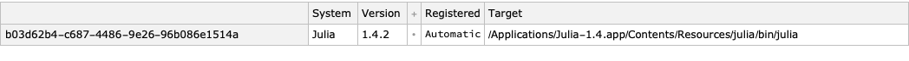

```mathematica
FindExternalEvaluators["R"]
```

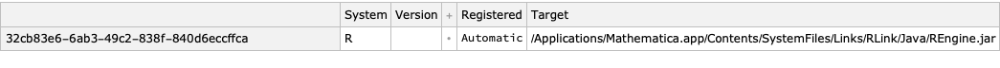

```mathematica
FindExternalEvaluators["Python"]
```

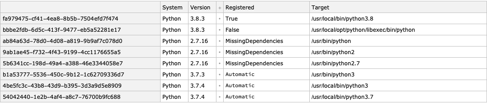

---

## Speech recognition?

**Spoken:** ”Use the titanic dataset. Filter by age equals 30 and sex male”

**Recognized:** “Use the titanic dataset filter by eight equals 30 and six mail”

```mathematica
SpeechRecognize[AudioCapture[]]
```

### Other examples

#### WL by AA

Use the titanic data filter by age equal 30 and sex male

```
SpeechRecognize[AudioCapture[]]

(*"use jeff titanic filter by passenger sex and passenger ge"*)

(*"you statonic data filter by six and ge"*)

(*"use the dataning data filter by six male and age thirty"*)
```

#### WL by AM

use  data frame named starwars
filter by species is Human;
select the columns name,sex,homeworld;
inner join with dfStarwarsVehicles by name

```
SpeechRecognize[AudioCapture[]]
```

```mathematica
"e a u state a frame named star wars"
```

```mathematica
"filter by species is human"
```

```mathematica
" select the columns name sex oh world"
```

```mathematica
"enner join with data frame named star wars vehicles by name"
```

---

## The ideal end result

Maybe it is more effective to show it in another notebook...

### Less than ideal (but still good)

Consider the natural language commands:

```mathematica

  myCommand = "use dfTitanic; filter by passengerSex is 'female' and passengerSurvival is 'died'; group by passengerClass and passengerSurvival;count;take value";
```

#### Julia

```mathematica
ToDataQueryWorkflowCode[myCommand, "Target" -> "Julia-DataFrames"]

(*"obj = dfTitanicobj = obj[ ((obj.passengerSex .== \"female\") .& (obj.passengerSurvival .== \"died\")), :]obj = groupby( obj, [:passengerClass, :passengerSurvival] )obj = combine(obj, nrow)obj"*)
```

```mathematica
CellPrintAndRunJulia[%]
```

```julia
obj = dfTitanic
obj = obj[ ((obj.passengerSex .== "female") .& (obj.passengerSurvival .== "died")), :]
obj = groupby( obj, [:passengerClass, :passengerSurvival] )
obj = combine(obj, nrow)
obj

(*<|"columns" -> {{"1st", "2nd", "3rd"}, {"died", "died", "died"}, {5, 12, 110}}, "colindex" -> <|"lookup" -> <|"passengerClass" -> 1, "nrow" -> 3, "passengerSurvival" -> 2|>, "names" -> {"passengerClass", "passengerSurvival", "nrow"}|>|>*)
```

#### Python

```mathematica
ToDataQueryWorkflowCode[myCommand, "Target" -> "Python-pandas"]

(*"obj = dfTitanic.copy()obj = obj[((obj[\"passengerSex\"]== \"female\") & (obj[\"passengerSurvival\"]== \"died\"))]obj = obj.groupby([\"passengerClass\", \"passengerSurvival\"])obj = obj.size()obj"*)
```

```mathematica
CellPrintAndRunPython[%]
```

```python
obj = dfTitanic.copy()
obj = obj[((obj["passengerSex"]== "female") & (obj["passengerSurvival"]== "died"))]
obj = obj.groupby(["passengerClass", "passengerSurvival"])
obj = obj.size()
obj
```

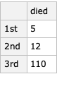

---

## The translation execution loop

In this notebook we use the following translation (parser-interpreter) execution loop:

```mathematica
Import["https://github.com/antononcube/ConversationalAgents/raw/master/ConceptualDiagrams/DataQueryWorkflows-execution-in-Mathematica-notebook.jpg"]
```

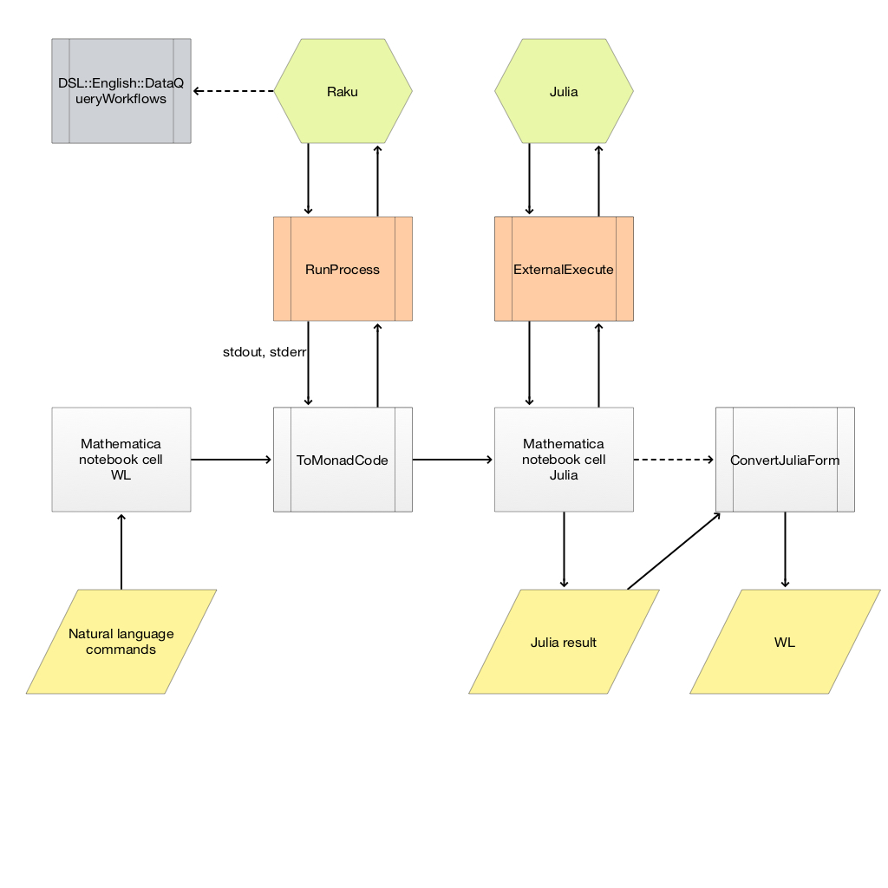

---

## Workflow considerations

### Simplifications are required

As in any software framework design certain assumptions, simplifications, and invariants are required.

### Pipelines

We concentrate on using (monadic) pipelines.

### Data 

We concentrate on using ***data frames***. 

More precisely ***tabular data and simple collections of tabular data***.

In WL: Datasets or lists of associations?

---

## Tabular data transformation workflows 

Here is a flow chart that shows the targeted workflows:

```mathematica
plWorkflows = ImageCrop@Import["https://github.com/antononcube/ConversationalAgents/raw/master/ConceptualDiagrams/Tabular-data-transformation-workflows.jpg"]
```


Only the data loading and summary analysis are not optional. (The left-most diagram elements.)

All other steps are optional.

**Remark:** The Split-Transform-Combine pattern (orange blocks) is implemented in [ParallelCombine](http://reference.wolfram.com/mathematica/ref/ParallelCombine.html).

Also, see the article ["The Split-Apply-Combine Strategy for Data Analysis"](https://www.jstatsoft.org/article/view/v040i01) by Hadley Wickham, [[HW1](https://www.jstatsoft.org/article/view/v040i01)].

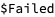


Obviously this approach can be used for any type of computational workflows.   
For more details and examples see the *useR! 2020 Conference* presentation [AA1, AA2]. 

Here is an example of an Epidemiology Modeling workflow:

create with the model susceptible exposed infected two hospitalized recovered;
assign 100000 to the susceptible population;
set infected normally symptomatic population to be 0;
set infected severely symptomatic population to be 1;
assign 0.56 to contact rate of infected normally symptomatic population;
assign 0.58 to contact rate of infected severely symptomatic population;
assign 0.1 to contact rate of the hospitalized population;
simulate for 240 days;
plot populations results;

```mathematica
ECMMonUnit[SEI2HRModel[t]] ⟹
ECMMonAssignInitialConditions[<|SP[0] -> 100000|>] ⟹
ECMMonAssignInitialConditions[<|INSP[0] -> 0|>] ⟹
ECMMonAssignInitialConditions[<|ISSP[0] -> 1|>] ⟹
ECMMonAssignRateRules[<|β[INSP] -> 0.56|>] ⟹
ECMMonAssignRateRules[<|β[ISSP] -> 0.58|>] ⟹
ECMMonAssignRateRules[<|β[HP] -> 0.1|>] ⟹
ECMMonSimulate["MaxTime" -> 240] ⟹
ECMMonPlotSolutions[ "Stocks" -> __ ~~ "Population"];
```

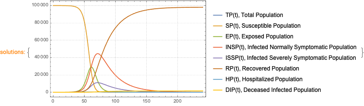

------

## How it is done?

We have two types of Domain Specific Languages (DSL’s) for data wrangling:

1. a software package for data transformations and 

2. a data wrangling DSL that is a subset of a spoken language.

These two DSL's are combined: the natural language commands of the latter are translated into the former.

By executing those translations we interpret commands of spoken DSL's into data transformation computational results.

Note, that we assume that there is a separate system that converts speech into text.

---

## Monadic pipelines

The code generated follows the “monadic pipeline” pattern.

Here is a comparison:

```mathematica
commands = "use dfStarwars; group by species; counts;";
```

```mathematica
aRes = Association@Map[# -> ToDataQueryWorkflowCode[commands, "Target" -> #, "Execute" -> False, "StringResult" -> True] &, {"Julia-DataFrames", "R-tidyverse", "Python-pandas", "WL-System"}];
```

```mathematica
ResourceFunction["GridTableForm"][List @@@ Normal[aRes]]
```

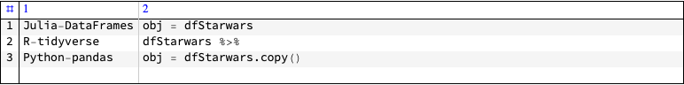

Here is another example:

```mathematica
ToDSLCode["use dfStarwars;rename species as VAR1;show pipeline value", Method -> "Print"]
```

```mathematica
obj = dfStarwars;
obj = Map[ Join[ KeyDrop[ #, {"species"} ], <|"VAR1" -> #["species"]|> ]&, obj];
Echo[obj]
```

### Executable cells

```mathematica
(*ToDSLCode["DSL TARGET "<># <>";"<>commands,Method->"Print"]&/@{"Julia-DataFrames","R-tidyverse","Python-pandas","WL-System"}*)
```

---

## Development cycle

Here is a clarification diagram:

```mathematica
Import["https://github.com/antononcube/ConversationalAgents/raw/master/ConceptualDiagrams/Monadic-making-of-ML-conversational-agents.jpg"]
```

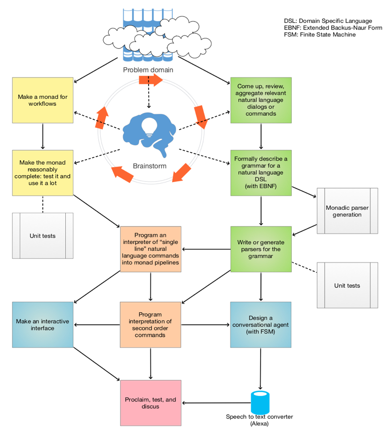

---

## Grammars and parsers

For each natural language is developed a specialized DSL translation [Raku](https://raku.org) module.

Each Raku module:

1. Has grammars for parsing a sequence of natural commands of a certain DSL

1. Translates the parsing results into corresponding programming code

Different programming languages and packages can be the targets of the DSL translation.

(At this point are implemented DSL-translators to Julia, Python, R, and Wolfram Language.)

Here is an [example grammar](https://github.com/antononcube/Raku-DSL-English-DataQueryWorkflows/blob/master/lib/DSL/English/DataQueryWorkflows/Grammar.rakumod). 

---

## Rigorous testing

Rigorous, multi-faceted, multi-level testing is required in order this whole machinery to work.

- Of course, certain level of testing is required in order to advance with the development. 

- Advanced testing is definitely required for any kind of "product release."   

    - That includes "minimal viable product" too.

### Types of tests

Parsing and translation tests:

- [Raku tests](https://github.com/antononcube/Raku-DSL-English-DataQueryWorkflows/tree/master/t)

- Execution and correctness tests:

    - [R-base and R-tidyverse testing package](https://github.com/antononcube/R-packages/tree/master/DataQueryWorkflowsTests) 

    - [Python-pandas test file](https://github.com/antononcube/ConversationalAgents/blob/master/UnitTests/Python/DataQueryWorkflows-Unit-Tests.py)

    - [WL test file](https://github.com/antononcube/ConversationalAgents/blob/master/UnitTests/WL/DataQueryWorkflows-Unit-Tests.wlt)

Much of the tests design and programming is not finished yet.

---

## Filter, group, and summarize: translation

```mathematica
ToDataQueryWorkflowCode["use dfStarwars;filter by birth_year greater than 27;select homeworld, mass and height;group by homeworld;replace missing with 0;replace 'NA' with 0;summarize the variables mass and height with Mean and Median"]
```

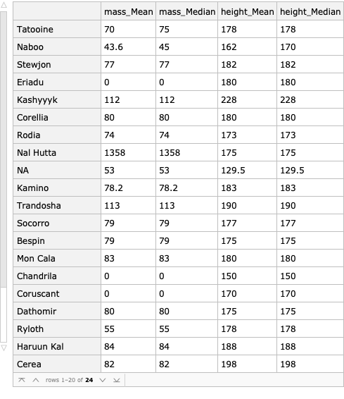

use dfStarwars;
filter by birth_year greater than 27;
group by homeworld;
replace missing with 0;
replace "NA" with 0;
summarize the variables mass and height with Mean and Median

```mathematica
obj = dfStarwars;
obj = Select[ obj, #["birth_year"] > 27 & ];
obj = GroupBy[ obj, #["homeworld"]& ];
obj = ReplaceAll[ obj, _Missing -> 0 ];
obj = ReplaceAll[ obj, "NA" -> 0 ];
obj = Dataset[obj][All, Association @ Flatten @ Outer[ToString[#1] <> "_" <> ToString[#2] -> Query[#2, #1] &,{"mass", "height"}, {Mean, Median}]]
```


---

## Joins

```mathematica
ToDataQueryWorkflowCode["use dfStarwarsFilms;left join with dfStarwars by 'name';sort by name, film desc;echo data summary;take pipeline value"]
```

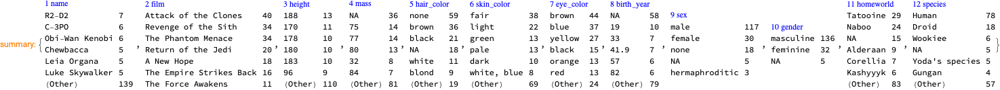

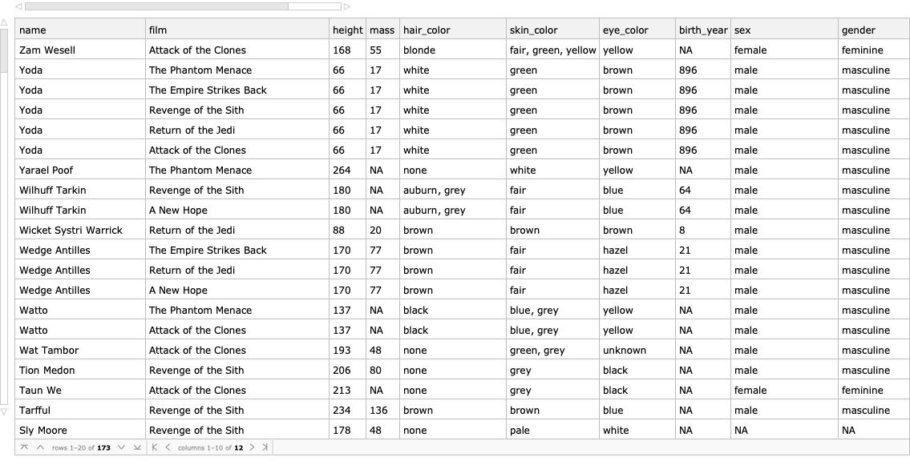

---

## Cross tabulation

```mathematica
ToDataQueryWorkflowCode["use dfTitanic;filter with passengerSex is 'male' and passengerSurvival equals 'died' or passengerSurvival is 'survived' ;cross tabulate passengerClass, passengerSurvival over passengerAge;"]
```

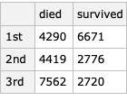

---

## Formulas with column references

Special care has to be taken for when formulas the references to columns are used. 

Here is an example:

```mathematica
ToDataQueryWorkflowCode["use data frame dfStarwars;keep the columns name, homeworld, mass & height;transform with bmi = `mass/height^2*10000`;filter rows by bmi >= 30 & height < 200;arrange by the variables mass & height descending", "Execute" -> False]
```

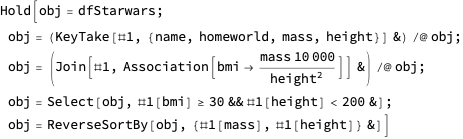

Here is the corrected code:

```mathematica
obj = dfStarwars;
obj = Map[ KeyTake[ #, {"name", "homeworld", "mass", "height"} ]&, obj];
obj = Map[ Join[ #, <|"bmi" -> #["mass"]/#["height"]^2*10000|> ]&, obj];
obj = Select[ obj, #["bmi"] >= 30 && #["height"] < 200 & ];
obj = ReverseSortBy[ obj, {#["mass"], #["height"]}& ]
```

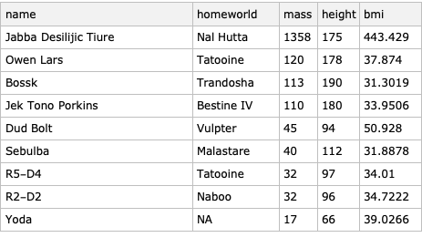

```mathematica
MyFromRForm[%]
```


DSL TARGET R-tidyverse;
use data frame dfStarwars;
keep the columns name, homeworld, mass & height;
transform with bmi = `mass/height^2*10000`;
filter rows by bmi >= 30 & height < 200;
arrange by the variables mass & height descending

```r
{
dfStarwars %>%
dplyr::select(name, homeworld, mass, height) %>%
dplyr::mutate(bmi = mass/height^2*10000) %>%
dplyr::filter(bmi >= 30 & height < 200) %>%
dplyr::arrange(desc(mass, height))
}

(*RDataFrame[RNames["name", "homeworld", "mass", "height", "bmi"], RData[{"Jabba Desilijic Tiure", "Owen Lars", "Bossk", "Jek Tono Porkins", "Dud Bolt", "Sebulba", "R2-D2", "R5-D4", "Yoda"}, {"Nal Hutta", "Tatooine", "Trandosha", "Bestine IV", "Vulpter", "Malastare", "Naboo", "Tatooine", Missing[]}, {1358., 120., 113., 110., 45., 40., 32., 32., 17.}, {175, 178, 190, 180, 94, 112, 96, 97, 66}, {443.429, 37.874, 31.3019, 33.9506, 50.928, 31.8878, 34.7222, 34.01, 39.0266}], RRowNames[1, 2, 3, 4, 5, 6, 7, 8, 9]]*)
```

---

## Grouping awareness

Since there is no dedicated data transformation WL monad -- we use standard WL code -- we can try to make the command sequence parsing to be “aware” of the grouping operations.

Here are is an example:

```mathematica
ToDataQueryWorkflowCode["use dfStarwars; group by species; echo counts; group by homeworld; counts", 
  "Execute" -> False, "StringResult" -> True]

(*"obj = dfStarwars;obj = GroupBy[ obj, #[\"species\"]& ];Echo[Map[ Length, obj], \"counts:\"];obj = GroupBy[ Join @@ obj, #[\"homeworld\"]& ];obj = Map[ Length, obj]"*)
```

**Remark:** A major feature of R-dplyr (part of tidyverse)  is the handling of grouped and ungrouped data in an uniform manner.

---

## “My data wrangling is too complicated for this approach”

It seems that I have to convince some data wrangling practitioners that the proposed workflows can be useful to them.

Two reasons for those doubts:

- [The LISP curse](http://winestockwebdesign.com/Essays/Lisp_Curse.html)

- WL targeting deeply hierarchical data

My response is:

- For tabular data (collections) we can streamline your complicated data wrangling to a large degree.  

---

## Complicated workflow

To illustrate the streamlining claim previous slide consider the following example with Anscombe’s quartet.

```mathematica
dsAnscombe = ExampleDataSpecToDataset[{"Statistics", "AnscombeRegressionLines"}]
```

```mathematica
dsAnscombe
```

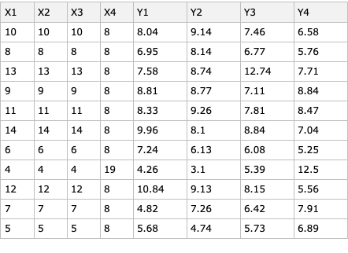

Let us generate the code and look into the intermediate steps:

use dsAnscombe;
convert to long form;
separate the data column Variable into Variable and Set with separator pattern "";
to wide form for id columns Set and AutomaticKey variable column Variable and value column Value

```mathematica
obj = dsAnscombe
obj = ToLongForm[ obj ]
obj = SeparateColumn[ obj, "Variable", {"Variable", "Set"}, "Separator" -> "" ]
obj = ToWideForm[ obj,  "IdentifierColumns" -> {"Set", "AutomaticKey"}, "VariablesFrom" -> "Variable", "ValuesFrom" -> "Value" ]
```


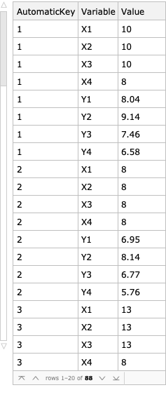

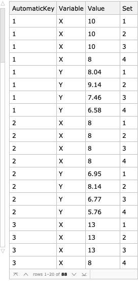

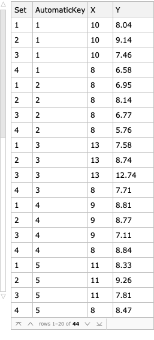

Now we plot the sets:

```mathematica
Map[ListPlot@*KeyTake[{"X", "Y"}], obj[GroupBy[#Set &]]]
```

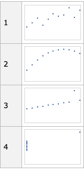

**Remark:** Note that we went three times through the loop of the workflows flow chart.

---

## Handling misspellings

It is important to handle misspellings:

- We make mistakes while typing

- Speech recognition systems mishear

Here is an example:

```mathematica
ToDataQueryWorkflowCode["use dfTitanic;flter by passengerSex is 'female';cross tablate passengerClass, passengerSurvival over passengerAge;"]
```

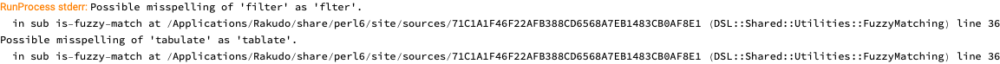

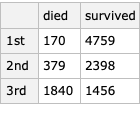

---

## Other human languages

Obviously we can translate a DSL based on English into DSL’s based on other natural languages.

Here is another example (EnglishSpanish):

```mathematica
ToDSLCode["DSL TARGET Spanish;use dfTitanic;filter by passengerSex == 'male';echo text grouping by variables;group by passengerClass, passengerSurvival;count;ungroup;"]["Code"]

(*"utilizar la tabla: dfTitanicfiltrar con la condicion: ((passengerSex es igual \"male\"))mensaje impreso: \"grouping by variables\"agrupar con columnas: \"passengerClass\", \"passengerSurvival\"encontrar recuentosdesagrupar"*)
```

Here is another example (EnglishBulgarian):

```mathematica
ToDSLCode["DSL TARGET Bulgarian;use dfTitanic;filter by passengerSex == 'male';echo text grouping by variables;group by passengerClass, passengerSurvival;count;ungroup;"]["Code"]

(*"използвай таблицата: dfTitanicфилтрирай с предиката: ((passengerSex се равнява на \"male\"))отпечатай съобщението: \"grouping by variables\"групирай с колоните: passengerClass, passengerSurvivalнамери брояраз-групирай"*)
```

---

## Complete feature set and development state

The complete feature set and development state can be seen this [org-mode](https://orgmode.org) file: ["Data Query Workflows DSL interpreter implementation.org"](https://github.com/antononcube/ConversationalAgents/blob/master/org/DataQueryWorkflows-DSL-interpreter-implementation.org).

[Raku DSL package design](https://github.com/antononcube/ConversationalAgents/raw/master/ConceptualDiagrams/Raku-DSL-package-design.png):

```mathematica
Import["https://github.com/antononcube/ConversationalAgents/raw/master/ConceptualDiagrams/Raku-DSL-package-design.png"]
```

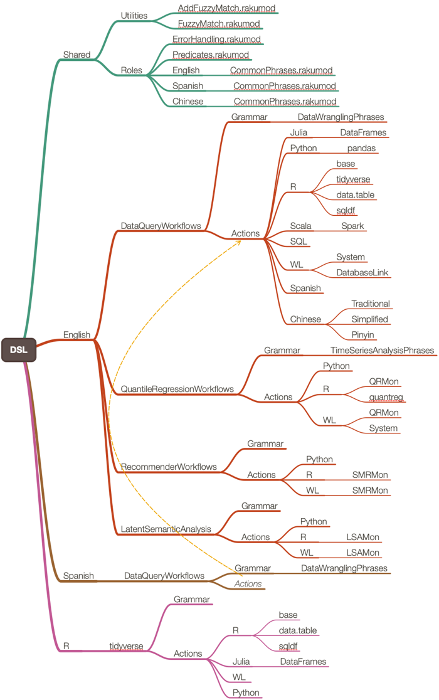

---

## Immediate future plans

- Producing random sentences (in order to help users.)

- Systematic handling of redundant words in the commands.

    - Like “pivot to a nice long form” instead of “pivot to long form”

- Spell check support for data variable names and column names.

- User guide.

- Reproducing results from well known data transformation tutorials.

-  More comprehensive data on-boarding commands.

- Combination with other DSLs:

    - ML workflows

    - Data analysis 

---

## The bigger picture -- demo

The same methodology is applied to Machine Learning and Scientific Computing workflows.

Here is an example with a Latent Semantic Analysis workflow:

```mathematica
ToDSLCode["create from aAbstracts;make document term matrix with stemming FALSE and automatic stop words;apply LSI functions glbal weight function IDF, local term weight function TermFrequency, normalizer function Cosine;extract 12 topics using method NNMF and max steps 16 and 20 min number of documents per term;show topics table with 12 terms;show tesaurus table for science, symbolic, system;"];
```

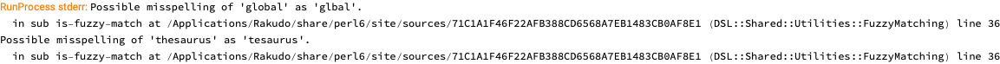

```mathematica
LSAMonUnit[aAbstracts] ⟹
LSAMonMakeDocumentTermMatrix[ "StemmingRules" -> False, "StopWords" -> Automatic] ⟹
LSAMonApplyTermWeightFunctions["GlobalWeightFunction" -> "IDF", "LocalWeightFunction" -> "None", "NormalizerFunction" -> "Cosine"] ⟹
LSAMonExtractTopics["NumberOfTopics" -> 12, Method -> "NNMF", "MaxSteps" -> 16, "MinNumberOfDocumentsPerTerm" -> 20] ⟹
LSAMonEchoTopicsTable["NumberOfTerms" -> 12] ⟹
LSAMonEchoStatisticalThesaurus[ "Words" -> {"science", "symbolic", "system"}];
```

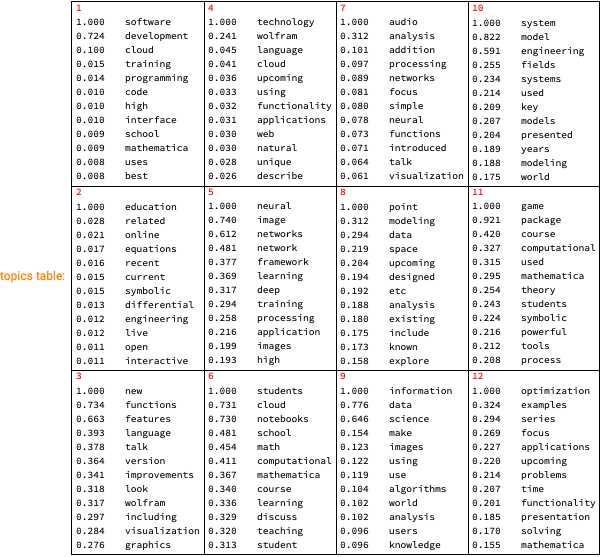

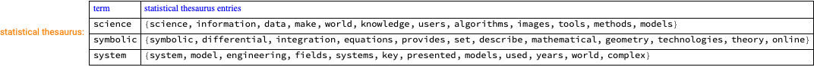

---

## Data transformations Wolfram U

I would like to use the opportunity to advertise a (short) cycle of [Wolfram U lectures on data transformations](https://github.com/antononcube/SimplifiedMachineLearningWorkflows-book/tree/master/Tutorials/WolframU-DataTransformation-workflows) we plan to do.

I see that tutorial lectures as part of a book I am writing titled: ["Simplified Machine Learning Workflows"](https://github.com/antononcube/SimplifiedMachineLearningWorkflows-book).

```mathematica
WebImage["https://github.com/antononcube/SimplifiedMachineLearningWorkflows-book/tree/master/Tutorials/WolframU-DataTransformation-workflows"]
```

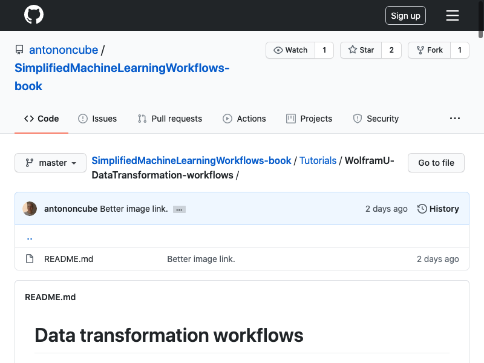

---

## References

### Articles, movies

[AA1] Anton Antonov, ["How to simplify Machine learning workflows specifications? (useR! 2020)"](https://mathematicaforprediction.wordpress.com/2020/06/28/how-to-simplify-machine-learning-workflows-specifications-user-2020/), (2020), [MathematicaForPrediction at WordPress](https://mathematicaforprediction.wordpress.com).

[AA2] Anton Antonov, ["useR! 2020: How to simplify Machine Learning workflows specifications (A. Antonov), lightning"](https://www.youtube.com/watch?v=b9Uu7gRF5KY), (2020), R Consortium at YouTube.

[HW1] Hadley Wickham, ["The Split-Apply-Combine Strategy for Data Analysis"](https://www.jstatsoft.org/article/view/v040i01), (2011), [Journal of Statistical Software](https://www.jstatsoft.org).

### Repositories

[AAr1] Anton Antonov, [DSL::English::DataQueryWorkflows Raku package](https://github.com/antononcube/Raku-DSL-English-DataQueryWorkflows), (2020), [GitHub/antononcube](https://github.com/antononcube).

[AAr2] Anton Antonov, [DSL::English::EpidemiologyModelingWorkflows Raku package](https://github.com/antononcube/Raku-DSL-English-EpidemiologyModelingWorkflows), (2020), [GitHub/antononcube](https://github.com/antononcube).

[AAr3] Anton Antonov, [Epidemiology Compartmental Modeling Monad in R](https://github.com/antononcube/ECMMon-R), (2020), [GitHub/antononcube](https://github.com/antononcube).

[AAp1] Anton Antonov, [Monadic Epidemiology Compartmental Modeling Mathematica package](https://github.com/antononcube/SystemModeling/blob/master/Projects/Coronavirus-propagation-dynamics/WL/MonadicEpidemiologyCompartmentalModeling.m), (2020), [SystemModeling at GitHub/antononcube](https://github.com/antononcube/SystemModeling).

[RS1] RStudio, [https://www.tidyverse.org](https://www.tidyverse.org).

[RS2] RStudio, [https://github.com/tidyverse](https://github.com/tidyverse).

### Contact information

Anton Antonov (antononcube@posteo.net)
