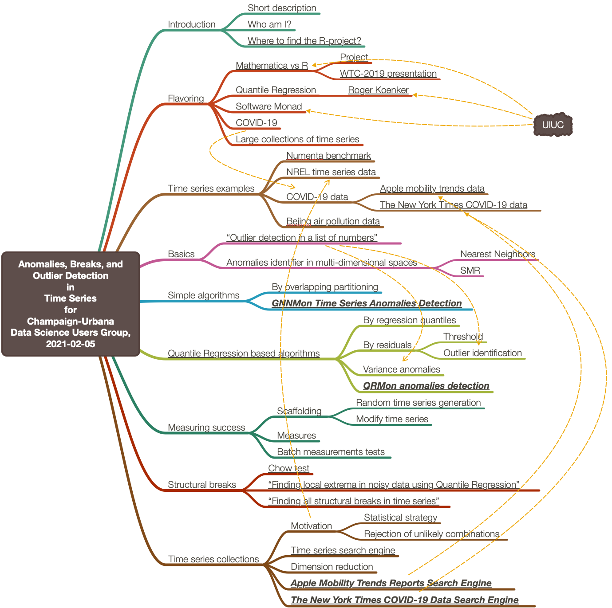

# "Anomalies, Breaks, and Outlier Detection in Time Series" for Champaign-Urbana Data Science User Group, 2021-02-05

This R-project has slides and related notebooks for 
[the presentation](https://www.meetup.com/CU-DSUG/events/jgrrbpyccdbhb/)
given at
[Champaign-Urbana Data Science User Group](https://www.meetup.com/CU-DSUG)
on 2021-02-5.

Here is a mind-map of the presentation:

# References

[AAv1] Anton Antonov,
["Anomalies, Breaks, and Outlier Detection in Time Series"](https://www.youtube.com/watch?v=h_fLb6YU87c),
(2020),
[Wolfram Research Inc, at YouTube](https://www.youtube.com/channel/UCJekgf6k62CQHdENWf2NgAQ).