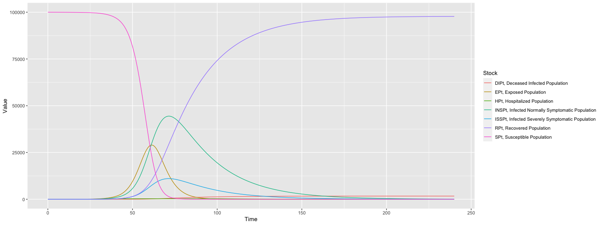

## Multi-language Data Wrangling Translations
### [*Data Science Study Group: South Florida Meetup*](https://www.meetup.com/Data-Science-Study-Group-South-Florida/events/273397708/) lightning talk
### 2020-10-07

**Anton Antonov**   
*Senior Research Scientist*   
*Accendo Data LLC*   
*https://github.com/antononcube*    

<!---  --->


## What is this about?

Rapid specification of data wrangling workflows using natural language commands.

In this presentation we show and compare data wrangling examples in different programming languages using different packages. 

## Motivation

Here are our primary motivation points:

- Often we have to apply the same data transformation workflows within different
  programming languages and/or packages. 
  
- Although the high-level data transformation workflows are the same, it might be time consuming
  to express those workflows in the logic and syntax of concrete programming languages or packages.
  
- It would be nice to have software solutions that speed-up the processes for
  multi-language expression of data transformation workflows.

Further, assume that:

- We want to create conversation agents that help Data Science (DS) and ML 
practitioners to quickly create first, initial versions of different data wrangling workflows 
for different programming languages and related packages. 

- We expect that the initial versions of programming code are tweaked further.
(In order to produce desired outcomes in the application area of interest.)


## The workflows considered

In this presentation we focus on these four data wrangling packages:

- [Julia-DataFrames](https://juliadata.github.io/DataFrames.jl/stable/)

- [Python-pandas](https://pandas.pydata.org)

- R-base

- [R-tidyverse](https://www.tidyverse.org)

- Wolfram Language (WL)


## First example data

Assume we have a data frame with Titanic data. 
Here is a summary:


```r
summary(as.data.frame(unclass(dfTitanic), stringsAsFactors = T))
```

```
##        id       passengerClass  passengerAge   passengerSex passengerSurvival
##  id.1   :   1   1st:323        Min.   :-1.00   female:466   died    :809     
##  id.10  :   1   2nd:277        1st Qu.:10.00   male  :843   survived:500     
##  id.100 :   1   3rd:709        Median :20.00                                 
##  id.1000:   1                  Mean   :23.55                                 
##  id.1001:   1                  3rd Qu.:40.00                                 
##  id.1002:   1                  Max.   :80.00                                 
##  (Other):1303
```


## Cross tabulataion: first example

Here is a cross tabulation specification:


```r
lsCommands <- 'use data frame dfTitanic; 
filter with passengerAge greater or equal to 0; 
rename "passengerSex" and "passengerClass" as "sex" and "class";
cross tabulate sex and class'
```


```r
res1 <- eval( expr = ToDataQueryWorkflowCode( command = lsCommands, parse = TRUE, target = "R-base") )
res1
```

```
##         class
## sex      1st 2nd 3rd
##   female 133 103 152
##   male   151 158 349
```


```r
res1 <- eval( expr = ToDataQueryWorkflowCode( command = lsCommands, parse = TRUE, target = "R-tidyverse") )
res1
```

```
##      sex class Freq
## 1 female   1st  133
## 2   male   1st  151
## 3 female   2nd  103
## 4   male   2nd  158
## 5 female   3rd  152
## 6   male   3rd  349
```


## Translation to other programming languages

Here are examples of translations of data wrangling English DSL commands into different programming languages (and data transformation packages):


```r
command <-
"use data frame dfStarwars;
keep the columns name, homeworld, mass & height;
arrange by mass, height, and name";
```


<table class="table table-striped" style="font-size: 22px; width: auto !important; ">
 <thead>
  <tr>
   <th style="text-align:left;"> Language.package </th>
   <th style="text-align:left;"> Translated </th>
   <th style="text-align:left;"> tidyverse </th>
  </tr>
 </thead>
<tbody>
  <tr>
   <td style="text-align:left;"> Julia-DataFrames </td>
   <td style="text-align:left;"> obj = dfStarwars </td>
   <td style="text-align:left;"> dfStarwars %&gt;% </td>
  </tr>
  <tr>
   <td style="text-align:left;"> Julia-DataFrames </td>
   <td style="text-align:left;"> obj = obj[ : , [:name, :homeworld, :mass, :height]] </td>
   <td style="text-align:left;"> dplyr::select(name, homeworld, mass, height) %&gt;% </td>
  </tr>
  <tr>
   <td style="text-align:left;"> Julia-DataFrames </td>
   <td style="text-align:left;"> obj = sort( obj, [:mass, :height, :name] ) </td>
   <td style="text-align:left;"> dplyr::arrange(mass, height, name) </td>
  </tr>
  <tr>
   <td style="text-align:left;"> --- </td>
   <td style="text-align:left;">  </td>
   <td style="text-align:left;">  </td>
  </tr>
  <tr>
   <td style="text-align:left;"> Python-pandas </td>
   <td style="text-align:left;"> obj = dfStarwars.copy() </td>
   <td style="text-align:left;"> dfStarwars %&gt;% </td>
  </tr>
  <tr>
   <td style="text-align:left;"> Python-pandas </td>
   <td style="text-align:left;"> obj = obj[["name", "homeworld", "mass", "height"]] </td>
   <td style="text-align:left;"> dplyr::select(name, homeworld, mass, height) %&gt;% </td>
  </tr>
  <tr>
   <td style="text-align:left;"> Python-pandas </td>
   <td style="text-align:left;"> obj = obj.sort_values( ["mass", "height", "name"] ) </td>
   <td style="text-align:left;"> dplyr::arrange(mass, height, name) </td>
  </tr>
  <tr>
   <td style="text-align:left;"> --- </td>
   <td style="text-align:left;">  </td>
   <td style="text-align:left;">  </td>
  </tr>
  <tr>
   <td style="text-align:left;"> R-base </td>
   <td style="text-align:left;"> obj &lt;- dfStarwars ; </td>
   <td style="text-align:left;"> dfStarwars %&gt;% </td>
  </tr>
  <tr>
   <td style="text-align:left;"> R-base </td>
   <td style="text-align:left;"> obj &lt;- obj[, c("name", "homeworld", "mass", "height")] ; </td>
   <td style="text-align:left;"> dplyr::select(name, homeworld, mass, height) %&gt;% </td>
  </tr>
  <tr>
   <td style="text-align:left;"> R-base </td>
   <td style="text-align:left;"> obj &lt;- obj[ order(obj[ ,c("mass", "height", "name")]), ] </td>
   <td style="text-align:left;"> dplyr::arrange(mass, height, name) </td>
  </tr>
  <tr>
   <td style="text-align:left;"> --- </td>
   <td style="text-align:left;">  </td>
   <td style="text-align:left;">  </td>
  </tr>
  <tr>
   <td style="text-align:left;"> WL </td>
   <td style="text-align:left;"> obj = dfStarwars; </td>
   <td style="text-align:left;"> dfStarwars %&gt;% </td>
  </tr>
  <tr>
   <td style="text-align:left;"> WL </td>
   <td style="text-align:left;"> obj = Map[ KeyTake[ #, {"name", "homeworld", "mass", "height"} ]&amp;, obj]; </td>
   <td style="text-align:left;"> dplyr::select(name, homeworld, mass, height) %&gt;% </td>
  </tr>
  <tr>
   <td style="text-align:left;"> WL </td>
   <td style="text-align:left;"> obj = SortBy[ obj, {#["mass"], #["height"], #["name"]}&amp; ] </td>
   <td style="text-align:left;"> dplyr::arrange(mass, height, name) </td>
  </tr>
  <tr>
   <td style="text-align:left;"> --- </td>
   <td style="text-align:left;">  </td>
   <td style="text-align:left;">  </td>
  </tr>
</tbody>
</table>


## Translation to other natural languages

Here are examples of translations of data wrangling English DSL commands into Bulgarian, Korean, and Spanish:


```r
command <-
"use data frame dfStarwars;
keep the columns name, homeworld, mass & height;
arrange by mass, height, and name";
```


<table class="table table-striped" style="font-size: 22px; width: auto !important; ">
 <thead>
  <tr>
   <th style="text-align:left;"> Language </th>
   <th style="text-align:left;"> Translated </th>
   <th style="text-align:left;"> English </th>
  </tr>
 </thead>
<tbody>
  <tr>
   <td style="text-align:left;"> Bulgarian </td>
   <td style="text-align:left;"> използвай таблицата: dfStarwars </td>
   <td style="text-align:left;"> use data frame dfStarwars </td>
  </tr>
  <tr>
   <td style="text-align:left;"> Bulgarian </td>
   <td style="text-align:left;"> избери колоните: "name", "homeworld", "mass", "height" </td>
   <td style="text-align:left;"> keep the columns name, homeworld, mass &amp; height </td>
  </tr>
  <tr>
   <td style="text-align:left;"> Bulgarian </td>
   <td style="text-align:left;"> сортирай с колоните: "mass", "height", "name" </td>
   <td style="text-align:left;"> arrange by mass, height, and name </td>
  </tr>
  <tr>
   <td style="text-align:left;"> --- </td>
   <td style="text-align:left;">  </td>
   <td style="text-align:left;">  </td>
  </tr>
  <tr>
   <td style="text-align:left;"> Korean </td>
   <td style="text-align:left;"> 테이블 사용: dfStarwars </td>
   <td style="text-align:left;"> use data frame dfStarwars </td>
  </tr>
  <tr>
   <td style="text-align:left;"> Korean </td>
   <td style="text-align:left;"> "name", "homeworld", "mass", "height" 열 선택 </td>
   <td style="text-align:left;"> keep the columns name, homeworld, mass &amp; height </td>
  </tr>
  <tr>
   <td style="text-align:left;"> Korean </td>
   <td style="text-align:left;"> 열로 정렬: "mass", "height", "name" </td>
   <td style="text-align:left;"> arrange by mass, height, and name </td>
  </tr>
  <tr>
   <td style="text-align:left;"> --- </td>
   <td style="text-align:left;">  </td>
   <td style="text-align:left;">  </td>
  </tr>
  <tr>
   <td style="text-align:left;"> Spanish </td>
   <td style="text-align:left;"> utilizar la tabla: dfStarwars </td>
   <td style="text-align:left;"> use data frame dfStarwars </td>
  </tr>
  <tr>
   <td style="text-align:left;"> Spanish </td>
   <td style="text-align:left;"> escoger columnas: "name", "homeworld", "mass", "height" </td>
   <td style="text-align:left;"> keep the columns name, homeworld, mass &amp; height </td>
  </tr>
  <tr>
   <td style="text-align:left;"> Spanish </td>
   <td style="text-align:left;"> ordenar con columnas: "mass", "height", "name" </td>
   <td style="text-align:left;"> arrange by mass, height, and name </td>
  </tr>
  <tr>
   <td style="text-align:left;"> --- </td>
   <td style="text-align:left;">  </td>
   <td style="text-align:left;">  </td>
  </tr>
</tbody>
</table>


## Not just data wrangling workflows

Obviously this approach can be used for any type of computational workflows.   
For more details and examples see the ***useR! 2020 Conference*** presentation [AA1, AA2]. 

Here is an example of an Epidemiology Modeling workflow:


```r
ecmCommands <- 
'create with the model susceptible exposed infected two hospitalized recovered;
 assign 100000 to the susceptible population;
 set infected normally symptomatic population to be 0;
 set infected severely symptomatic population to be 1;
 assign 0.56 to contact rate of infected normally symptomatic population;
 assign 0.58 to contact rate of infected severely symptomatic population;
 assign 0.1 to contact rate of the hospitalized population;
 simulate for 240 days;
 plot populations results;'
```


```r
ToEpidemiologyModelingWorkflowCode(ecmCommands, parse = TRUE)
```

```
## expression(ECMMonUnit(model = SEI2HRModel()) %>% ECMMonAssignInitialConditions(initConds = c(SPt = 1e+05)) %>% 
##     ECMMonAssignInitialConditions(initConds = c(INSPt = 0)) %>% 
##     ECMMonAssignInitialConditions(initConds = c(ISSPt = 1)) %>% 
##     ECMMonAssignRateValues(rateValues = c(contactRateINSP = 0.56)) %>% 
##     ECMMonAssignRateValues(rateValues = c(contactRateISSP = 0.58)) %>% 
##     ECMMonAssignRateValues(rateValues = c(contactRateHP = 0.1)) %>% 
##     ECMMonSimulate(maxTime = 240) %>% ECMMonPlotSolutions(stocksSpec = ".*Population"))
```


```r
ecmmon2 <- eval( ToEpidemiologyModelingWorkflowCode(ecmCommands) )
```

<!-- -->

## How it is done?

We two types of Domain Specific Languages (DSL's) for data wrangling:

1. a software package for data transformations and 

2. a data wrangling DSL that is a subset of a spoken language.

These two DSL's are combined: the natural language commands of the latter are translated into the former.

By executing those translations we interpret commands of spoken DSL's into data transformation computational results.

Note, that we assume that there is a separate system that converts speech into text.


## Development cycle

Here is a clarification diagram:


## Grammars and parsers

For each natural language is developed a specialized DSL translation [Raku](https://raku.org) module.

Each Raku module:

1. Has grammars for parsing a sequence of natural commands of a certain DSL

2. Translates the parsing results into corresponding programming code

Different programming languages and packages can be the targets of the DSL translation.

(At this point are implemented DSL-translators to Julia, Python, R, and Wolfram Language.)

Here is an [example grammar](https://github.com/antononcube/Raku-DSL-English-DataQueryWorkflows/blob/master/lib/DSL/English/DataQueryWorkflows/Grammar.rakumod). 

## The translation execution loop

In this notebook we use the following translation (parser-interpreter) execution loop:


## Filter, group, and summarize: translation

Here is how a sequence of natural commands that specifies a data transformation workflow
is translated into code for a "tidyverse":


```r
qrExpr <- 
  ToDataQueryWorkflowCode( 
    "use dfStarwars;
     filter by birth_year greater than 27;
     select homeworld, mass and height;
     group by homeworld;
     summarize all with mean and median", target = "R-tidyverse" )
qrExpr
```

```
## expression(dfStarwars %>% dplyr::filter(birth_year > 27) %>% 
##     dplyr::select(homeworld, mass, height) %>% dplyr::group_by(homeworld) %>% 
##     dplyr::summarise_all(.funs = c(mean = mean, median = median)))
```

## Filter, group, and summarize: evaluation

Here we evaluate the generated data transformation code:


```r
res2 <- eval(expr = parse( text = paste(qrExpr)))
res2
```

```
## # A tibble: 24 x 5
##    homeworld    mass_mean height_mean mass_median height_median
##    <chr>            <dbl>       <dbl>       <dbl>         <dbl>
##  1 Alderaan            NA         191          NA           191
##  2 Bespin              79         175          79           175
##  3 Cerea               82         198          82           198
##  4 Chandrila           NA         150          NA           150
##  5 Concord Dawn        79         183          79           183
##  6 Corellia            80         180          80           180
##  7 Coruscant           NA         170          NA           170
##  8 Dathomir            80         175          80           175
##  9 Eriadu              NA         180          NA           180
## 10 Haruun Kal          84         188          84           188
## # … with 14 more rows
```

## More complicated workflow: translation

Here is how a sequence of natural commands that specifies a more complicated data transformation workflow
is translated into "tidyverse" code:


```r
cExpr <- 
  ToDataQueryWorkflowCode( "use data frame dfStarwars;
  keep the columns name, homeworld, mass & height;
  transform with bmi = `mass/height^2*10000`;
  filter rows by bmi >= 30 & height < 200;
  glimpse data;
  arrange by the variables mass & height descending", target = "tidyverse")
cExpr
```

```
## expression(dfStarwars %>% dplyr::select(name, homeworld, mass, 
##     height) %>% dplyr::mutate(bmi = mass/height^2 * 10000) %>% 
##     dplyr::filter(bmi >= 30 & height < 200) %>% dplyr::glimpse() %>% 
##     dplyr::arrange(desc(mass, height)))
```

##  More complicated workflow: evaluation

Here we execute the generated LSA monad code:


```r
eval(expr = cExpr)
```

```
## Rows: 9
## Columns: 5
## $ name      <chr> "R2-D2", "Owen Lars", "R5-D4", "Jabba Desilijic Tiure", "Jek Tono Porkins", "Yoda", "Bossk", "Sebulba", "Dud Bolt"
## $ homeworld <chr> "Naboo", "Tatooine", "Tatooine", "Nal Hutta", "Bestine IV", NA, "Trandosha", "Malastare", "Vulpter"
## $ mass      <dbl> 32, 120, 32, 1358, 110, 17, 113, 40, 45
## $ height    <int> 96, 178, 97, 175, 180, 66, 190, 112, 94
## $ bmi       <dbl> 34.72222, 37.87401, 34.00999, 443.42857, 33.95062, 39.02663, 31.30194, 31.88776, 50.92802
```

```
##                    name  homeworld mass height       bmi
## 1 Jabba Desilijic Tiure  Nal Hutta 1358    175 443.42857
## 2             Owen Lars   Tatooine  120    178  37.87401
## 3                 Bossk  Trandosha  113    190  31.30194
## 4      Jek Tono Porkins Bestine IV  110    180  33.95062
## 5              Dud Bolt    Vulpter   45     94  50.92802
## 6               Sebulba  Malastare   40    112  31.88776
## 7                 R2-D2      Naboo   32     96  34.72222
## 8                 R5-D4   Tatooine   32     97  34.00999
## 9                  Yoda       <NA>   17     66  39.02663
```
## Joins


```r
command <- 
  'use dfStarwars;
  filter by species is "Human";
  select name, sex, homeworld;
  inner join with dfStarwarsVehicles on "name";'
```


```r
eval(ToDataQueryWorkflowCode(command = command, target = "R-base"))
obj
```

```
##               name    sex homeworld               vehicle
## 1 Anakin Skywalker   male  Tatooine   Zephyr-G swoop bike
## 2 Anakin Skywalker   male  Tatooine       XJ-6 airspeeder
## 3            Dooku   male   Serenno      Flitknot speeder
## 4      Leia Organa female  Alderaan Imperial Speeder Bike
## 5   Luke Skywalker   male  Tatooine           Snowspeeder
## 6   Luke Skywalker   male  Tatooine Imperial Speeder Bike
## 7   Obi-Wan Kenobi   male   Stewjon       Tribubble bongo
## 8     Qui-Gon Jinn   male      <NA>       Tribubble bongo
## 9   Wedge Antilles   male  Corellia           Snowspeeder
```


```r
eval(ToDataQueryWorkflowCode(command = command, target = "R-tidyverse"))
```

```
##               name    sex homeworld               vehicle
## 1   Luke Skywalker   male  Tatooine           Snowspeeder
## 2   Luke Skywalker   male  Tatooine Imperial Speeder Bike
## 3      Leia Organa female  Alderaan Imperial Speeder Bike
## 4   Obi-Wan Kenobi   male   Stewjon       Tribubble bongo
## 5 Anakin Skywalker   male  Tatooine   Zephyr-G swoop bike
## 6 Anakin Skywalker   male  Tatooine       XJ-6 airspeeder
## 7   Wedge Antilles   male  Corellia           Snowspeeder
## 8     Qui-Gon Jinn   male      <NA>       Tribubble bongo
## 9            Dooku   male   Serenno      Flitknot speeder
```

## Handling misspellings

The approach taken in the design and implementation of the natural language commands interpreters 
can handle misspellings:


```r
res4 <- 
  eval( expr = ToDataQueryWorkflowCode( 
    "use data frame starwars;
    keep the columns name, homeworld, mass & height;
    transfom with bmi = `mass/height^2*10000`;
    filter rows by bmi >= 30 & height < 200;
    summarize data;
    arange by the variables mass & height decending" ) )
```

```
##      name            homeworld              mass            height         bmi        
##  Length:9           Length:9           Min.   :  17.0   Min.   : 66   Min.   : 31.30  
##  Class :character   Class :character   1st Qu.:  32.0   1st Qu.: 96   1st Qu.: 33.95  
##  Mode  :character   Mode  :character   Median :  45.0   Median :112   Median : 34.72  
##                                        Mean   : 207.4   Mean   :132   Mean   : 81.90  
##                                        3rd Qu.: 113.0   3rd Qu.:178   3rd Qu.: 39.03  
##                                        Max.   :1358.0   Max.   :190   Max.   :443.43
```

## Evaluation in Python

Using `reticulate` we can see the results of translating the natural commands into Python's "pandas" library.

Get data in Python:


```python
import pandas
dfStarwars = pandas.read_csv("https://raw.githubusercontent.com/antononcube/R-packages/master/DataQueryWorkflowsTests/inst/extdata/dfStarwars.csv")
dfStarwarsVehicles = pandas.read_csv("https://raw.githubusercontent.com/antononcube/R-packages/master/DataQueryWorkflowsTests/inst/extdata/dfStarwarsVehicles.csv")
```

Load the translator library and translate commands:


```python
from ExternalParsersHookUp import ParseWorkflowSpecifications

command =  '''
use dfStarwars; 
filter by "species" is "Human"; 
select name, sex, homeworld; 
inner join with dfStarwarsVehicles on "name";
'''
res = ParseWorkflowSpecifications.ToDataQueryWorkflowCode( command = command, execute = True, globals = globals() )

print(res)
```

```
## obj = dfStarwars.copy()
## obj = obj[((obj["species"]== "Human"))]
## obj = obj[["name", "sex", "homeworld"]]
## obj = obj.merge( dfStarwarsVehicles, on = ["name"], how = "inner" )
```

Show the evaluation result:


```python
obj
```

```
##                name     sex homeworld                vehicle
## 0    Luke Skywalker    male  Tatooine            Snowspeeder
## 1    Luke Skywalker    male  Tatooine  Imperial Speeder Bike
## 2       Leia Organa  female  Alderaan  Imperial Speeder Bike
## 3    Obi-Wan Kenobi    male   Stewjon        Tribubble bongo
## 4  Anakin Skywalker    male  Tatooine    Zephyr-G swoop bike
## 5  Anakin Skywalker    male  Tatooine        XJ-6 airspeeder
## 6    Wedge Antilles    male  Corellia            Snowspeeder
## 7      Qui-Gon Jinn    male       NaN        Tribubble bongo
## 8             Dooku    male   Serenno       Flitknot speeder
```


## References

### Articles, movies

[AA1] Anton Antonov,
["How to simplify Machine learning workflows specifications? (useR! 2020)"](https://mathematicaforprediction.wordpress.com/2020/06/28/how-to-simplify-machine-learning-workflows-specifications-user-2020/),
(2020),
[MathematicaForPrediction at WordPress](https://mathematicaforprediction.wordpress.com).

[AA2] Anton Antonov,
["useR! 2020: How to simplify Machine Learning workflows specifications (A. Antonov), lightning"](https://www.youtube.com/watch?v=b9Uu7gRF5KY),
(2020),
R Consortium at YouTube.

### Repositories

[AAr1] Anton Antonov, 
[DSL::English::DataQueryWorkflows Raku package](https://github.com/antononcube/Raku-DSL-English-DataQueryWorkflows), 
(2020),
GitHub.

[AAr2] Anton Antonov, 
[DSL::English::EpidemiologyModelingWorkflows Raku package](https://github.com/antononcube/Raku-DSL-English-EpidemiologyModelingWorkflows), 
(2020),
GitHub.

[AAr3] Anton Antonov, 
[Epidemiology Compartmental Modeling Monad in R](https://github.com/antononcube/ECMMon-R), 
(2020),
GitHub.
