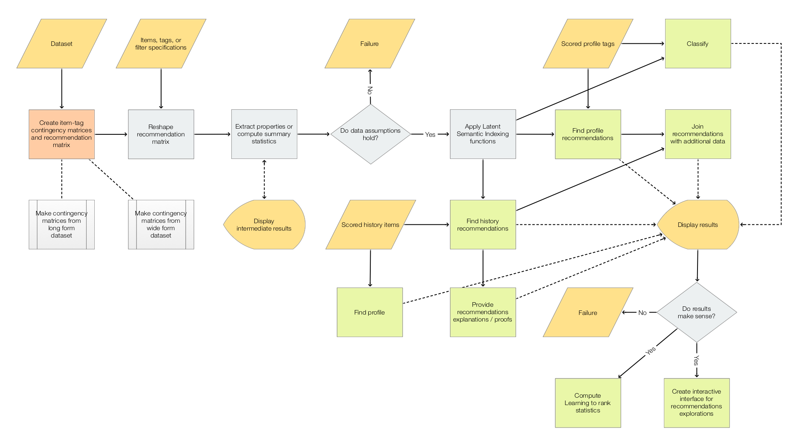

# Recommendation systems workflows

*(Here is the
[call for speakers](https://odsc.com/boston/call-for-speakers/) for
[Open Data Science Conference (ODSC) East 2020](https://odsc.com/boston/).)* 

## Title: Recommendation systems workflows

## Abstract

In this tutorial we consider workflows of typical recommendation systems.
We use both item-item and item-user recommenders. The item-item recommenders are 
based on Information retrieval principles; the item-user recommenders are based
on graph theory and Collaborative filtering principles.  

For clarity we use both programming code and sequences of natural language commands. 
We also introduce and exemplify the use of different recommender interactive interfaces.

The discussed recommender workflows are constructed with dedicated R packages. 
We mostly use (monadic) pipeline specifications.

All parts of the tutorial are illustrated with a diverse set of examples based on 
the following types of data: digital content (books, movies, music), 
financial time series, document collections, retail invoices, medical data.

The following plan is (roughly) followed.

1. General set-up: problem formulation, scope, areas of focus.

2. Description of the standard workflows followed by more advanced or 
specialized workflows. 

3. Elements of the theory of different aspects of recommendations computation
algorithms and related interpretations. 

4. Demonstration of different extensions of recommendation systems for doing
Progressive learning and Time series collections analysis.
 
5. Discussion of the making of conversational agents that generate recommender 
workflows. (Julia, Python, R, WL.)
 
## Detailed tutorial plan 

- General set-up.
   - The recommendation problem.
   - Approaches.
   - Recommendation systems types.
   - Introductory examples.

- Core workflows.
   - Creation
      - Creation by contingency matrices.
      - Creation by specifications.
   - Categorization of numerical data.
   - LSI functions application.
   - Recommendation by history.
   - Recommendation by profile.
   - Explanations and proofs.
   - Recommendations re-ordering.
   - Cut-off selection by outlier identifiers.
   
- Further workflows.
   - Using dimension reduction.
   - Tuning recommendations.
   - Recommendations breakdown.
   - Classification.
   - Anomalies identification.
   
- Computations theory.
   - Sparse Matrix Linear Algebra.
   - Using scored-lists / hash-maps.
   - Using graphs and centrality measures.
   - Pre-computation of nearest neighbors scored-lists. 
   - LSA and LSI utilization.
   - Designing more specialized and/or advanced algorithms.
     - Based on quick recommender computations.
   
- Recommender object transformations.
  - Joining two or more recommenders.
  - Reduction by predicates. 
  - Adding and removing sub-matrices / tag types.
  
- Application to Progressive learning.  
  - Incremental recommender enhancement.
  - Why it works?
  - Evaluation.
  - Examples.
  
- Time series search engine.
  - The general approach.
  - The special interactive interface.
  - Finding trends.
  - Finding nearest neighbours.
  
- Making an item-user recommender.
  - Bi-partite graph based.
  - Pure collaborative filtering.
  - Examples.
  
- Composite recommenders.
  - The Composite design pattern.
  - Normalization and weighted voting.
  
- Tags significance determination and Learning to rank. 

- Conversational agents for generating recommender workflows.

- Summary and Q&A.
  

## Visual aids

Here is a diagram for the recommender workflows:




---
 
This sequence of natural commands:

```r
to_SMRMon_R_command( 
    "create from dfTitanic; 
     apply the LSI functions inverse document frequency, term frequency, and cosine;
     recommend by profile female->3, 30->0.1; 
     extend recommendations with dfTitanic; 
     show pipeline value" )
```
generates this R code:

```r
SMRMonCreate( data = dfTitanic) %>%
  SMRMonApplyTermWeightFunctions( globalWeightFunction = "IDF", localWeightFunction = "TermFrequency", normalizerFunction = "Cosine") %>%
  SMRMonRecommendByProfile( profile = c("female"=3, "30"=0.1)) %>%
  SMRMonJoinAcross( data = dfTitanic) %>%
  SMRMonEchoValue()
```