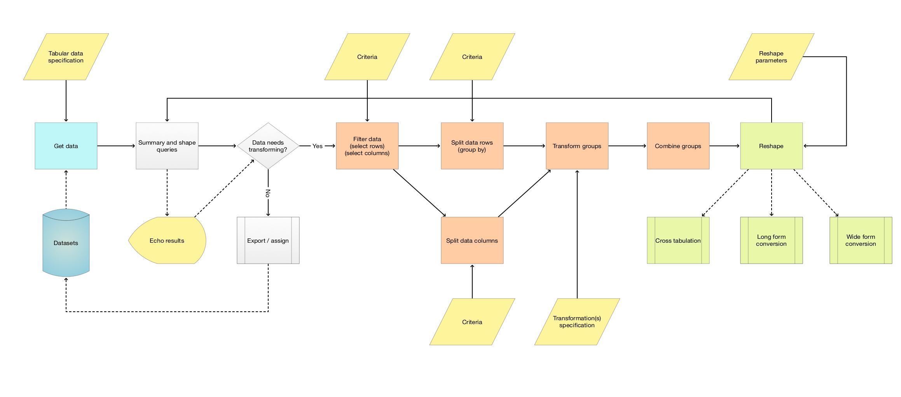

# Data transformation workflows

## In brief

The Data Transformation (DT) lectures outlined below are *to be* recorded for 
[Wolfram U](https://www.wolfram.com/wolfram-u/) 
in October-December 2020.

- Each tutorial lecture is between 25 and 40 minutes.

- Most of the workflows in the lectures have code in programming languages Julia, Python, R, and WL.
  (Dedicated data transformation packages are used.)

- We are going to extensively use the Domain Specific Language (DSL) 
[Raku](https://www.raku.org) 
programmed system 
[DSL::English::DataQueryWorkflows](https://github.com/antononcube/Raku-DSL-English-DataQueryWorkflows), \[AA1\], 
that generates code for the programming languages R and WL and 
the software packages:
  - [Julia-DataFrames](http://juliadata.github.io/DataFrames.jl/stable/) 
  - [Python-pandas](https://pandas.pydata.org) 
  - [R-tidyverse](https://www.tidyverse.org) (mostly [dplyr](https://dplyr.tidyverse.org))

- The WL generated code uses functions from the [Wolfram Function Repository](https://resources.wolframcloud.com/FunctionRepository/).
  For example:

  - [`CrossTabulate`](https://resources.wolframcloud.com/FunctionRepository/resources/CrossTabulate)

  - [`RecordsSummary`](https://resources.wolframcloud.com/FunctionRepository/resources/RecordsSummary)

## General description

TBD...

## Detailed tutorial plan

### Introduction through questions and answers

TBD...

### Mental model 

*...of the considered Data queries.* 

TBD...

### Data summarization

TBD...

### Joins 

TBD...

### Long form and Wide form 

TBD...

## Visual aids

Here is flow chart that encompases large fraction of typical tabular data transformation workflows:

 

---
 
This call of 
[`ToDataQueryWorkflow`](https://github.com/antononcube/Raku-DSL-English-DataQueryWorkflows)
through
[`ExternalParsersHookUp`](https://github.com/antononcube/ConversationalAgents/blob/master/Packages/WL/ExternalParsersHookup.m), \[AAp2\],
over a sequence of natural commands:

```mathematica
ToDataQueryWorkflowCode["use dfTitanic; 
      filter with passengerSurvival is 'survived';
      rename passengerClass, passengerSex as class and sex;
      cross tabulate class and sex", "Execute" -> False]
```
generates this WL code:

```mathematica
Hold[obj = dfTitanic; 
 obj = Select[obj, #1["passengerSurvival"] == "survived" &]; 
 obj = (Join[KeyDrop[#1, {"passengerClass", "passengerSex"}], Association["class" -> #1["passengerClass"], "sex" -> #1["passengerSex"]]] &) /@ obj; 
 obj = ResourceFunction["CrossTabulate"][({#1["class"], #1["sex"]} &) /@ obj]]
```
which when executed gives the dataset:

```mathematica
Dataset[<|
"1st" -> <|"female" -> 139, "male" -> 61|>, 
"2nd" -> <|"female" -> 94, "male" -> 25|>, 
"3rd" -> <|"female" -> 106, "male" -> 75|>|>, 
 TypeSystem`Assoc[TypeSystem`Atom[String], TypeSystem`Struct[{"female", "male"}, {TypeSystem`Atom[Integer], TypeSystem`Atom[Integer]}], 3], 
 <|"ID" -> 177940708079520|>]
```

## References

### Articles

\[HW1\] Hadley Wickham, 
["The Split-Apply-Combine Strategy for Data Analysis"](https://www.jstatsoft.org/article/view/v040i01),
(2011),
Journal of Statistical Software.

\[AA1\] Anton Antonov,
["Contingency tables creation examples"](https://mathematicaforprediction.wordpress.com/2016/10/04/contingency-tables-creation-examples/),
(2016),
[MathematicaForPrediction at WordPress](https://mathematicaforprediction.wordpress.com).

\[AA2\] Anton Antonov,
["Pareto principle adherence examples"](https://mathematicaforprediction.wordpress.com/2016/11/17/pareto-principle-adherence-examples/),
(2016),
[MathematicaForPrediction at WordPress](https://mathematicaforprediction.wordpress.com).

 
### Packages

\[AAp1\] Anton Antonov, 
[DSL::English::DataQueryWorkflows Raku package](https://github.com/antononcube/Raku-DSL-English-DataQueryWorkflows), 
(2020), 
[GitHub/antononcube](https://github.com/antononcube).

\[AAp2\] Anton Antonov, 
[External Parsers Hookup Mathematica package](https://github.com/antononcube/ConversationalAgents/blob/master/Packages/WL/ExternalParsersHookup.m), 
(2020), 
[ConversationalAgents at GitHub](https://github.com/antononcube/ConversationalAgents).

\[AAp3\] Anton Antonov,
[Cross tabulation implementation in Mathematica](https://github.com/antononcube/MathematicaForPrediction/blob/master/CrossTabulate.m), 
(2017),
[MathematicaForPrediction at GitHub](https://github.com/antononcube/MathematicaForPrediction).

\[AAp4\] Anton Antonov,
[Data reshaping Mathematica package](https://github.com/antononcube/MathematicaForPrediction/blob/master/DataReshape.m), 
(2018),
[MathematicaForPrediction at GitHub](https://github.com/antononcube/MathematicaForPrediction).

### Wolfram Function Repository functions

